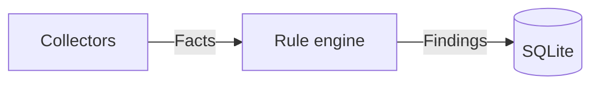

# AGENTS.md

This file provides guidance to AI coding agents working with code in this repository.

## What this is

Bulwark scans a Linux host for security misconfigurations and intrusion indicators using a native Rust rule engine over declarative YAML rules, and explains findings in plain language with a suggested fix. Design rationale, architecture, and alternatives-considered all live in `docs/guide/architecture.md` — read that before making an architectural change, not just this file. Background research grounding the rule checklist (Lynis, MITRE ATT&CK, HackTricks) is in `research/2026-07-11-linux-security-checklist/report.md`.

## Build & development commands

```bash
# Core + CLI
cargo build --workspace
cargo test --workspace
cargo clippy --workspace --all-targets -- -D warnings
cargo fmt --all                        # cargo fmt --all -- --check in CI
cargo run -p bulwarkctl -- scan
cargo run -p bulwarkctl -- rules validate rules/
cargo test -p bulwarkctl --test e2e -- --ignored --test-threads=1   # needs Docker; see below

# GUI (from apps/bulwark-app/)
npm install
cargo tauri dev                        # hot reload for frontend; Rust/tauri.conf.json changes need a restart
cargo tauri build                      # produces .deb, .rpm, .AppImage in target/release/bundle/
npx tsc --noEmit                       # type-check the frontend
npm run lint                           # eslint
npm run format:check                   # prettier --check

# Docs site (from docs/)
npm install
npm run dev                            # local preview
npm run build                          # static build to docs/.vitepress/dist

# Packaging (from workspace root, after a release build)
cargo build --release -p bulwarkctl
cargo deb -p bulwarkctl --no-build       # requires `cargo install cargo-deb`
cargo generate-rpm -p crates/bulwarkctl  # requires `cargo install cargo-generate-rpm`
```

CI (`.github/workflows/ci.yml`) runs fmt-check, clippy `-D warnings`, `cargo test --workspace`, `rules validate rules/`, and a frontend typecheck — run all of these locally before considering a change done.

### Releases

`.github/workflows/release.yml` builds and publishes every artifact: the GUI (`.deb`, `.rpm`, AppImage, via `cargo tauri build`) and the CLI (`.deb`, `.rpm`, tarball). Cutting a release is `git tag v0.1.0 && git push origin v0.1.0`; the workflow refuses to build if the tag disagrees with the workspace version, and it publishes as a **draft** so the assets can be looked at before anything goes public. `workflow_dispatch` runs the whole pipeline without publishing, which is how you rehearse a release without burning a version number.

Built on `ubuntu-22.04`, deliberately not `ubuntu-latest`: the oldest glibc linked against becomes the oldest distro the artifacts run on, and `ubuntu-latest` silently raises that floor whenever GitHub re-points it.

The workflow asserts on package *contents* (≥50 rule files in each of the CLI `.deb`, CLI `.rpm`, and GUI `.deb`), not merely that the packaging command exited 0 — `cargo deb`/`cargo tauri build` succeeding only proves the metadata parsed. The CLI's `.rpm` shipped **zero** rules for a while precisely because nothing checked: its asset list had drifted out of sync with the `.deb`'s, and `bulwarkctl` resolves `/usr/share/bulwark/rules` on an installed system, so every invocation failed with "couldn't find a 'rules' directory."

**Known gap:** the GUI package does *not* ship `bulwarkctl`, and doesn't depend on it. The GUI's privileged path shells out to `pkexec bulwarkctl`, so on a GUI-only install "Run privileged checks" fails. A package dependency would fix the `.deb`/`.rpm` but *cannot* fix the AppImage (single portable file) — bundling the binary into the GUI (Tauri `externalBin`, plus teaching `resolve_cli_binary` to look next to `current_exe`) is the fix that covers all three.

### Finding lifecycle (open → resolved)

`Store::persist_and_reconcile` both **adds** and **closes** findings, and the thing that makes closing safe is `ScanRun::rules_evaluated` — the set of rule IDs that demonstrably ran (collector applicable, privileged enough, returned facts without erroring). An open row whose rule is in that set and which the new scan did not re-observe is marked `resolved`: the check ran and no longer fires, so the issue is genuinely fixed. A row whose rule is *not* in that set is left alone, because a skipped/errored collector proves nothing — conflating "skipped" with "passing" is the failure mode this design exists to prevent.

Historically the reconciler could only ever add, never close, so **any remediated issue stayed on the dashboard forever** — recording a FIM baseline left seven "no file-integrity baseline yet" findings on screen permanently even though every subsequent scan came back clean. Regression cover: `a_fixed_issue_is_resolved_once_its_rule_runs_clean`, `a_finding_is_not_resolved_when_its_rule_never_ran`, `resolving_is_per_row_for_a_list_shaped_rule`.

### Database migrations

Schema changes go in `MIGRATIONS` in `crates/bulwark-core/src/store.rs`, versioned via SQLite's `PRAGMA user_version` (`rusqlite_migration`). **Append only** — never edit or reorder a migration that has shipped: a database already stamped at version N will never re-run it, so an edit silently splits users into two different schemas depending on when they first installed. Add a new `M::up` instead.

Databases created before versioning existed report `user_version = 0` and are indistinguishable from a brand-new one by the pragma alone; `baseline_pre_versioning_db` inspects the actual schema to bring them forward. Now that packages ship, a user's database survives across upgrades, so any new migration wants a test proving existing rows survive it (see `a_pre_versioning_db_upgrades_without_losing_data`).

### Pre-commit hooks

Native git hooks, not husky/pre-commit-framework, so a pure-Rust contributor never needs Node and a pure-frontend contributor never needs the full Cargo toolchain. One-time setup per clone:

```bash
git config core.hooksPath .githooks
```

Runs gitleaks (staged-secret scan), `cargo fmt --all -- --check` (only if staged `.rs` files), and prettier/eslint/tsc (only if staged files under `apps/bulwark-app/`). Deliberately skips `cargo test`/`cargo clippy` — comprehensive but slow on this workspace; CI is the backstop for those.

### Commit message convention

Every commit message (subject line) must follow [Conventional Commits v1.0.0](https://www.conventionalcommits.org/en/v1.0.0/): `<type>[(scope)][!]: <description>`. `type` is one of `build`, `chore`, `ci`, `docs`, `feat`, `fix`, `perf`, `refactor`, `revert`, `style`, `test`; `!` after the type/scope marks a breaking change. Scope is optional and free-form (e.g. `core`, `docs`, `e2e`, `repo`) — add one when it disambiguates which part of the monorepo changed, skip it when the type alone is clear. The body is unconstrained prose; keep writing the same detailed why-not-just-what commit bodies this project already uses.

Enforced by `.githooks/commit-msg` (same `core.hooksPath` setup as pre-commit above, so no extra install step) — it rejects a non-conforming subject line, and skips validation for `git`-generated `Merge ...` and `Revert "..."` messages. The entire pre-existing history was rewritten to this convention (message-only — file contents and tree hashes are untouched) rather than left inconsistent; the base of that rewrite lives in the repo's public GitHub history now, not as a separate migration commit.

## Documentation is part of the change, not a follow-up

**When you change the code or the architecture, update the docs in the same change.** A design doc
that describes a system which no longer exists is worse than no doc at all: it is confidently
wrong, and the next person believes it. Treat the docs as part of the diff, not as cleanup for
later.

Concretely, when you touch something structural, walk this list:

| You changed… | Update… |
|---|---|
| A module's responsibility, or added one | `docs/guide/architecture.md` (and its diagram) + this file's Architecture section |
| The database schema | `crates/bulwark-core/migrations/` (append-only!) + `schema.rs` + the migration note below |
| A rule, collector, or detector | The rule table in the relevant `docs/guide/*.md` |
| A CLI command or flag | The CLI section of the relevant guide page + `README.md` if it's user-facing |
| Anything a user sees in the GUI | The screenshots (`apps/bulwark-app/scripts/capture-screenshots.mjs`) |
| A new docs page | Its sidebar entry in `docs/.vitepress/config.mts` **and** the OG card list in `docs/scripts/generate-og.mjs` — a page missing from the latter silently previews as the generic homepage card |

**Explain with diagrams, not just prose.** The docs site renders [mermaid](https://mermaid.js.org/)
(via `vitepress-plugin-mermaid`), so a data flow, a state machine, or a decision belongs in a
diagram rather than in three paragraphs the reader has to hold in their head:

````markdown

````

Aim for a diagram that answers "what talks to what, and in which direction" at a glance. Prose then
explains *why* it is shaped that way — which is the part a diagram cannot carry, and the part this
codebase actually cares about.

## Architecture

Cargo workspace, three members:

- **`crates/bulwark-core`** — pure library, zero UI/CLI-specific code. Fact collectors (`src/collectors/`), the condition-DSL parser/evaluator (`src/condition.rs`), the rule-loading + scan engine (`src/engine.rs`), the `Finding`/`Rule`/`ScanRun` model (`src/models.rs`), SQLite persistence (`src/store.rs`). Two features live *outside* the collector/rule-engine model because their work doesn't fit the flat condition DSL: `src/av_scan.rs` (ClamAV) and `src/ai_scan/` (AI-assistant artifact scanning — discovery, secret detection, config detectors, opt-in redaction; its `BLWK-AI-*` "rules" are native Rust detectors defined in `ai_scan/detectors.rs::CATALOG`, not YAML). AI findings persist to their own `ai_scan_runs`/`ai_findings` tables (store migration V4), latest-run-wins rather than reconciled.
- **`crates/bulwarkctl`** — thin CLI front-door (`clap`), package/binary name `bulwarkctl`. `scan`, `rules list`, `rules validate`, `history`, `logs scan`, `ai scan`, `ai redact`.
- **`apps/bulwark-app`** — thin Tauri v2 + React front-door. `scan_start` streams findings over a Tauri Channel; `scan_privileged` shells out to `pkexec bulwarkctl scan --privileged --json` and deserializes the result — it does **not** duplicate collector logic. The AI Security tab (`src/components/AiSecurityView.tsx`, backed by `src-tauri/src/ai_security.rs`) streams an `ai_scan_start` the same way, and runs a periodic background AI sweep (`ai_security::spawn`).

Both front-doors share one on-disk SQLite history (`~/.local/share/bulwark/bulwark.db`) and one rule pack (`rules/`, bundled as a Tauri resource for the GUI, installed to `/usr/share/bulwark/rules` for the CLI's `.deb`).

### Adding a new check

1. If no existing collector produces the fact you need, add one under `crates/bulwark-core/src/collectors/` implementing the `Collector` trait (see any existing collector for the pattern — `is_applicable()` for graceful skip, `requires_privilege()` if it needs root, return one `Fact` row per item for list-shaped data).
2. Register it in `collectors/mod.rs::all_collectors()`.
3. Write a YAML rule under `rules/<category>/BLWK-<CATEGORY>-<NNN>.yaml` (see any existing rule for the exact schema; condition grammar is documented in `docs/guide/architecture.md` §5 — `==` `!=` `in` `contains` `matches` `<` `>` `<=` `>=`, `and`/`or`/`not`, one collector per rule, no cross-collector joins).
4. Run `cargo run -p bulwarkctl -- rules validate rules/` and `cargo test --workspace`.
5. Write a collector unit test with a fixture, **and** — if the rule's condition itself is non-trivial (especially anything with a regex) — a test asserting it does *not* false-positive on a plausible benign input. A backslash-escaping bug in `BLWK-ACCT-001`'s regex once flagged every ordinary `.sh` cron script as critical; it was only caught by testing against a real machine, not by the rule loading without error.

### Privilege model

Two different mechanisms, deliberately: the GUI uses `pkexec` with `polkit/com.bulwark.policy` (`auth_admin`, one prompt per privileged scan — `auth_admin_keep` was dropped because it caches authorization for the *generic* exec action; see `install-polkit.sh`), and the exact root binary is pinned app-side in `resolve_cli_binary` (sidecar-beside-exe only, no env/PATH override); the CLI uses `sudo bulwarkctl scan --privileged` directly and refuses to run privileged without an actual root EUID. `pkexec` depends on a GUI-session-bound polkit agent that's normally absent over plain SSH, which is the whole reason the CLI doesn't use it (`docs/guide/architecture.md` §4, ADR-0004). Don't unify these into one mechanism without re-reading that reasoning.

### End-to-end fixture tests (`crates/bulwarkctl/tests/e2e.rs`)

Collector unit tests prove parsing logic works against a fixture *string*; they don't prove the full pipeline — a real file on a real filesystem, read by the real collector, evaluated by the real rule engine, surfaced in the real CLI's JSON output — actually works together. `tests/e2e/fixtures/<scenario>/` pairs a `Dockerfile` (a known-bad or known-good config baked into `ubuntu:24.04`) with `expected-findings.json` (rule IDs that must appear) and an optional `forbidden-findings.json` (rule IDs that must not). The harness builds the image, mounts the just-built `bulwarkctl` binary and `rules/` into a container, runs a real `bulwarkctl scan --json` via `docker exec`, and checks the result.

**Subset checks, not exact-set equality, on purpose.** A bare `ubuntu:24.04` container has its own baseline of unrelated findings (no ClamAV, no rsyslog, no FIM baseline, default login.defs policy) that have nothing to do with what a given fixture is testing. Kernel/sysctl rules specifically read the *host's* live sysctl values — sysctls aren't containerized/namespaced by default — so they vary by whatever machine actually runs the suite. Don't add new fixtures for kernel-hardening rules; they can't be pinned to a specific expected value this way. SSH/cron/systemd-persistence rules (reading config files/units, not live kernel state) are the right shape for this harness.

**Mutate config with `sed`, not `>>` append.** The collectors use first-occurrence-wins semantics matching how the daemons themselves read their configs — a duplicate directive appended after an already-uncommented one (Ubuntu's stock `sshd_config` ships several directives uncommented already) is silently ignored, not an override. `ssh-hardened`'s Dockerfile has the full replace-or-append pattern to copy for a new fixture.

`#[ignore]`d so plain `cargo test --workspace` stays fast and Docker-independent for contributors who don't have it; CI runs them explicitly in a separate `e2e` job, gated on changes to `rules/`, `crates/bulwark-core/src/collectors/`, or the fixtures themselves (`.github/workflows/ci.yml`).

## Current status (2026-07-12)

Done and verified (not just implemented — actually run, tested, and in most cases packaged and inspected): core engine, CLI, 59 rules across all 11 categories, GUI with a working end-to-end `pkexec` privileged path, real ClamAV virus scanning (now with live streamed progress — see below), file-watcher-based near-real-time monitoring, a compliance view (now with a Lynis-style hardening index score), a History timeline view, file-integrity monitoring, a promiscuous-network-interface rootkit check, real `.deb`/`.rpm`/AppImage builds, a README with a sourced comparison against Lynis/rkhunter/chkrootkit/AIDE/OpenSCAP/Wazuh/CrowdStrike Falcon/SentinelOne, CI pipeline verified locally, a system tray icon (verified live via the real `org.kde.StatusNotifierWatcher` D-Bus registration, not just "no error thrown") so closing the window hides it instead of killing the monitoring loop, and a docs site (`docs/`, VitePress) publishing the architecture doc and research.

**Latest pass** (rule expansion + 3 real bugs found and fixed by dogfooding, not by review): 7 more rules mined from this project's own Lynis benchmark (banners, min password age, login.defs hashing-rounds/umask, process accounting, rare-protocol/usb-storage module blacklisting, GRUB password), each sanity-checked against this machine first. Along the way: (1) the banner heuristic missed `/etc/issue.net` entirely (no getty escape codes there, unlike `/etc/issue`) until a live scan showed only 1 of 2 expected findings; (2) a real, more serious bug — `persist_and_reconcile` matched on exact-string context equality, so extending `login_defs.rs` with two new fields silently broke reconciliation for the *existing* `BLWK-ACCT-002` rule and produced a duplicate row on the next scan; fixed by making the identity check a subset-match (`store::is_context_subset`) instead of exact equality, with regression tests covering both "collector gains a field" and "list-shaped collector's rows must still not merge"; (3) list-shaped rules (`BLWK-BANN-001`, `BLWK-KERNEL-020`, all `BLWK-FIM-*`) shared identical titles across genuinely distinct findings, reading as duplicates in the UI even though storage was correct — fixed by extending `{{ }}` templating to `title`, not just `explain`. Also fixed: switching sidebar tabs used to unmount the active view and lose any in-progress scan state (App.tsx now keeps visited views mounted, hidden via CSS, instead of conditionally rendering); ClamAV scanning now streams live per-file progress over a Channel instead of blocking silently for minutes; five views (Rules/Compliance/Monitoring/History/Antivirus) were widened and restructured into responsive grids instead of a narrow centered column; Threats was renamed to Antivirus and paired with proactive ClamAV status.

Deliberately deferred as v1 non-goals (`docs/guide/architecture.md` §2, §13 Option C) — not gaps, decisions: real-time eBPF/syscall monitoring, and sandboxed untrusted-code execution / an agent framework. The architecture (crate boundaries, the `Collector` trait, Channel-based event streaming) is shaped so either could become a new workspace member later without a rewrite, but neither should be started without its own design doc first — sandboxing especially, since a rushed implementation of a security-isolation boundary is a worse outcome than not having the feature.

Not yet done, and genuinely open (as opposed to the above): visual/animation polish pass per `docs/guide/architecture.md` §16 (motion currently exists but hasn't had a dedicated tuning pass); rule-signing/provenance story for community-contributed rules (needed before any "install rules from the internet" feature, not before that); an `sshd -T` (effective-config, defaults-resolved) collector path — the current `sshd_config` collector only sees directives explicitly written to the file, so a directive relying on its OpenSSH-compiled-in default is invisible to every SSH rule, including the new ones. Not implemented because it needs a real `sshd` binary to verify against and this dev environment has none installed — a real gap, not an oversight, and worth a dogfooded pass on a machine that actually runs sshd before landing it (mapping `sshd -T`'s smashed-together lowercase keys like `clientaliveinterval` to this codebase's snake_case field names is exactly the kind of silent-mismatch risk the `to_snake_case` bug already burned once).

## Rules

- Never add an AI/agent co-author to git commits — human contributor only.
- Don't commit or push unless explicitly asked, even mid-task — this project's history includes long unattended implementation stretches; committing without being asked is not an exception to make just because a lot of work happened.
- Before trusting that packaging works, actually build the artifact and inspect its contents (`dpkg-deb --contents`) or run it — `cargo deb`/`cargo tauri build` succeeding only proves the metadata is syntactically valid, not that the runtime paths inside it are correct. This caught a real bug once (`bulwarkctl`'s rules-directory resolver only worked inside the dev workspace, not when installed).
- A collector or rule that fails should be visible (a `CollectorError`, a `RuleLoadError`, a `privileged_collectors_skipped` entry) — never a silent drop. This is a hard invariant, not a style preference; see `docs/guide/architecture.md` §8.
- `bulwark-core` has zero UI/CLI-specific code and no network calls. Keep it that way — both front-doors' value depends on staying thin wrappers over one real engine, and the no-network-calls invariant is load-bearing for the "fully local, no telemetry" claim in `docs/guide/architecture.md` §10.
