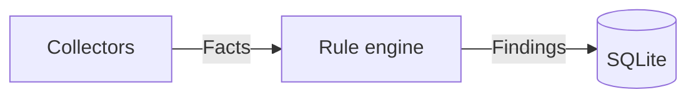

# AGENTS.md

This file provides guidance to AI coding agents working with code in this repository.

## What this is

Bulwark scans a Linux host for security misconfigurations and intrusion indicators using a native Rust rule engine over declarative YAML rules, and explains findings in plain language with a suggested fix. Design rationale, architecture, and alternatives-considered all live in `docs/guide/architecture.md` — read that before making an architectural change, not just this file. Background research grounding the rule checklist (Lynis, MITRE ATT&CK, HackTricks) is in `research/2026-07-11-linux-security-checklist/report.md`.

## Build & development commands

```bash
# Core + CLI
cargo build --workspace
cargo test --workspace
cargo clippy --workspace --all-targets -- -D warnings
cargo fmt --all                        # cargo fmt --all -- --check in CI
cargo run -p bulwarkctl -- scan
cargo run -p bulwarkctl -- rules validate rules/
cargo test -p bulwarkctl --test e2e -- --ignored --test-threads=1   # needs Docker; see below

# GUI (from apps/bulwark-app/)
npm install
cargo tauri dev                        # hot reload for frontend; Rust/tauri.conf.json changes need a restart
cargo tauri build                      # produces .deb, .rpm, .AppImage in target/release/bundle/
npx tsc --noEmit                       # type-check the frontend
npm run lint                           # eslint
npm run format:check                   # prettier --check

# Docs site (from docs/)
npm install
npm run dev                            # local preview
npm run build                          # static build to docs/.vitepress/dist

# Packaging (from workspace root, after a release build)
cargo build --release -p bulwarkctl
cargo deb -p bulwarkctl --no-build       # requires `cargo install cargo-deb`
cargo generate-rpm -p crates/bulwarkctl  # requires `cargo install cargo-generate-rpm`
```

CI (`.github/workflows/ci.yml`) runs fmt-check, clippy `-D warnings`, `cargo test --workspace`, `rules validate rules/`, and a frontend typecheck — run all of these locally before considering a change done.

### Releases

`.github/workflows/release.yml` builds and publishes every artifact: the GUI (`.deb`, `.rpm`, AppImage, via `cargo tauri build`) and the CLI (`.deb`, `.rpm`, tarball). Cutting a release is `git tag v0.1.0 && git push origin v0.1.0`; the workflow refuses to build if the tag disagrees with the workspace version, and it publishes as a **draft** so the assets can be looked at before anything goes public. `workflow_dispatch` runs the whole pipeline without publishing, which is how you rehearse a release without burning a version number.

**Bumping the version — always use `scripts/bump-version.sh`, never edit by hand.** The version is declared in six files that must never disagree (`Cargo.toml`, the `bulwark-core` path-dep pin in `crates/bulwarkctl/Cargo.toml`, both `package.json`s, `apps/bulwark-app/src-tauri/tauri.conf.json`, and the `getVersion` mock in `apps/bulwark-app/src/mocks/tauri/app.ts`), plus `Cargo.lock`. Miss one and you ship a `0.5.0` package whose `--version` prints `0.4.0`, or a tag CI rejects. The script sets all of them and syncs `Cargo.lock`:

```bash
scripts/bump-version.sh 0.5.0     # set every declaration + sync Cargo.lock
scripts/bump-version.sh --check   # verify they already agree (use in CI / before tagging)
```

Then commit (`chore(release): 0.5.0`) and tag. If a new file starts carrying the version, add it to the script's file list — that list is the single source of truth for what a bump touches.

Built on `ubuntu-22.04`, deliberately not `ubuntu-latest`: the oldest glibc linked against becomes the oldest distro the artifacts run on, and `ubuntu-latest` silently raises that floor whenever GitHub re-points it.

### Architectures (x86_64 + aarch64)

Every artifact — CLI and GUI, `.deb`/`.rpm`/AppImage/tarball — ships for **both x86_64 and aarch64**, built **natively** on `ubuntu-24.04` and `ubuntu-24.04-arm` runners (free for public repos). Nothing in the Rust source is arch-specific: no `#[cfg(target_arch)]`, no `std::arch`, no SIMD, no asm, and the only native dependency is `libsqlite3-sys`, which compiles vendored SQLite C. `remote.rs`'s SSH push path was already arch-generic (`compatible_uname_m`, fail-closed on an unknown arch).

**Native, not cross-compiled.** `src-tauri/build.rs` *used to* stage the CLI sidecar from `target/<profile>/bulwarkctl` — the host target dir — so a `cargo build --target aarch64-…` would silently stage an **x86_64** binary under an aarch64 triple's name. That is fixed: it now honours `CARGO_TARGET_DIR` and checks `target/<triple>/<profile>` **first**, so a cross-build can no longer fall back to a stale host binary. Native runners remain the right choice anyway — they are free for public repos, and they are the only way to launch-test a GUI honestly — but the cross-compile footgun itself is gone rather than merely avoided. Likewise the GUI launch test runs on real arm64 hardware rather than qemu: a WebKit GUI under emulation is minutes-per-frame slow and fails on graphics paths no user touches, so a red result would carry no information.

The arch axis reaches **build, packaging, install and launch**: `release.yml`'s `linux` matrix builds both; `verify-install` installs both across the same five distro images; `verify-appimage` link-checks both (its `LD_LIBRARY_PATH` probe takes the GNU multiarch triple from the matrix — hardcoding `x86_64-linux-gnu` would find no bundled libs on aarch64 and then blame the *bundle*); `verify-gui-launch` starts and screenshots the real GUI on both. `ci.yml`'s `test-distros` also runs `cargo test` on both arches, so an aarch64-only regression is a red PR check rather than a release-day discovery. That job asserts `uname -m` matches its matrix cell first — otherwise a wrong or substituted runner label would let every "aarch64" row quietly re-test x86_64 and still pass. Arch is x86_64-only there because there is no official `archlinux` image for arm64 (Arch Linux ARM is a separate distribution).

Two arch traps already cost real time and are now pinned by checks rather than memory:

- **Tauri's bundlers disagree on the arch spelling.** The `.deb` gets Debian's `arm64`, the `.rpm` gets rpm's `aarch64`, and the AppImage has used both. The collect step globs the AppImage on version alone (one per build job, so it is unambiguous) instead of guessing a token that fails the release *after* everything has compiled.
- **`docs/download.md` matched assets by `endsWith(".deb")`.** With one arch that was fine; with two, `find()` returns whichever GitHub lists first, so an x86_64 visitor could be handed the arm64 package — a silent, user-side failure (`package architecture (arm64) does not match system (amd64)`). Every predicate there now pins an arch suffix. Do not loosen them.

**The GUI launch test was strengthened for the arch work, because its strongest check was too weak to carry it.** `scripts/test-gui-packages-docker.sh` judged rendering by counting distinct colours in a screenshot — necessary, but satisfiable by a window that paints its background and chrome while running no application code. On a second architecture that stops being a theoretical gap: **JavaScriptCore ships a separate arm64 JIT**, so "the native shell renders but the JS never executed" is a genuinely arch-specific failure, and a colour count is blind to it by construction. Four checks now close it from independent directions — a **WebKitWebProcess** must exist (the web engine started at all; the Flatpak bug's exact shape, and invisible to every log-based check), a **window titled Bulwark** must be mapped at a usable size (`import -window root` will happily photograph an empty desktop), the display must differ from a **baseline captured before launch** (compared root-to-root, since `compare` *errors* on mismatched dimensions and that error reads as "not zero"), and **OCR must find real text** — the only check that proves the React app mounted rather than that WebKit painted. Plus a known-bad log-signature sweep and a clean-SIGTERM-shutdown assertion, since a teardown crash is one the user meets every single time they close the window. The OCR check is deliberately lenient about *which* text (any known nav label, else ≥30 recognised characters): software-rendered OCR cannot reliably match an exact string, and pinning one would make every UI copy change a release blocker.

Three more arch landmines were found by sweeping for them rather than by anything failing, and all are fixed:

- **`build.rs` ignored `CARGO_TARGET_DIR`.** `stage_cli_sidecar` hardcoded `<workspace>/target`, so any build with that variable set (shared target dir, CI caching) found no CLI and staged the **zero-byte placeholder** — a GUI that builds, installs and launches, and whose privileged path fails only when a user clicks it, behind a single `cargo:warning`. It now honours the override *and* checks the `target/<triple>/<profile>` layout **first**, because a `--target` cross-build would otherwise stage a stale **host-arch** binary under a foreign triple's name. (The shipped artifact was already protected: `verify-install` runs `/usr/bin/bulwark scan` standalone, which an empty or wrong-arch sidecar cannot survive.)
- **The snap downloaded an x86_64 Node tarball unconditionally** — the only fixed-arch prebuilt in the tree (rustup's installer detects the host). Invisible while the only builder was amd64; a bare "cannot execute binary file" the moment anyone built on arm. It now derives from `CRAFT_ARCH_BUILD_FOR`. The snap also gained an explicit `platforms:` key: without one snapcraft builds host-arch-only, so the snap was amd64-only *purely because a workflow said `runs-on: ubuntu-24.04`* — an architecture decision recorded nowhere and enforced by nothing.
- **The PPA was advertised dual-arch and verified on x86_64 only.** `Architecture: any` is correct and Launchpad does build arm64, but `test-ppa.yml` only ever installed the amd64 build — the one "yes" in the channel table with no verification behind it, and the one most likely to rot unnoticed since Launchpad reports per-arch results by email. It is now a two-row matrix on native runners, each asserting `uname -m` before trusting the install.

`scripts/check-packaging-consistency.sh` derives the expected arch lists **from `release.yml`'s build matrix** and asserts them against the AUR `PKGBUILD`, the generated `.SRCINFO`, the COPR spec's `ExclusiveArch`, the PPA's `Architecture: any`, and the snap's `platforms:` — so adding an arch to the release and forgetting a channel is a red check, not silent drift for months. Flathub is checked as a **subset**, deliberately: Flathub builds every arch it declares on its own infrastructure from the Flatpak manifest's own offline sources, so a GUI arch proven by our `.deb` pipeline is *not* proven there; claiming an arch the release never builds is still a hard error. As of 0.9.0 it declares **both** arches — the aarch64 entry is a promise rather than a result, backed by the natively launch-tested arm64 GUI and by offline sources that already carry the arm64 native bindings (`node-sources.json` has `@rolldown/binding-linux-arm64-gnu`), but **no `flatpak-builder --arch=aarch64` run has completed**. If Flathub's aarch64 build fails, narrow it back in `scripts/flatpak-gen-flathub-manifest.sh` rather than leaving a failing arch in a live submission. Widening the COPR spec alone ships nothing — `scripts/publish-copr.sh` selects chroots per arch (naively widening its regex and keeping `tail -3` would have selected three aarch64 chroots and **no x86_64 one at all**, silently dropping the primary architecture while exiting 0). The Snap stays x86_64-only; it is blocked on store approval for unrelated reasons.

The workflow asserts on package *contents* (≥50 rule files in each of the CLI `.deb`, CLI `.rpm`, and GUI `.deb`), not merely that the packaging command exited 0 — `cargo deb`/`cargo tauri build` succeeding only proves the metadata parsed. The CLI's `.rpm` shipped **zero** rules for a while precisely because nothing checked: its asset list had drifted out of sync with the `.deb`'s, and `bulwarkctl` resolves `/usr/share/bulwark/rules` on an installed system, so every invocation failed with "couldn't find a 'rules' directory."

**The GUI ships its own CLI** (this used to be a known gap; it is fixed). The GUI's privileged path shells out to `pkexec <cli> scan --privileged`, so a GUI-only install needs the binary present. It is bundled as a Tauri `externalBin` sidecar named `bulwark` — *not* `bulwarkctl` (would file-conflict with the standalone CLI package's `/usr/bin/bulwarkctl` when both are installed, and clobbers the CLI crate's build output during dev — see `src-tauri/build.rs`) and *not* `bulwark-app` (the GUI binary already owns that name). It covers the `.deb`, the `.rpm` *and* the AppImage; a package dependency could never have fixed the last of those. `resolve_cli_binary` pins the root binary to that sidecar beside `current_exe` (canonicalized, no env/PATH override), and `scan_privileged` passes `--rules-dir` explicitly from the Tauri resource dir. So a GUI-only machine has `/usr/bin/bulwark-app` (GUI) + `/usr/bin/bulwark` (CLI) under lowercase `/usr/lib/bulwark/`, and installing the standalone CLI package alongside adds `/usr/bin/bulwarkctl` with no conflict.

**Open question — the polkit policy is not packaged.** `polkit/com.bulwark.policy` is installed only by running `install-polkit.sh` by hand; no GUI package ships it. That is defensible, because the policy overrides the defaults of the *generic* `org.freedesktop.policykit.exec` action, so installing it changes `pkexec` behaviour for every program on the machine, not just Bulwark — not obviously a package's business. But the consequence is that a plain `.deb`/`.rpm`/AppImage install falls back to the distro default for that action, which on most distros is `auth_admin_keep` — the caching behaviour the policy exists to reject (see the comment in the policy file, and §4/ADR-0004). So the hardening is opt-in, and a user who never runs the script silently gets the weaker posture. Worth an explicit decision: package it, drop it, or say plainly in the README that it is opt-in.

### Publishing to Linux distros (PPA + classic Snap + Flatpak)

Beyond the GitHub-release artifacts, Bulwark can ship on the native app channels. The split is forced by the privilege model — full workflow, caveats, and one-time Launchpad/Store setup are in **`packaging/README.md`**. The confinement table there is the key mental model: a host security auditor needs `pkexec` + host `/etc`, and how much survives depends entirely on the sandbox (`.deb`/AppImage/classic-Snap = full; strict-Snap/Flatpak = degraded).

**Both sandboxed app stores are likely to refuse this application, and that is a structural fact rather than a packaging defect.** Flathub's inclusion policy says *"System utilities which are generally used on host will not be accepted"*; the Snap Store's classic-confinement criteria name *"access to /etc"*, *"direct access to sudo"* and *"direct access to pkexec"* in its **not-supported** list, with no security-tool category among the supported ones. Two near-identical Snap requests (`cybertection-guardbot`, `sentinelscan`) were refused on purely categorical grounds. An app store built on not trusting apps with the host has no natural place for a tool whose purpose is auditing the host. Plan distribution around the unconfined channels — `.deb`/`.rpm`/AppImage/PPA/AUR/COPR already deliver the complete product — and treat Flathub and the Snap Store as speculative. Details, precedents and the exact policy quotes are in `packaging/README.md`; read them before spending time on either channel.

- **CLI → Launchpad PPA** (`ppa:vietanhng/bulwark` — note the Launchpad username `vietanhng` ≠ GitHub `vietanhdev`). A PPA won't take the `cargo deb` binary — Launchpad's build farm compiles the source itself on **network-less** builders, so every crate must travel in the source tarball. `scripts/build-ppa-source.sh` trims the workspace to `bulwark-core` + `bulwarkctl`, `cargo vendor`s the deps, writes a `.cargo/config.toml` redirect, and builds a `3.0 (quilt)` source package that compiles with `CARGO_NET_OFFLINE=true`. Packaging templates live in `packaging/ppa/debian/`. Validated end-to-end (offline build → working `bulwarkctl`; clean `.dsc`, lintian-clean). **The real failure mode is the builder's archive `rustc` lagging the workspace's needs** (noble ships ~1.75) — rehearse in an `sbuild` chroot before uploading, since PPA uploads can't be deleted, only superseded.
- **GUI → classic Snap** (`snap/snapcraft.yaml`). Strict confinement can't `pkexec` or read host `/etc`, which would neuter a host auditor, so it must be `confinement: classic` — which **requires manual Snap Store approval that is unlikely to be granted** (see above; the criteria disallow `/etc`, `sudo` and `pkexec` by name). Snap builds *have* network, so no vendoring there. Two spots need a real `snapcraft` build to verify (marked `TODO(verify)`): the Tauri resource-dir path for the rule pack, and the unpackaged polkit policy (same opt-in caveat as the `.deb` above). If classic is refused, the only strict path is the `system-backup` interface, which relocates every host path under `/var/lib/snapd/hostfs` — a real `bulwark-core` change the CLI build must not inherit, and still no `pkexec` and no host ClamAV. Unlike Flathub, the Snap Store has **no AI-content policy**.
- **GUI → Flatpak/Flathub** (`packaging/flatpak/`, app-id `com.vietanhdev.bulwark`). Widest cross-distro reach, but Flatpak has **no unconfined mode at all**. Flatpak builds offline like the PPA, so both cargo *and* npm deps are pre-generated by `scripts/flatpak-gen-sources.sh` into `cargo-sources.json`/`node-sources.json`. Build validated on real `flatpak-builder 1.4.8` (GNOME 50 runtime): offline build compiles both binaries, WebKitGTK ABI links, and it installs + bundles (`scripts/flatpak-build-local.sh` stages a clean `git archive` tree so the multi-GB `target/` is never copied in — a raw `flatpak-builder` from the repo root recurses into its own build dir, 100+ GB). The old load-bearing limitation — privileged scans couldn't run in the sandbox — **is fixed**: `crates/bulwark-core/src/sandbox.rs` detects `/.flatpak-info` and wraps commands in `flatpak-spawn --host`, so privileged scans and host ClamAV both reach the host (see `collectors/clamav.rs` for the host-binary-missing path). It still depends on a host-installed `bulwarkctl` for the privileged path, and unprivileged config scans work via `--filesystem=host:ro` regardless. Changes to that path still want testing against a live flatpak rather than reasoning alone. **Flathub's linter-exceptions policy refuses sandbox-escape exceptions — `host`, `flatpak-spawn`, arbitrary bus names — where there are "signs of LLM usage in the software", with no mature-project carve-out and a stated penalty of *permanent* denial.** All three of the manifest's lint errors are in that named list, so asking for all three at once and being refused may foreclose a later, narrower request. `flatpak-spawn --host pkexec` specifically was already refused for another app on the merits. Narrow the ask before submitting, if submitting at all.

**CI publishing** — three **manual** (`workflow_dispatch`) workflows, never on tag/push, because a PPA/Snap upload hits a live store and a PPA upload is irreversible: `.github/workflows/publish-ppa.yml` (signed source pkg → `dput`; secrets `LAUNCHPAD_GPG_PRIVATE_KEY`/`LAUNCHPAD_GPG_PASSPHRASE`), `publish-snap.yml` (`snapcore/action-*`; secret `SNAPCRAFT_STORE_CREDENTIALS`), `publish-flatpak.yml` (builds `bulwark.flatpak`, no secrets). The PPA signing key must sign non-interactively: the workflow writes a `passphrase-file` + `pinentry-mode loopback` into `gpg.conf` (the gpg-agent *preset* method fails headless — proven). See `packaging/README.md` "CI publishing" for the secret provisioning and the one-time Launchpad key-import + Snap macaroon steps.

`scripts/bump-version.sh` **does** set `snap/snapcraft.yaml`, along with the AUR `PKGBUILD`/`.SRCINFO` and the COPR spec — ten declarations in total, all verified by `--check`. (It did not always; if you find a note saying otherwise, that note is stale.)

The Flatpak `metainfo.xml` is a special case: the script **checks it but never writes it**. Its `<releases>` block is a changelog, and only a human can write the notes — but Flathub *renders those notes on the store page*, so bumping without adding an entry advertises the previous release to every visitor. `--check` therefore fails until the newest `<release version="…">` matches, and tells you to write the entry. That's a deliberate split: the version declarations are set mechanically, the changelog is refused rather than faked.

### Finding lifecycle (open → resolved)

`Store::persist_and_reconcile` both **adds** and **closes** findings, and the thing that makes closing safe is `ScanRun::rules_evaluated` — the set of rule IDs that demonstrably ran (collector applicable, privileged enough, returned facts without erroring). An open row whose rule is in that set and which the new scan did not re-observe is marked `resolved`: the check ran and no longer fires, so the issue is genuinely fixed. A row whose rule is *not* in that set is left alone, because a skipped/errored collector proves nothing — conflating "skipped" with "passing" is the failure mode this design exists to prevent.

Historically the reconciler could only ever add, never close, so **any remediated issue stayed on the dashboard forever** — recording a FIM baseline left seven "no file-integrity baseline yet" findings on screen permanently even though every subsequent scan came back clean. Regression cover: `a_fixed_issue_is_resolved_once_its_rule_runs_clean`, `a_finding_is_not_resolved_when_its_rule_never_ran`, `resolving_is_per_row_for_a_list_shaped_rule`.

### Database migrations

Schema changes go in `MIGRATIONS` in `crates/bulwark-core/src/store.rs`, versioned via SQLite's `PRAGMA user_version` (`rusqlite_migration`). **Append only** — never edit or reorder a migration that has shipped: a database already stamped at version N will never re-run it, so an edit silently splits users into two different schemas depending on when they first installed. Add a new `M::up` instead.

Databases created before versioning existed report `user_version = 0` and are indistinguishable from a brand-new one by the pragma alone; `baseline_pre_versioning_db` inspects the actual schema to bring them forward. Now that packages ship, a user's database survives across upgrades, so any new migration wants a test proving existing rows survive it (see `a_pre_versioning_db_upgrades_without_losing_data`).

**`rules_evaluated` is persisted (migration `2026-07-19-000000_scan_rules_evaluated`), and its back-fill default is load-bearing.** The field had lived on `ScanRun` in memory only: `persist_and_reconcile` consumed it inside the same call that produced it and then dropped it. That was enough while reconciliation was its only consumer, and stopped being enough the moment compliance scoring needed to answer a question about a *stored* scan. Rows written before the migration back-fill to `'[]'` — **no** evidence, deliberately, because there is no way to recover what actually ran and any richer default would invent a scan result. An empty set makes every mapped control `NotAssessed` and every score `None`, which the GUI renders as "not assessed" rather than as a clean bill of health. Back-filling with the current rule pack would be precisely the "an unprivileged scan scores *higher* than a privileged one" bug that `compliance`'s module docs name as the worst it could have. Cover: `adding_rules_evaluated_preserves_existing_rows` (which reverts the real migration rather than hand-writing an old schema, so the test cannot drift from what the migration does), `rules_evaluated_round_trips_through_the_database`, `a_scan_that_evaluated_nothing_is_stored_as_empty_not_absent`.

### Pre-commit hooks

Native git hooks, not husky/pre-commit-framework, so a pure-Rust contributor never needs Node and a pure-frontend contributor never needs the full Cargo toolchain. One-time setup per clone:

```bash
git config core.hooksPath .githooks
```

Runs gitleaks (staged-secret scan), `cargo fmt --all -- --check` (only if staged `.rs` files), and prettier/eslint/tsc (only if staged files under `apps/bulwark-app/`). Deliberately skips `cargo test`/`cargo clippy` — comprehensive but slow on this workspace; CI is the backstop for those.

### Commit message convention

Every commit message (subject line) must follow [Conventional Commits v1.0.0](https://www.conventionalcommits.org/en/v1.0.0/): `<type>[(scope)][!]: <description>`. `type` is one of `build`, `chore`, `ci`, `docs`, `feat`, `fix`, `perf`, `refactor`, `revert`, `style`, `test`; `!` after the type/scope marks a breaking change. Scope is optional and free-form (e.g. `core`, `docs`, `e2e`, `repo`) — add one when it disambiguates which part of the monorepo changed, skip it when the type alone is clear. The body is unconstrained prose; keep writing the same detailed why-not-just-what commit bodies this project already uses.

Enforced by `.githooks/commit-msg` (same `core.hooksPath` setup as pre-commit above, so no extra install step) — it rejects a non-conforming subject line, and skips validation for `git`-generated `Merge ...` and `Revert "..."` messages. The entire pre-existing history was rewritten to this convention (message-only — file contents and tree hashes are untouched) rather than left inconsistent; the base of that rewrite lives in the repo's public GitHub history now, not as a separate migration commit.

## Documentation is part of the change, not a follow-up

**When you change the code or the architecture, update the docs in the same change.** A design doc
that describes a system which no longer exists is worse than no doc at all: it is confidently
wrong, and the next person believes it. Treat the docs as part of the diff, not as cleanup for
later.

Concretely, when you touch something structural, walk this list:

| You changed… | Update… |
|---|---|
| A module's responsibility, or added one | `docs/guide/architecture.md` (and its diagram) + this file's Architecture section |
| The database schema | `crates/bulwark-core/migrations/` (append-only!) + `schema.rs` + the migration note below |
| A rule, collector, or detector | The rule table in the relevant `docs/guide/*.md` |
| A CLI command or flag | The CLI section of the relevant guide page + `README.md` if it's user-facing |
| Anything a user sees in the GUI | The screenshots (`apps/bulwark-app/scripts/capture-screenshots.mjs`) |
| A new docs page | Its sidebar entry in `docs/.vitepress/config.mts` **and** the OG card list in `docs/scripts/generate-og.mjs` — a page missing from the latter silently previews as the generic homepage card |

**Explain with diagrams, not just prose.** The docs site renders [mermaid](https://mermaid.js.org/)
(via `vitepress-plugin-mermaid`), so a data flow, a state machine, or a decision belongs in a
diagram rather than in three paragraphs the reader has to hold in their head:

````markdown

````

Aim for a diagram that answers "what talks to what, and in which direction" at a glance. Prose then
explains *why* it is shaped that way — which is the part a diagram cannot carry, and the part this
codebase actually cares about.

## Architecture

Cargo workspace, three members:

- **`crates/bulwark-core`** — pure library, zero UI/CLI-specific code. Fact collectors (`src/collectors/`), the condition-DSL parser/evaluator (`src/condition.rs`), the rule-loading + scan engine (`src/engine.rs`), the `Finding`/`Rule`/`ScanRun` model (`src/models.rs`), SQLite persistence (`src/store.rs`). Two features live *outside* the collector/rule-engine model because their work doesn't fit the flat condition DSL: `src/av_scan.rs` (ClamAV) and `src/ai_scan/` (AI-assistant artifact scanning — discovery, secret detection, config detectors, opt-in redaction; its `BLWK-AI-*` "rules" are native Rust detectors defined in `ai_scan/detectors.rs::CATALOG`, not YAML). AI findings persist to their own `ai_scan_runs`/`ai_findings` tables (store migration V4), latest-run-wins rather than reconciled.

  **Compliance standards (`src/compliance/`).** Maps the rule pack onto PCI DSS 4.0.1, the HIPAA Security Rule and ISO 27001:2022, with the control definitions embedded as YAML via `include_str!` rather than living in `rules/` — a control mapping is a *claim this project makes* about someone else's standard, so unlike a rule it is deliberately not user-extensible. Read its module docs before touching it; two invariants there are not style preferences. (1) **"Not assessed" is never "passing"**: a control is only scored when one of its mapped rules is in the scan's `rules_evaluated` set, so a skipped collector excludes the control from the denominator instead of inflating the score. (2) **Every score travels with its scope** — `scope_note`, `mapped_controls`, `catalog_size`, `assessed` — because none of these standards is mostly host-testable and a bare "PCI DSS 87%" is a claim this project cannot support. Surfaced in the GUI by the `compliance_report` Tauri command and the "All checks → Framework compliance" tab. Note what is *not* scored: **CIS may appear only as coverage/mapping, never with a compliance percentage or level**, which CIS's non-member terms forbid; MITRE ATT&CK is a technique taxonomy, not a standard. Both stay in the coverage map with no ratio attached.
- **`crates/bulwarkctl`** — thin CLI front-door (`clap`), package/binary name `bulwarkctl`. `scan`, `rules list`, `rules validate`, `history`, `logs scan`, `ai scan`, `ai redact`, `ssh protect`, and `fix` (autofixes). `scan --ssh [user@]host` scans a **remote** machine over SSH — the CLI shells out to the system `ssh`/`scp` (in `src/remote.rs`, kept out of `bulwark-core` to preserve its no-network invariant), prefers a bulwark installed on the remote else pushes this binary + rule pack to a `mktemp -d` (arch-checked via `uname -m`) and cleans up, then deserializes the remote `scan --json` stdout back into a `ScanRun`. Remote results persist to an **isolated per-host DB** (`~/.local/share/bulwark/remotes/<host>.db`), never the single-host local DB, because reconciliation would otherwise resolve local findings against a remote run.

  **Autofixes (`fix` + `remediation`).** The remediation logic lives in `bulwark-core::remediation` (still network-free, filesystem-only): `permissions.rs` tightens over-permissive modes (never loosens, never follows a symlink, records the prior mode) for `~/.ssh` (user-scoped) and sensitive `/etc` files (root); `sshd.rs` hardens `/etc/ssh/sshd_config` by inserting an idempotent sentinel-delimited block at the **top** of the file (first-value-wins beats any `Include` drop-in), backing up the original and validating with `sshd -t` before keeping it. The `fix` command (`fix list|ssh-perms|etc-perms|sshd|all`) is the front door; all fixers are **dry-run by default** and only apply with `--apply`. The two lockout-risky sshd directives (`PasswordAuthentication no`, `PermitRootLogin no`) are opt-in behind `--include-auth` and excluded from `fix all`. This joins the pre-existing `ssh protect` (bulk key passphrase) and `ai redact` (secret redaction) autofixes.
- **`apps/bulwark-app`** — thin Tauri v2 + React front-door. `scan_start` streams findings over a Tauri Channel; `scan_privileged` shells out to `pkexec bulwarkctl scan --privileged --json` and deserializes the result — it does **not** duplicate collector logic. The AI Security tab (`src/components/AiSecurityView.tsx`, backed by `src-tauri/src/ai_security.rs`) streams an `ai_scan_start` the same way, and runs a periodic background AI sweep (`ai_security::spawn`).

Both front-doors share one on-disk SQLite history (`~/.local/share/bulwark/bulwark.db`) and one rule pack (`rules/`, bundled as a Tauri resource for the GUI, installed to `/usr/share/bulwark/rules` for the CLI's `.deb`).

### Adding a new check

1. If no existing collector produces the fact you need, add one under `crates/bulwark-core/src/collectors/` implementing the `Collector` trait (see any existing collector for the pattern — `is_applicable()` for graceful skip, `requires_privilege()` if it needs root, return one `Fact` row per item for list-shaped data).
2. Register it in `collectors/mod.rs::all_collectors()`.
3. Write a YAML rule under `rules/<category>/BLWK-<CATEGORY>-<NNN>.yaml` (see any existing rule for the exact schema; condition grammar is documented in `docs/guide/architecture.md` §5 — `==` `!=` `in` `contains` `matches` `<` `>` `<=` `>=`, `and`/`or`/`not`, one collector per rule, no cross-collector joins).
4. Run `cargo run -p bulwarkctl -- rules validate rules/` and `cargo test --workspace`.
5. Write a collector unit test with a fixture, **and** — if the rule's condition itself is non-trivial (especially anything with a regex) — a test asserting it does *not* false-positive on a plausible benign input. A backslash-escaping bug in `BLWK-ACCT-001`'s regex once flagged every ordinary `.sh` cron script as critical; it was only caught by testing against a real machine, not by the rule loading without error.

### Privilege model

Two different mechanisms, deliberately: the GUI uses `pkexec` with `polkit/com.bulwark.policy` (`auth_admin`, one prompt per privileged scan — `auth_admin_keep` was dropped because it caches authorization for the *generic* exec action; see `install-polkit.sh`), and the exact root binary is pinned app-side in `resolve_cli_binary` (sidecar-beside-exe only, no env/PATH override); the CLI uses `sudo bulwarkctl scan --privileged` directly and refuses to run privileged without an actual root EUID. `pkexec` depends on a GUI-session-bound polkit agent that's normally absent over plain SSH, which is the whole reason the CLI doesn't use it (`docs/guide/architecture.md` §4, ADR-0004). Don't unify these into one mechanism without re-reading that reasoning.

### End-to-end fixture tests (`crates/bulwarkctl/tests/e2e.rs`)

Collector unit tests prove parsing logic works against a fixture *string*; they don't prove the full pipeline — a real file on a real filesystem, read by the real collector, evaluated by the real rule engine, surfaced in the real CLI's JSON output — actually works together. `tests/e2e/fixtures/<scenario>/` pairs a `Dockerfile` (a known-bad or known-good config baked into `ubuntu:24.04`) with `expected-findings.json` (rule IDs that must appear) and an optional `forbidden-findings.json` (rule IDs that must not). The harness builds the image, mounts the just-built `bulwarkctl` binary and `rules/` into a container, runs a real `bulwarkctl scan --json` via `docker exec`, and checks the result.

**Subset checks, not exact-set equality, on purpose.** A bare `ubuntu:24.04` container has its own baseline of unrelated findings (no ClamAV, no rsyslog, no FIM baseline, default login.defs policy) that have nothing to do with what a given fixture is testing. Kernel/sysctl rules specifically read the *host's* live sysctl values — sysctls aren't containerized/namespaced by default — so they vary by whatever machine actually runs the suite. Don't add new fixtures for kernel-hardening rules; they can't be pinned to a specific expected value this way. SSH/cron/systemd-persistence rules (reading config files/units, not live kernel state) are the right shape for this harness.

**Mutate config with `sed`, not `>>` append.** The collectors use first-occurrence-wins semantics matching how the daemons themselves read their configs — a duplicate directive appended after an already-uncommented one (Ubuntu's stock `sshd_config` ships several directives uncommented already) is silently ignored, not an override. `ssh-hardened`'s Dockerfile has the full replace-or-append pattern to copy for a new fixture.

`#[ignore]`d so plain `cargo test --workspace` stays fast and Docker-independent for contributors who don't have it; CI runs them explicitly in a separate `e2e` job, gated on changes to `rules/`, `crates/bulwark-core/src/collectors/`, or the fixtures themselves (`.github/workflows/ci.yml`).

## Current status (2026-07-12)

Done and verified (not just implemented — actually run, tested, and in most cases packaged and inspected): core engine, CLI, 59 rules across all 11 categories, GUI with a working end-to-end `pkexec` privileged path, real ClamAV virus scanning (now with live streamed progress — see below), file-watcher-based near-real-time monitoring, a compliance view (now with a Lynis-style hardening index score), a History timeline view, file-integrity monitoring, a promiscuous-network-interface rootkit check, real `.deb`/`.rpm`/AppImage builds, a README with a sourced comparison against Lynis/rkhunter/chkrootkit/AIDE/OpenSCAP/Wazuh/CrowdStrike Falcon/SentinelOne, CI pipeline verified locally, a system tray icon (verified live via the real `org.kde.StatusNotifierWatcher` D-Bus registration, not just "no error thrown") so closing the window hides it instead of killing the monitoring loop, and a docs site (`docs/`, VitePress) publishing the architecture doc and research.

**GUI tray + notifications (v0.6.8).** Two desktop-integration fixes. (1) *Empty tray menu on Ubuntu/GNOME.* The code was already API-correct — the menu is retained as an owned clone, and Tauri's own docs say the Linux tray emits no click event and shows its menu on **right-click**, so `show_menu_on_left_click` is a no-op there. The separator was removed (a `PredefinedMenuItem::separator` is a known trouble spot for the GNOME/ayatana dbusmenu, which can render the whole menu empty/truncated), and — the real safety net — `tauri-plugin-single-instance` was added so relaunching `bulwark-app` re-focuses the existing window rather than trapping the user when the window is hidden to a flaky tray. The empty-menu rendering itself couldn't be reproduced headlessly; the single-instance re-focus guarantees the window is always reachable regardless. (2) *Scan notifications.* Background monitoring and the AI sweep already raised desktop notifications on new issues; `scan_start` (the manual "Scan" click) now does too — it captures `persist_and_reconcile`'s newly-appeared findings and shows a completion notification that leads with any new issues, or confirms a clean finish. Needs `notification:default` in `capabilities/default.json` (already present).

**AI-scan CPU blowup (fixed).** An `ai scan` on a real home directory never finished — it pegged half the cores for hours. The cause was not thread count, I/O, or the volume of transcripts: it was the *shape* of the vendored gitleaks patterns. 122 of them open with an optional leading wildcard (`(?i)[\w.-]{0,50}?…`) which denies the `regex` crate a literal prefilter and thrashes the lazy-DFA cache into a slow fallback engine — one rule took **2.9 s** against a single 4 MB transcript where the same rule with that prefix stripped took **0.5 ms**. `secrets::drop_leading_wildcard` strips it at pack-build time (leaving the vendored file pristine and re-syncable with upstream). Whole-machine scan: **>300 s and still running → 1.5 s wall / 9 s CPU** over 1,886 artifacts; on a fixed 50-file corpus, 212 s → 1.1 s of CPU with byte-identical findings. Because the failure mode of a bad rewrite is a scanner that silently stops finding keys, it's pinned by a differential test that compiles both the original and the rewritten form of *every* rule and asserts identical captures, plus explicit guards that leave untouched any pattern whose prefix is actually required. Full reasoning in `docs/guide/architecture.md` §9.

**Redaction destroyed `.env` secrets (data-loss, fixed), then tightened to agent folders only.** A live provider key in a project `.env` was reported with `redactable=true`, so `bulwarkctl ai redact --apply` (and the GUI redact) rewrote the real value to `[bulwark:redacted-secret]` — breaking the project *and* destroying the only copy of the key in that file. A `.env` is the textbook functional secrets file: something reads the value back, so rewriting it in place is pure damage. `redactable` now requires **three** conditions, plus two backstops: (1) `kind_allows_redaction` in `ai_scan/mod.rs` — only genuine *leak surfaces* (`Transcript`, `Instructions`), never `DotEnv`/`McpConfig`/`Settings`/`Tasks`/`CodexConfig`/`Credential`; (2) `path_in_agent_dir` — the file must live **inside a recognized agent directory** (`.claude`, `.codex`, `.cursor`, `.gemini`, `.continue`, `.roo`, `.windsurf`, `.amazonq`), so a leak surface at a project *root* (a bare `CLAUDE.md`, `.cursorrules`, `.aider.chat.history.md`) is reported but never rewritten; (3) the GUI's `redactable_files()` allowlist filters on `f.redactable`; (4) `redact_one` refuses any `.env`/`.env.*` by name. **Gitignored files are skipped entirely** — not scanned, not reported, not redacted (`drop_gitignored`, a batched one-`git check-ignore`-per-repo pre-filter over the discovered artifacts; global `$HOME` state has no repo and is always kept). A gitignored file is one the developer deliberately keeps out of version control, so Bulwark leaves it alone. Non-gitignored secrets are still *reported* everywhere (plus the gitignore-leak check), so the user learns to rotate — only the destructive rewrite is further gated, and only ever inside a tracked agent folder. Proven end-to-end with the real CLI over a 15-file scenario fixture: the `.env` and a root `CLAUDE.md` are left byte-for-byte unchanged, the gitignored `.cursor/rules/gitignored.mdc` is never even reported, and a key in `.claude/commands/notes.md` (plus the tracked `.cursor/rules/r.mdc` sibling) is redacted. Regression cover in `ai_scan/mod.rs`, `ai_scan/redact.rs`, and `bulwarkctl/tests/ai_cli.rs`; recorded as a security invariant.

**A scan that found no rules used to report a clean host (fixed).** Point `--rules-dir` (or `BULWARK_RULES_DIR`) at a path that isn't there — a typo, an emptied directory, a mispackaged build — and `bulwarkctl scan` exited **0** with an empty findings list and no error: rules_loaded 0, rule_load_errors empty, a confident green all-clear from a scan that examined nothing. Worse, the run was persisted, and `persist_and_reconcile` resolves every open finding a scan didn't re-observe, so an empty rule pack would quietly mark the whole dashboard fixed. The log pipeline had guarded this since it shipped (`logs scan` refuses on zero decoders/rules); the config scan never did. Both front-doors now refuse (`rules_loaded == 0` → hard error), and an explicitly-named directory that doesn't exist is an error rather than a silent fallback to the auto-detected pack. Regression cover: `crates/bulwarkctl/tests/rules_dir_guard.rs` (drives the real binary, no Docker). Found by installing the shipped packages and running them, not by review — the same way the rules-resolver bug was found the first time.

**The shipped Flatpak crashed on launch, and every CI check passed (fixed).** `flatpak run com.vietanhdev.bulwark` died immediately: a panic inside `libappindicator-sys`, which `dlopen`s `libayatana-appindicator3` at first use and panics outright when it is absent — and the GNOME runtime ships no appindicator or dbusmenu at all. One line above the panic it also printed `couldn't find a 'rules' directory`, having silently disabled continuous monitoring. Three separate defects, all now fixed: (1) `tray::spawn` is wrapped in `catch_unwind`, because the failure was a *panic*, not the `Err` the existing handler was written for — a missing tray must degrade the tray, never take the app down; (2) `resolve_rules_dir` gained an explicit next-to-exe fallback — the GUI has its **own** resolver, separate from `bulwark-core`'s, and it only checked Tauri's `resource_dir()`, which in the Flatpak layout points at a directory holding no rules; (3) close-to-tray now degrades to a real quit when no tray exists, since hiding a window with no tray to restore it from is worse than closing it.

The reason none of this was caught is the part worth remembering: **every existing check drove `--command=bulwark`, the CLI sidecar** — it shares a directory with the GUI but not a line of its code. "`cargo tauri build` exited 0", "the `.deb` contains 65 rule files", "the AppImage's linkage resolves", and "the sandboxed CLI lists all rules" were *all true* of a build whose GUI could not start. A structural check cannot catch a binary that dies before it draws a window. The manifest comment even said the rules path was "verified" — the CLI had been verified and the GUI *inferred* from it. Cover now exists at both layers: `scripts/test-gui-packages-docker.sh` installs the real `.deb`/`.rpm`/AppImage in clean containers, launches the actual GUI under Xvfb, and fails on any panic, on the missing-rules warning, or on the process dying; `release.yml`'s `verify-gui-launch` job runs it against the just-built artifacts, and `publish-flatpak.yml` launches the real Flatpak GUI the same way (no `--socket` overrides, so a missing runtime library fails in CI rather than on a user's desktop). The `.deb`, `.rpm` and AppImage were all launch-tested retroactively and pass — only the Flatpak was broken, because only it lacks the appindicator library its packaging dependencies supply elsewhere. **Deliberate non-fix:** the five-module `libappindicator` chain (2012-era autotools, four patches) is *not* built into the Flatpak — on GNOME a tray needs a shell extension to be visible anyway, so it is real build fragility for an icon most Flathub users would never see. The Flatpak simply has no tray, and now behaves correctly without one.

**The Flatpak then started but drew nothing — four more sandbox bugs (fixed).** With the crash contained the app launched, logged a resolved rule pack, held its PID, and presented a transparent, empty window carrying `GDBus.Error:org.freedesktop.portal.Error.NotAllowed: This call is not available inside the sandbox`. Causes, in the order they were found: (1) **`tauri-plugin-single-instance` claims a session-bus name at startup and a sandbox refuses any name the manifest hasn't declared** — it is registered *first*, so the denial lands before a UI exists to report it in ([Tauri documents this exact case](https://v2.tauri.app/plugin/single-instance/#usage-in-snap-and-flatpak)); the name derives from `tauri.conf.json`'s **identifier**, not the Flatpak app-id, and at the time those read `vietanhnv` and `vietanhdev` respectively — both individually correct, and unverifiable by eye. (The identifier has since been renamed to `com.vietanhdev.bulwark`, so the two now agree; `check-packaging-consistency.sh` asserts that equality rather than trusting it.) (2) **`--own-name` listed before `--talk-name` is silently downgraded**: both write the same metadata key, the last wins, and `own` outranks `talk`, so the manifest read correctly, the build succeeded, the permission appeared in `flatpak info`, and the plugin still couldn't claim the name. (3) **WebKitGTK renders nothing** without `WEBKIT_DISABLE_DMABUF_RENDERER` / `WEBKIT_DISABLE_COMPOSITING_MODE` (tauri#8970, #10626) — which hid because `scripts/test-gui-packages-docker.sh` sets both, so every other package rendered under test. (4) `reveal`/`open` used routes the sandbox rejects; both now go through `/usr/bin/xdg-open`, and privileged scans explain themselves instead of failing on a missing `pkexec`.

Two process lessons cost more time than any of the bugs. **`pkill -f <app-id>` and `flatpak kill <app-id>` also kill an in-progress `flatpak-builder`** (the build runs in a sandbox under the same app ID) — it surfaces as `Child process exited with code 137` and then as a rerun that installs nothing while the previous good install still launches. So **an install that silently didn't happen is indistinguishable from a fix that didn't work**: two manifest fixes were reported as ineffective when they had never reached the installed build. Always diff the *built metadata* against what the manifest asked for (`flatpak info --show-permissions`), never the build's exit code — that is also the only thing that exposed bug (2). Both traps are written up in `packaging/README.md`.

Prevention is `scripts/check-packaging-consistency.sh` (CI job `packaging`): a static, build-free check that derives the D-Bus name from the identifier and asserts it in both the Flatpak and Snap manifests, asserts the `own`-after-`talk` ordering, the two WebKit env vars, that the rule pack is still installed, that all ten version declarations agree (it caught real drift on its first run), and — added with the arch work — that the **architectures** agree across all six distro channels, derived from `release.yml`'s build matrix (see the Architectures section above). Each assertion was verified non-vacuous by breaking it deliberately. The GUI launch test also gained pixel-level assertions, because every prior check passed on an app that rendered nothing: it started with a distinct-colour count and now additionally requires a live `WebKitWebProcess`, a mapped window of usable size, a pixel difference against a pre-launch baseline, and real on-screen text via OCR.

**Secret-pack validation (new, and it found three real bugs).** The pack had 262 vendored regexes and no test that any individual rule still *worked* — `every_bundled_rule_compiles` proves a pattern parses, not that it can catch its own key. Two tests now close that, modelled on gitleaks' `Validate(rule, tps, fps)`: true positives are **generated from each rule's own pattern** (`rand_regex`, the same trick as gitleaks' `secrets.NewSecret`) so every rule gets a real sample and no secret-shaped literal is ever committed; false positives are **vendored from gitleaks** (`crates/bulwark-core/tests/data/gitleaks_false_positives.toml`, 378 fixtures across 79 rules — regenerate with `scripts/extract-gitleaks-fixtures.py`). Their first run failed, and every failure was a genuine defect: (1) **the pack's allowlists were never parsed**, so every rule inherited gitleaks' false positives without gitleaks' suppression — the data was sitting in `secret_rules.toml` and nothing read it; (2) one allowlist regex **silently failed to compile** (gitleaks writes RE2, where a literal `{{` is legal, and Rust's `regex` rejects it) and was dropped by a `filter_map(…ok())` — which is why `curl -u "${{ env.PASS }}"` kept being reported as a leaked credential, and why `every_allowlist_regex_compiles` is now an assertion: a dropped allowlist is a *silent false positive*; (3) **`path` conditions were ignored**, so `nuget-config-password` (a rule about `nuget.config` files) ran against every chat transcript. Net effect on a real home directory: ten fewer false positives, every one a placeholder or a test fixture quoted inside a transcript, with no true positive lost. Full reasoning in `docs/guide/architecture.md` §9.

**Earlier pass** (rule expansion + 3 real bugs found and fixed by dogfooding, not by review): 7 more rules mined from this project's own Lynis benchmark (banners, min password age, login.defs hashing-rounds/umask, process accounting, rare-protocol/usb-storage module blacklisting, GRUB password), each sanity-checked against this machine first. Along the way: (1) the banner heuristic missed `/etc/issue.net` entirely (no getty escape codes there, unlike `/etc/issue`) until a live scan showed only 1 of 2 expected findings; (2) a real, more serious bug — `persist_and_reconcile` matched on exact-string context equality, so extending `login_defs.rs` with two new fields silently broke reconciliation for the *existing* `BLWK-ACCT-002` rule and produced a duplicate row on the next scan; fixed by making the identity check a subset-match (`store::is_context_subset`) instead of exact equality, with regression tests covering both "collector gains a field" and "list-shaped collector's rows must still not merge"; (3) list-shaped rules (`BLWK-BANN-001`, `BLWK-KERNEL-020`, all `BLWK-FIM-*`) shared identical titles across genuinely distinct findings, reading as duplicates in the UI even though storage was correct — fixed by extending `{{ }}` templating to `title`, not just `explain`. Also fixed: switching sidebar tabs used to unmount the active view and lose any in-progress scan state (App.tsx now keeps visited views mounted, hidden via CSS, instead of conditionally rendering); ClamAV scanning now streams live per-file progress over a Channel instead of blocking silently for minutes; five views (Rules/Compliance/Monitoring/History/Antivirus) were widened and restructured into responsive grids instead of a narrow centered column; Threats was renamed to Antivirus and paired with proactive ClamAV status.

Deliberately deferred as v1 non-goals (`docs/guide/architecture.md` §2, §13 Option C) — not gaps, decisions: real-time eBPF/syscall monitoring, and sandboxed untrusted-code execution / an agent framework. The architecture (crate boundaries, the `Collector` trait, Channel-based event streaming) is shaped so either could become a new workspace member later without a rewrite, but neither should be started without its own design doc first — sandboxing especially, since a rushed implementation of a security-isolation boundary is a worse outcome than not having the feature.

Not yet done, and genuinely open (as opposed to the above): visual/animation polish pass per `docs/guide/architecture.md` §16 (motion currently exists but hasn't had a dedicated tuning pass); rule-signing/provenance story for community-contributed rules (needed before any "install rules from the internet" feature, not before that); an `sshd -T` (effective-config, defaults-resolved) collector path — the current `sshd_config` collector only sees directives explicitly written to the file, so a directive relying on its OpenSSH-compiled-in default is invisible to every SSH rule, including the new ones. Not implemented because it needs a real `sshd` binary to verify against and this dev environment has none installed — a real gap, not an oversight, and worth a dogfooded pass on a machine that actually runs sshd before landing it (mapping `sshd -T`'s smashed-together lowercase keys like `clientaliveinterval` to this codebase's snake_case field names is exactly the kind of silent-mismatch risk the `to_snake_case` bug already burned once).

## Rules

- Never add an AI/agent co-author to git commits — human contributor only.
- Don't commit or push unless explicitly asked, even mid-task — this project's history includes long unattended implementation stretches; committing without being asked is not an exception to make just because a lot of work happened.
- Before trusting that packaging works, actually build the artifact and inspect its contents (`dpkg-deb --contents`) or run it — `cargo deb`/`cargo tauri build` succeeding only proves the metadata is syntactically valid, not that the runtime paths inside it are correct. This caught a real bug once (`bulwarkctl`'s rules-directory resolver only worked inside the dev workspace, not when installed).
- A collector or rule that fails should be visible (a `CollectorError`, a `RuleLoadError`, a `privileged_collectors_skipped` entry) — never a silent drop. This is a hard invariant, not a style preference; see `docs/guide/architecture.md` §8.
- `bulwark-core` has zero UI/CLI-specific code and no network calls. Keep it that way — both front-doors' value depends on staying thin wrappers over one real engine, and the no-network-calls invariant is load-bearing for the "fully local, no telemetry" claim in `docs/guide/architecture.md` §10.
