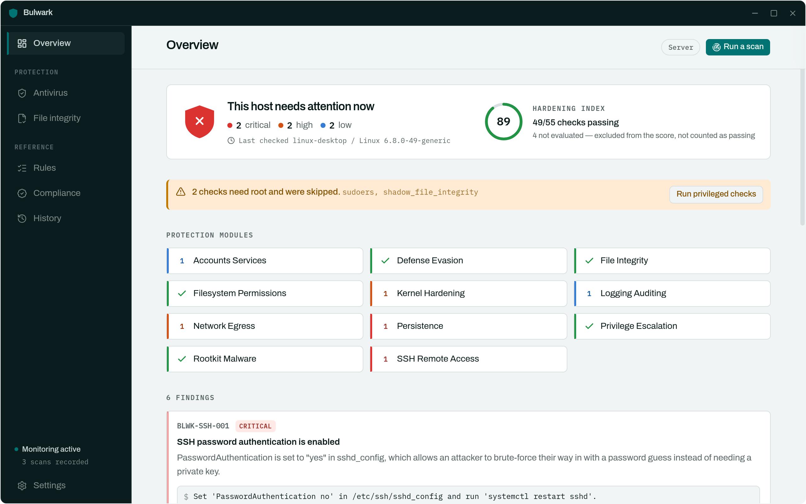
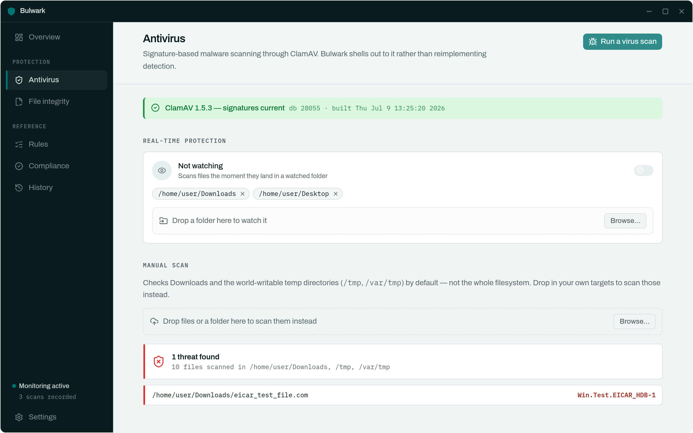
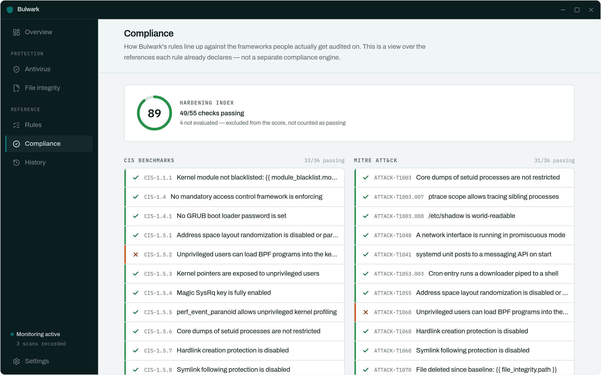
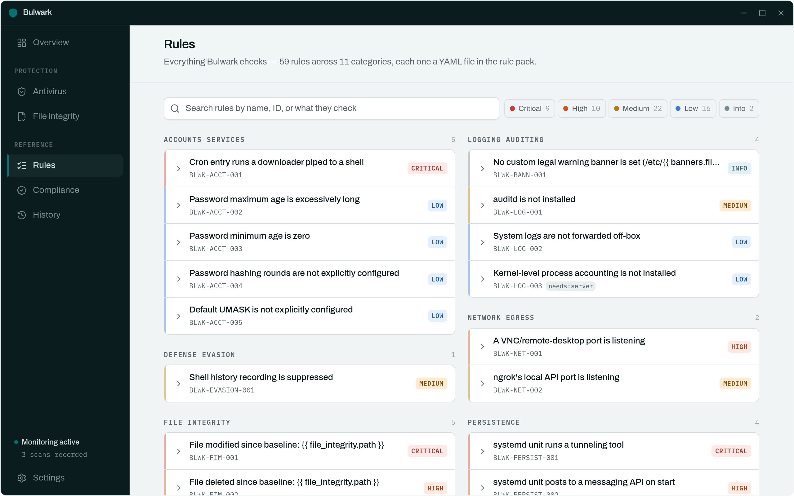

# Bulwark

[](https://github.com/vietanhdev/bulwark/actions/workflows/ci.yml)
[](LICENSE)
[](https://bulwark.nrl.ai)

A Linux host security scanner with a native CLI and desktop GUI, built for everyone running
Linux — desktops and servers alike. Bulwark checks a machine's configuration against a
declarative rule pack — SSH hardening, systemd/cron persistence, sudoers, kernel/sysctl
hardening, file permissions, logging, rootkit indicators — and explains every finding in plain
language with a concrete fix, alongside real ClamAV virus scanning and continuous background
monitoring.

Built with Tauri v2 + Rust + React. One rule engine, one rule pack, two front-doors: `bulwarkctl`
(CLI) and the desktop app.

## Screenshots






## Features

- **59 rules** across 11 categories (SSH/remote access, persistence, network egress, kernel
  hardening, filesystem permissions, privilege escalation, logging/auditing, accounts/services,
  defense evasion, rootkit/malware, file integrity), each carrying a severity, a plain-language
  explanation with live values interpolated in, a one-line fix, and CIS/MITRE ATT&CK references.
- **Antivirus scanning** — shells out to a real ClamAV `clamscan` on demand, plus a fast
  presence/database-freshness check on every routine scan.
- **Continuous monitoring** — a periodic re-scan loop (default 15 min) plus a filesystem watcher
  on the specific sensitive paths the rule pack actually reads (sshd_config, systemd units,
  sudoers, cron, `authorized_keys`), so an edit to one of those triggers an immediate re-check
  instead of waiting for the next tick. Findings are reconciled across runs so recurring issues
  don't duplicate, and genuinely new findings raise a desktop notification.
- **Compliance view** — every rule's CIS/MITRE ATT&CK references are cross-referenced against
  open findings to show pass/fail coverage per framework.
- **Two front-doors, one engine** — everything above is available identically from the CLI
  (scriptable, cron-friendly, JSON output) and the GUI (dashboard, live scan streaming, one-click
  privileged re-scan via polkit).
- **Extensible by design** — new checks are YAML files with a small condition DSL
  (`==`, `!=`, `in`, `contains`, `matches`, `<`/`>`/`<=`/`>=`, `and`/`or`/`not`), not Rust code.
  No plugin API to learn.

## How it compares

Bulwark fills a specific gap: a *desktop-native, continuously-monitoring* host scanner with a
real GUI — most established open-source Linux auditors are CLI-only, snapshot-style tools, and
most tools with a real-time/EDR story are commercial, cloud-connected, and built for fleets, not
a single desktop.

| Tool | Type | Scope | GUI | Continuous | Compliance mapping | Remediation |
|---|---|---|---|---|---|---|
| **Bulwark** | Open source | Host config audit + AV + basic rootkit indicators | ✅ native desktop | ✅ periodic + file-watch | ✅ CIS/ATT&CK per rule | Plain-language fix hint |
| [Lynis](https://github.com/cisofy/lynis) | Open source | Host config audit, ~300+ checks across boot, filesystem, network, auth, kernel[^1] | ❌ CLI-only[^1] | ❌ on-demand/cron only[^1] | Partial (HIPAA/ISO27001/PCI DSS via Enterprise)[^1] | Suggestions in report, no auto-fix |
| [rkhunter](https://rkhunter.sourceforge.net/) / [chkrootkit](https://github.com/Magentron/chkrootkit) | Open source | Rootkit/backdoor signature detection[^2] | ❌ CLI-only | ❌ on-demand/cron only | ❌ | Detection only, no remediation[^2] |
| AIDE | Open source | File-integrity monitoring (checksummed baseline vs. current state) | ❌ CLI-only | ❌ on-demand/cron only | ❌ | Detection only |
| [OpenSCAP](https://www.open-scap.org/) / CIS-CAT | Open source | Standardized compliance scanning (CIS, DISA STIG, PCI-DSS) against SCAP content[^3] | Partial (SCAP Workbench) | ❌ on-demand/cron only | ✅ Primary purpose[^3] | ✅ Ansible/Bash remediation scripts[^3] |
| [Wazuh](https://wazuh.com/) | Open source | Full XDR/SIEM: FIM, rootcheck, log analysis, SCA, ClamAV/YARA/VirusTotal integration[^4] | ✅ web dashboard (needs a manager+indexer stack) | ✅ real-time agent | ✅ built-in SCA | Active-response scripting |
| CrowdStrike Falcon | Commercial | Cloud-native EDR — IOA/behavioral analytics, threat hunting, vulnerability mgmt[^5] | ✅ cloud console | ✅ real-time, cloud-dependent | Enterprise add-ons | Automated response |
| SentinelOne Singularity | Commercial | Local AI-driven EPP+EDR, autonomous response, rollback[^5] | ✅ cloud console | ✅ real-time, works offline | Enterprise add-ons | Automated response + rollback |

**Where Bulwark sits**: closer to Lynis in scope (a single-host config auditor, not a fleet-wide
SIEM) but with the desktop-native GUI, continuous file-triggered re-checks, and antivirus
integration that Lynis intentionally doesn't provide[^1]. It doesn't attempt Wazuh's or the
commercial EDR platforms' real-time syscall/process telemetry — that's real-time *kernel-level*
monitoring (eBPF-class), which is a deliberate v1 non-goal (see the design doc, §2 and §13
Option C) rather than a gap nobody noticed. It also doesn't do AIDE-style cryptographic
file-integrity baselining or Wazuh/rkhunter-style rootkit signature databases beyond a small,
targeted set of persistence/rootkit indicator rules — those are natural, scoped directions for
the rule pack to grow into, not architectural blockers.

[^1]: [Lynis on GitHub](https://github.com/cisofy/lynis) — CLI/agentless tool, plugin-extensible, HIPAA/ISO27001/PCI DSS compliance testing via CISOfy Enterprise.
[^2]: [Chkrootkit and rkhunter: rootkit detectors for Linux](https://www.fgfgo.com/chkrootkit-and-rkhunter-best-free-rootkit-detectors-for-linux-2026/) — signature/heuristic detection tools, not remediation tools; commonly run together for coverage.
[^3]: [Red Hat: CIS compliance in RHEL using OpenSCAP](https://www.redhat.com/en/blog/center-internet-security-cis-compliance-red-hat-enterprise-linux-using-openscap) — SCAP-standardized scanning with CIS/STIG/PCI-DSS profiles and Ansible/Bash-based automated remediation.
[^4]: [Wazuh platform overview](https://wazuh.com/platform/overview/) and [Wazuh malware detection](https://opennix.org/en/docs/wazuh/capabilities/wazuh-malware-detection/) — FIM (scheduled/real-time/who-data modes), rootcheck, ClamAV/YARA/VirusTotal-integrated malware detection, SCA compliance module.
[^5]: [SentinelOne vs. CrowdStrike](https://www.sentinelone.com/vs/crowdstrike/) and [CrowdStrike Falcon EDR](https://www.crowdstrike.com/en-us/compare/crowdstrike-vs-sentinelone/) — CrowdStrike is cloud-native/cloud-dependent for analytics; SentinelOne's agent runs detection locally and works offline.

## Quick start

```bash
# Core + CLI
cargo build --workspace
cargo run -p bulwarkctl -- scan

# GUI (from apps/bulwark-app/)
npm install
cargo tauri dev
```

See [`AGENTS.md`](AGENTS.md) for the full command reference, and
[`docs/guide/architecture.md`](docs/guide/architecture.md)
for architecture, data model, and the alternatives considered before landing on this design.

## Adding a rule

Rules are YAML files under `rules/<category>/`, no Rust required:

```yaml
id: BLWK-SSH-004
title: SSH X11 forwarding is enabled
category: ssh-remote-access
severity: low
collector: sshd_config
condition: x11_forwarding == "yes"
explain: "X11Forwarding is set to \"{{ sshd.x11_forwarding }}\" in sshd_config..."
fix: "Set 'X11Forwarding no' in /etc/ssh/sshd_config and run 'systemctl restart sshd'."
references: [CIS-5.2.4]
```

See `AGENTS.md`'s "adding a new check" section for the full workflow, including the condition
grammar and testing expectations.

## License

AGPL-3.0-or-later — see [`LICENSE`](LICENSE). Contributions are covered by a lightweight CLA;
see [`CONTRIBUTING.md`](CONTRIBUTING.md).
