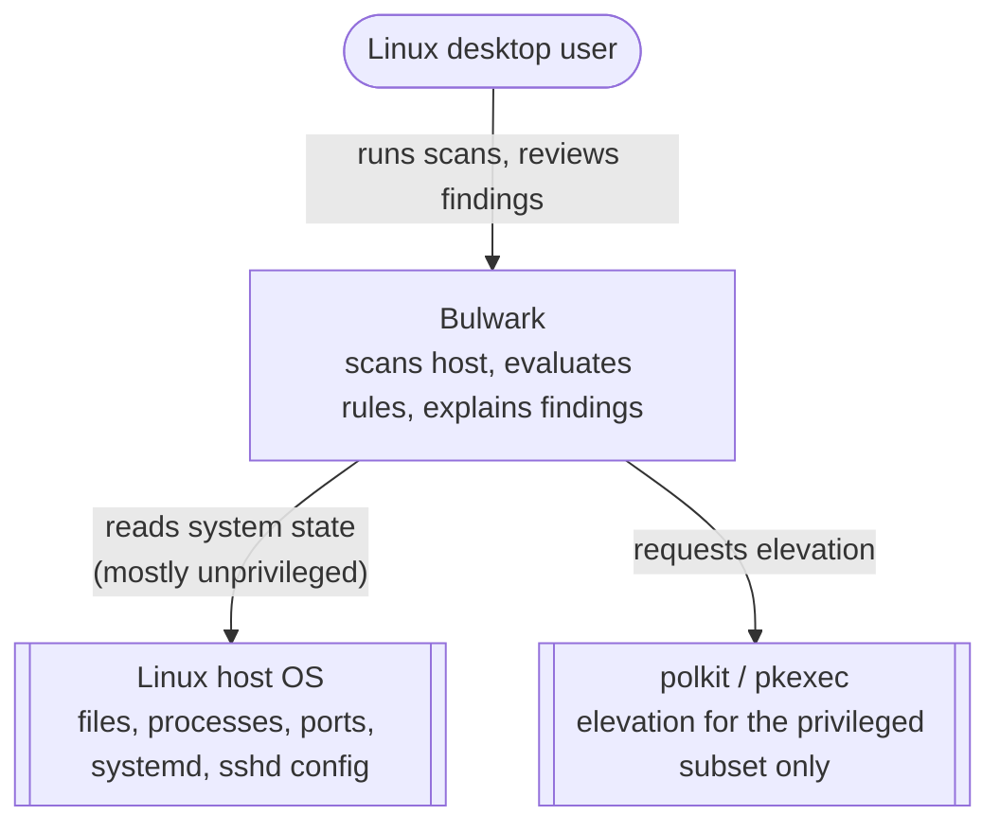
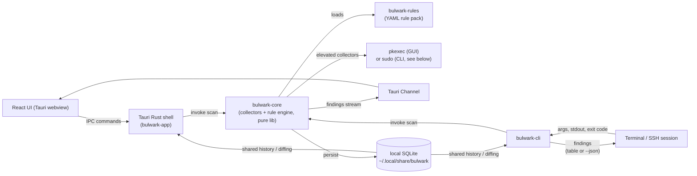
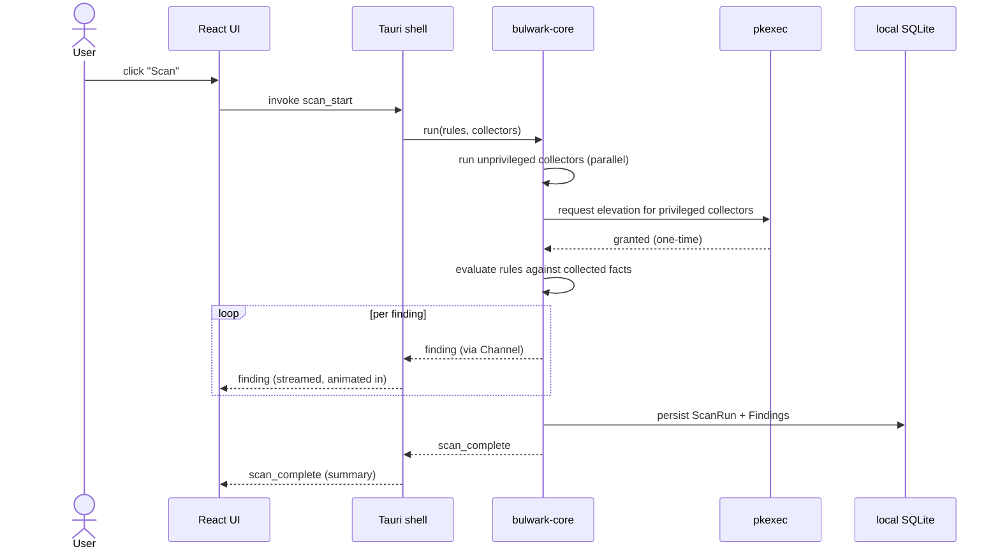

# Bulwark — Linux Host Security Scanner

> **Status:** Draft • **Author:** vietanhdev (with Claude) • **Date:** 2026-07-11 • **Reversibility:** hours (pre-v1, no users, no shared state) — becomes weeks-tier once the rule-file format ships to real users, since format changes then break community-contributed rules.

## TL;DR

Bulwark is a Tauri + Rust desktop app that scans a Linux host for security misconfigurations, intrusion indicators, and hardening gaps, using a native Rust engine that evaluates declarative YAML rules against collected system facts, then explains findings in plain language with a one-line fix. The single most important design decision: rules are native and declarative (a Sigma/Falco-style condition DSL), not a wrapper around Lynis/rkhunter — so the rule set can grow without recompiling, stays open to community contribution, and can cover attack patterns (like tunnel-service egress) that no existing tool names as a control.

---

## 1. Problem

### What's broken today
Linux desktops are compromised through a well-worn, well-documented playbook: persistence via a rogue systemd unit tunneling remote access out through a service like ngrok, a remote-desktop service (VNC) left exposed with no password, SSH brute-forced after password auth gets quietly re-enabled, browser/OS-keyring credential theft, and exfiltration of cloud and API secrets sitting in plaintext `.env` files and shell history. Every one of these leaves static, after-the-fact traces — but is rarely caught *at the time*, because the tools that could catch it (Lynis, rkhunter, auditd, Wazuh) are individually solid yet CLI-only, snapshot-oriented, and not something a non-SOC developer actually installs and reads day to day. The gap isn't detection technology — it's that none of it is a friendly, GUI-native tool this audience will actually run.

### Who feels it
- **Primary:** solo Linux desktop developers/power users — no SOC, no existing HIDS deployment, technical enough to act on a finding once it's explained.
- **Secondary:** future OSS adopters with the same profile, across more distros than just Debian/Ubuntu.

### Why now
The research groundwork is already done — a checklist grounded in Lynis's 46 test categories, MITRE ATT&CK, and HackTricks/linPEAS (`research/2026-07-11-linux-security-checklist/report.md`) is directly enumerable into rules today. The marginal cost of starting now vs. later is pure execution time, not more research.

---

## 2. Goals and non-goals

### Goals (ranked)
1. **Catch real-world intrusion indicators with plain-language, actionable output** — breadth grounded in established frameworks (Lynis, MITRE ATT&CK Persistence/Credential Access/Defense Evasion, HackTricks/linPEAS), not a narrow, ad hoc list. See the research report.
2. **Be genuinely usable by a non-SOC developer** — GUI-native, explains *why* a finding matters and *how* to fix it.
3. **Ship as a real, installable, personal-tool-first OSS project** — matches the packaging bar of [ThinkUtils](https://github.com/vietanhdev/ThinkUtils) (`.deb`/`.rpm`/AppImage, apt repo) — a separate, already-shipped project by the same author, referenced throughout this doc as a *pattern to replicate independently*, not a code dependency — without needing a team to maintain it.

### Non-goals (explicit)
- Real-time eBPF/syscall monitoring in v1 (Falco-class complexity) — v1 is on-demand/periodic scanning, "Lynis with a GUI."
- A full EDR/antivirus replacement — shells out to the system's own ClamAV installation for signature-based malware (the same integration pattern ThinkUtils uses, applied independently here) rather than reimplementing it.
- Wrapping Lynis/rkhunter as a backend — native Rust checks only (§13, Option A).
- Multi-OS support (macOS/Windows) in v1 — Linux desktop only, Debian/Ubuntu-first packaging.
- A hosted/cloud dashboard or telemetry phone-home — fully local, no data leaves the machine, ever.
- **Sandboxed untrusted-code execution and autonomous "agents" are explicitly out of v1 scope**, but the architecture (crate boundaries, a generic executor pattern, Channel-based event streaming) is deliberately shaped so adding them later is a new workspace member, not a rewrite. See §4 and §14.

### Success metrics
- **Rule coverage** — v1 ships rules across all 11 categories in the research checklist, not a narrow slice.
- **Time-to-first-finding** — an unprivileged baseline scan completes and renders results in under 10 seconds; this explicitly excludes any time spent on a human entering a `pkexec`/`sudo` password, which is outside the app's control (see §10).
- **Dogfooding** — a fixture set of known attack-pattern indicators (rogue systemd persistence, exposed VNC, re-enabled SSH password auth, browser credential exposure, etc.) is encoded as rule unit tests and run against the author's own machines; all must be correctly flagged before v0.1 ships.

---

## 3. Constraints

| Constraint | Value / limit |
|------------|---------------|
| Deadline | None fixed — personal tool sharpened into OSS, no external deadline pressure |
| Team / headcount | Solo-maintained (author + AI pair-programming) |
| Budget | $0 — OSS; distribution via GitHub Releases + a self-hosted apt repo (mirrors ThinkUtils' `gh.vietanh.dev` pattern) |
| Existing stack | Tauri + Rust backend, React + Vite frontend (matches ThinkUtils' eslint/prettier/stylelint/husky toolchain). Cargo workspace ships both a GUI (`bulwark-app`) and a CLI (`bulwark-cli`) over the same `bulwark-core` library, so headless/SSH-only boxes are scannable without a display session. |
| Compliance / security | No formal compliance target, but findings reference CIS/MITRE ATT&CK IDs where applicable, leaving headroom for compliance-mapping later |
| SLA | None — desktop app, no uptime commitment |

---

## 4. High-level architecture

### System context (C4 L1)



### Container view (C4 L2)



**`bulwark-core` has zero UI/Tauri/CLI-specific code.** Both `bulwark-app` (Tauri GUI) and `bulwark-cli` are thin front-doors over the same library crate — same collectors, same rule engine, same `Finding`/`Rule`/`ScanRun` model, same local SQLite history. A scan run from the CLI shows up in the GUI's history and vice versa, since they share one on-disk store rather than each keeping their own. This also means the CLI can ship and be dogfooded before the GUI is polished, and it's the only form factor that can reach a headless box (`ssh host 'bulwark scan'`) — the case that matters most for catching lateral movement on a local network.

**Privilege model decision:** the GUI uses `pkexec` with a bundled polkit policy (`auth_admin_keep`, mirroring ThinkUtils' `install-polkit.sh` pattern) so a session only prompts once. The CLI does **not** use `pkexec` — `pkexec` depends on a running polkit authentication agent, which is normally GUI-session-bound and typically absent on a box reached only over SSH. Instead `bulwark-cli` requires the elevated subset to be run as `sudo bulwark scan --privileged`; unprivileged checks run either way without elevation. This is a deliberate, resolved decision, not an open question — `sudo` has no GUI-agent dependency and is the one elevation path guaranteed to work identically in a local terminal and over plain SSH.

**Future extension seam (not built in v1):** `bulwark-sandbox` and `bulwark-agent` are reserved as future workspace members. `bulwark-core`'s executor and event-streaming pattern (a Tauri Channel for the GUI, a plain iterator/stream for the CLI) is written generically enough that a sandboxed-execution job or an agent action could plug into the same pattern instead of requiring a parallel system — see §14.

---

## 5. Data model

```
Finding
  id            uuid        primary key
  rule_id       text        references Rule.id (e.g. "BLWK-SSH-001")
  severity      enum        critical | high | medium | low | info
  title         text        not null
  explanation   text        plain-language, rendered from the rule's template
  fix_hint      text        suggested command or action
  context       json        raw fact snippet that triggered the rule
  first_seen    timestamptz not null
  last_seen     timestamptz not null
  status        enum        open | acknowledged | resolved
  scan_run_id   uuid        references ScanRun.id

ScanRun
  id                uuid        primary key
  started_at        timestamptz not null
  finished_at       timestamptz
  host_fingerprint  text        hostname + kernel version, for future multi-host history
  rules_loaded      int
  rules_failed      int         rules that failed to parse/load (surfaced, never silent)
  collectors_failed int         collectors that errored or timed out (surfaced, never silent)

Rule (YAML source, not DB-stored — modeled here for the engine's sake)
  id            text    e.g. "BLWK-SSH-001"
  title         text    short, human-readable — becomes Finding.title
  category      text    one of the 11 research-checklist categories
  severity      enum
  collector     text    which fact-collector produces the fact this rule reads
  condition     expr    boolean condition over that collector's output fields (grammar below)
  explain       text    plain-language template, can interpolate condition fields
  fix           text    suggested command/action
  references    list    CIS / MITRE ATT&CK IDs
```

### Condition grammar (v1)

A condition is a boolean expression over the named fields a collector produces — no cross-collector joins in v1 (one rule reads one collector's output; matches Sigma's per-logsource scoping). Grammar: field references (`sshd.password_authentication`), comparison operators (`==`, `!=`, `in`, `contains`, `matches` for regex, and `<` `>` `<=` `>=` for numeric thresholds like password-aging policy), and boolean combinators (`and`, `or`, `not`), parenthesized for precedence — deliberately a subset of Falco's filter syntax, not a new language.

```yaml
id: BLWK-SSH-001
title: SSH password authentication is enabled
category: ssh-remote-access
severity: critical
collector: sshd_config
condition: sshd.password_authentication == "yes"
explain: >
  PasswordAuthentication is set to "{{ sshd.password_authentication }}" in sshd_config,
  which allows brute-force login attempts.
fix: "Set 'PasswordAuthentication no' in /etc/ssh/sshd_config and restart sshd."
references: [CIS-5.2.10, ATTACK-T1110]
```

A collector's output is a flat map of fields (`{password_authentication: "yes", permit_root_login: "yes", ...}`), so writing a new rule against an existing collector never touches collector code, only YAML. Collectors that produce lists (listening ports, cron entries) expose them the same way, evaluated one row at a time.

### Access patterns
- **Read path:** the UI/CLI queries the latest `ScanRun`'s findings, grouped by severity/category; prior runs are diffed to show new-vs-resolved findings over time.
- **Write path:** the scan engine emits `Finding`s over a stream as they're produced (streamed, not batched); on completion, findings are persisted to local SQLite in one transaction.
- **Index strategy:** local SQLite (`rusqlite`), indexed on `(rule_id, status)` and `(scan_run_id)` — single-host scale, at most a few thousand rows; nothing heavier is needed.

---

## 6. API / contracts

There's no network API — the "client" and "server" are the same process, exposed two ways.

### Tauri IPC commands (GUI)

| Command | Purpose | Auth |
|---------|---------|------|
| `scan_start` | Kick off a scan; streams findings via Channel as they're produced | none (local single-user) |
| `scan_get_history` | List past `ScanRun`s | none |
| `finding_get_by_run` | Fetch findings for a given run | none |
| `finding_update_status` | Mark a finding acknowledged/resolved | none |
| `rule_list` | List loaded rules (built-in + user-added), including any that failed to load | none |
| `privileged_collect` | Runs the subset of collectors that need root, via `pkexec` | polkit prompt |

### CLI commands (`bulwark-cli`)

| Command | Purpose | Exit code |
|---------|---------|-----------|
| `bulwark scan` | Run unprivileged checks only, print a table to stdout | `0` clean, `1` findings ≥ medium, `2` findings ≥ critical (CI-friendly) |
| `bulwark scan --privileged` | Full scan; must be run under `sudo` (see §4) | same as above |
| `bulwark scan --json` | Same as `scan`, machine-readable output | same as above |
| `bulwark rules list` | List loaded rules, including load failures | `0` / `1` if any rule failed to load |
| `bulwark rules validate <path>` | Lint a rule file without running a scan (used in CI for the bundled pack) | `0` valid / `1` invalid |
| `bulwark history` | List past `ScanRun`s (shared with the GUI's history) | `0` |

There is no traditional authn/authz layer — this is a single-user local app; the OS login session is the trust boundary, and `pkexec` (GUI) / `sudo` (CLI) are the only elevation gates (see §10).

### Streamed event shape
```json
{
  "event": "finding",
  "data": {
    "rule_id": "BLWK-SSH-001",
    "severity": "critical",
    "title": "SSH password authentication is enabled",
    "explanation": "PasswordAuthentication is set to 'yes' in sshd_config, which allows brute-force login attempts.",
    "fix_hint": "Set 'PasswordAuthentication no' in /etc/ssh/sshd_config and restart sshd.",
    "context": { "file": "/etc/ssh/sshd_config", "line": 42, "value": "yes" }
  }
}
```

### Error shapes
Collector failures (e.g. `sshd_config` unreadable, elevation denied) surface as explicit `collector_error` events alongside findings, never a silent drop — a check that fails silently is worse than a check that doesn't exist, because it creates false confidence.

---

## 7. Sequence flow — happy path



The CLI path is identical minus the Tauri/React layer: `bulwark-cli` calls `bulwark-core` directly and prints each finding as it arrives instead of streaming it over a Channel.

---

## 8. Failure modes

| Failure | Likelihood | Impact | Detection | Mitigation |
|---------|------------|--------|-----------|------------|
| Privileged collector's elevation denied or not run (`sudo` omitted on CLI, polkit prompt denied on GUI) | Medium | Partial scan — some categories skipped | Explicit "N checks skipped (no privilege)" banner/line, never silent | Re-run just the privileged subset without a full rescan |
| Rule file has invalid YAML/condition syntax | Low-medium (rises as community rules grow) | That rule silently fails to load | Rule-load validation at startup; `rules_failed` count surfaced in `ScanRun` | `bulwark rules validate` (§6); CI lint on the bundled rule pack |
| A collector hangs (e.g. a spawned process never returns) | Low | Whole scan stalls | Per-collector timeout (5s default) | Collector reported as timed-out; scan continues without it |
| Host has an unusual layout (non-systemd init, non-Debian distro) | Medium (v1 targets Debian/Ubuntu) | Irrelevant checks or false negatives | Each collector declares its own applicability precondition (e.g. "requires systemd") | Collector skips gracefully, excluded from coverage stats — never reported as false "clean" |

---

## 9. Scalability

Reframed as rule-set and scan-performance growth, since there's no multi-tenant traffic.

- **Current load:** single host, ~50–100 v1 rules.
- **Expected load:** community-contributed rules could grow into the hundreds over time — Lynis's own documentation describes "hundreds" of individual tests (exact count unconfirmed; see research report), a directionally useful reference ceiling.
- **Breaking point:** naively re-running a collector for every rule that references it duplicates work once dozens of rules share one collector (e.g. many SSH rules all reading `sshd_config`).
- **Scale-out plan:** not distributed — collectors are memoized per scan run (collect once, evaluate N rules against the cached fact), and independent collectors run concurrently (`tokio` or `rayon`).

---

## 10. Security & privacy

- **Authn:** N/A — single local user; OS-level login is the trust boundary.
- **Authz:** privilege boundary via `pkexec`/polkit (GUI) or `sudo` (CLI), scoped per-collector — mirrors ThinkUtils' pattern of only requiring root for specific operations, never for the whole app.
- **Data classification:** a finding's context can itself contain sensitive material (a finding may quote the exact secret pattern it detected). Never logged externally, never transmitted — local SQLite only, no network calls from `bulwark-core` by design (a hard invariant, not just a default).
- **Threat model:** Bulwark is itself an attractive target if compromised — broad read access across the system, and elevated write access for any future "apply fix" action. Rule files (and any future "apply fix") are a supply-chain-sensitive surface; signed/provenance-checked rule packs are required before any "install rules from the internet" feature ships (see §14).
- **Known limitation — root-level compromise:** Bulwark cannot defend against an attacker who already has root on the machine it's running on. Such an attacker can disable rules, tamper with the local SQLite findings store, or replace the Bulwark binary itself, exactly as easily as they'd disable any other local defense — a local-only tool cannot be tamper-evident against the privilege level it's trying to detect. This is a structural limit of the v1 design (no phone-home, see Non-goals), not an oversight; it's stated here explicitly rather than left implicit. A future opt-in mode that ships scan results to a destination the same attacker doesn't control (e.g. remote syslog) would close this gap but is out of v1 scope.
- **Audit logging:** every privileged action is logged locally with timestamp and exact command, viewable in-app — useful for review, though subject to the same limitation above if the attacker already has root.

---

## 11. Observability

- **Metrics:** none exported — no telemetry, by design (non-goal). Local-only counters (scan duration, rules loaded, collectors failed) shown in-app only.
- **Logs:** local rotating log file (`~/.local/share/bulwark/logs/`), never transmitted.
- **Traces:** N/A — single-process desktop app, not a distributed system.
- **Alerts:** N/A for v1 (no background daemon). A desktop notification on scan completion, via Tauri's notification API, is the closest analog.

---

## 12. Rollout plan

Reframed as release channels, since there's no %-traffic rollout for a desktop app.

| Step | What | Gate |
|------|------|------|
| 1 | `bulwark-cli` only, dogfood on the author's machines, including one scanned over SSH | Rule unit tests correctly flag the full attack-pattern fixture set (§2) |
| 2 | v0.1 GitHub Release, CLI binary only (`.deb`/`.rpm`/tarball) | Clean manual install/uninstall on Ubuntu 24.04; `bulwark-core` stable enough for the GUI to build on without churn |
| 3 | `bulwark-app` (Tauri GUI) joins the release, full `.deb`/`.rpm`/AppImage line-up via the self-hosted apt repo | 2 weeks of CLI dogfood with no false-negative against the fixture set |
| 4 | Public announce (README only, no paid promo) | Rule-pack coverage matches all 11 categories in the research checklist |

Shipping the CLI first validates `bulwark-core` — the actual hard part — fast, with far less UI work, and it's the only form factor that can reach a headless/remote box at all.

### Rollback
Uninstalling via the package manager removes the binary only. The local SQLite findings DB and logs under `~/.local/share/bulwark/` are never auto-deleted, since scan history has ongoing forensic value — cleanup is always a deliberate user action, never automatic.

---

## 13. Alternatives considered

### Option A — Wrap Lynis/rkhunter as a backend
- **Pros:** instant access to Lynis's large, battle-tested test suite; far less initial engineering.
- **Cons:** GPLv3 coupling; can't easily add checks Lynis doesn't have (e.g. tunnel-service egress detection — this project's most differentiated check, per the research report); output-parsing is brittle against Lynis version drift.
- **Why rejected:** the whole point is covering patterns no surveyed tool names as a control (see the research report's "Contradictions & open questions"), and community extensibility is a ranked goal — a rule engine you can extend beats a report parser you can't.

### Option B — Full policy language (OPA/Rego)
- **Pros:** more expressive than a flat condition DSL, handles complex hierarchical policy composition, proven at scale in Kubernetes/cloud security.
- **Cons:** steep learning curve for a "personal tool sharpened into OSS" whose contribution bar should be "add a YAML file," not "learn a new declarative logic language."
- **Why rejected:** over-engineered for the actual rule shape needed (mostly flat "does fact X match condition Y" checks); Sigma/Falco's simpler condition-expression model covers the real cases with far less contributor friction.

### Option C — Real-time eBPF monitoring (Falco-style) as v1
- **Pros:** catches persistence/exfil at the moment it happens, not on the next scan.
- **Cons:** major engineering lift (kernel-level event capture, an always-on daemon, much higher blast radius if buggy); works against goal #3 (ship something real, soon).
- **Why rejected:** explicitly deferred to v2. Every indicator in the attack-pattern fixture set (§2) is still detectable after the fact from static host state — v1's periodic-scan model already covers what matters, without daemon complexity.

---

## 14. Open questions

- [ ] Exact workspace crate boundaries for the future sandbox/agent extension (`bulwark-sandbox`, `bulwark-agent`) — only reserved as a direction so far. Safely sandboxing untrusted code on Linux (namespaces/seccomp/cgroups, or a microVM approach) is a materially different privilege model than per-collector elevation, and deserves its own design doc once it becomes real scope.
- [ ] Rule-signing/provenance story for community-contributed rules — deferred until there's an actual external contributor, but §10 flags it as required before any "install rules from the internet" feature ships.
- [ ] Whether findings context needs at-rest encryption in the local SQLite store, or whether OS-level disk encryption is the sufficient boundary — leaning toward the latter for v1, not yet decided.
- [ ] Exact collector memoization/caching strategy across rules — flagged as necessary in §9, not designed in detail.
- [ ] A compliance-coverage view (HIPAA/ISO27001/PCI-DSS-style, mirroring Lynis's own compliance-testing angle) that groups findings by the `references` field already on every rule — every rule already carries CIS/MITRE ATT&CK IDs (§5), so this is a reporting view on existing data, not new architecture. Not scoped into a rollout step yet.

---

## 15. Decisions referenced

- ADR-0001 — Native Rust rule engine over wrapping Lynis/rkhunter (§13, Option A)
- ADR-0002 — Sigma/Falco-style condition DSL over OPA/Rego (§13, Option B)
- ADR-0003 — Tauri Channels over the global event system for finding-stream delivery, per Tauri's documented guidance on ordered, high-throughput streaming
- ADR-0004 — `sudo` (not `pkexec`) as the CLI's elevation path, since `pkexec` depends on a GUI-session-bound polkit agent that's typically absent over plain SSH (§4)

---

## 16. Visual design & interaction language (addendum)

*Not part of the standard template — included because "a GUI-native alternative to Lynis" is core to this project's reason for existing, so the interaction model is a first-class design decision, not a styling afterthought.*

**Primary color: blue, not green.** Green is already claimed as a *status* color (pass/safe) across nearly every dashboard convention — CI checks, Lynis's own hardening index, GitHub Actions. Using it as the brand-primary too would visually collide with "all clear" states and muddy severity color-coding. Blue stays neutral and lets a dedicated severity palette (red = critical, orange = high, amber = medium, blue-gray = low, green = resolved/passed) do its job untouched.

**Motion principles:**
- Findings stream in one at a time as a scan runs (via the Tauri Channel in §4); each animates in with a short (150–200ms) fade + slide — not a jarring pop — so a fast scan doesn't read as an unreadable flicker of rows.
- Status changes (e.g. marking a finding "resolved") animate the row's color/icon transition rather than an instant swap, so the state change registers as an event, not a silent re-render.
- No animation on content the user is actively reading or scrolling — motion is reserved for state transitions, never decorative idle motion.
- `prefers-reduced-motion` is respected everywhere — all micro-animations degrade to instant state changes when the OS signals reduced motion.

**Not designed yet** (belongs to an actual prototype, once `bulwark-core`'s finding model is real): specific component library choice (likely a headless/unstyled base, styled to the blue/severity system) and exact screen layouts. This section defines the constraints a prototype must satisfy, not the prototype itself.
