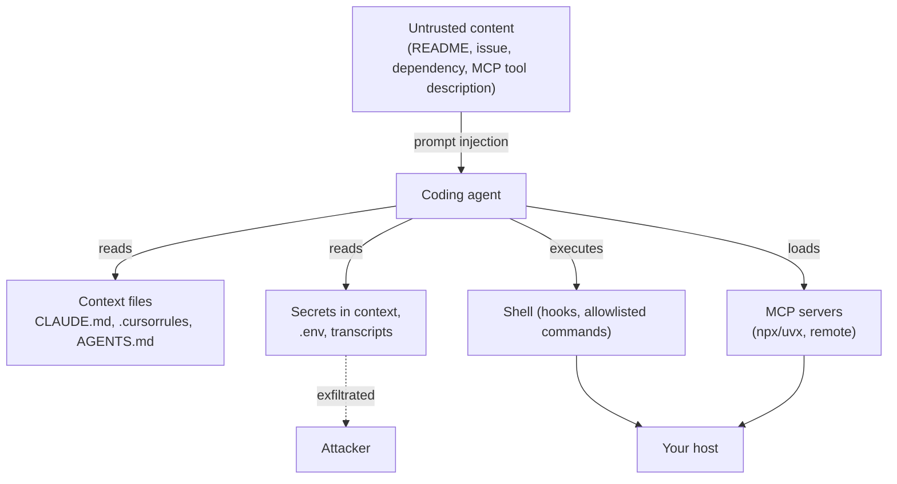

# Your AI Coding Assistant Is a Security Surface

An AI coding assistant is not an editor plugin. It is a program that reads arbitrary files on your
machine, executes shell commands, installs and runs third-party servers, and keeps a durable
transcript of every conversation — including whatever you pasted into it at 2am to debug something.

That is a substantial amount of privilege, and in 2025 it started getting attacked in earnest.
This article is about the resulting attack surface, why most of it is invisible from inside the
tool itself, and how to check your own machine.

Bulwark's [Agent Security](/guide/agent-security) scan exists to answer exactly this question, and
the checks below map one-to-one onto what it looks for.


## Two different problems

They get conflated constantly, so it's worth separating them up front.

**1. Secrets that end up in agent context.** You paste an API key into a chat to debug a 401. The
key is now in a transcript on disk, and probably in the model's context on every subsequent turn.
Maybe it also went into a `CLAUDE.md` because it was convenient. Nothing has been "hacked" — you
did this, and it is entirely ordinary.

**2. Agent configuration that turns a prompt injection into code execution.** The agent reads
untrusted content — a README, a GitHub issue, a dependency's source. If that content can steer the
agent, then whatever the agent is *allowed* to do without asking, the attacker can do.

The second problem is what makes the first one urgent. A leaked key in a file is bad. A leaked key
in a file, read by an agent that will happily `curl` it to an attacker because a repo told it to,
is a different category of bad.

## The attack surface, concretely



### Hooks: code execution on repo open

Claude Code supports **hooks** — shell commands that run automatically on session and tool events.
They're a genuinely useful feature. They're also a file in the repository.

Check Point demonstrated ([CVE-2025-59536][cp]) that a malicious `.claude/settings.json` shipped in
a repo could run commands via a `SessionStart` hook *before* the trust dialog, and could point
`ANTHROPIC_BASE_URL` at an attacker's host — which quietly ships your API key in the request's auth
header. Cloning a repo and opening it was enough.

The general shape recurs everywhere: **configuration that lives in the repository, and is honoured
before you have reviewed the repository.**

### "YOLO mode": the auto-approve flag

Every agent has an approval prompt, and every agent has a way to turn it off. VS Code's is
`"chat.tools.autoApprove": true`.

The interesting part isn't that the setting exists — it's that an agent can *write settings files*.
[CVE-2025-53773][yolo] is exactly this: a prompt injection makes Copilot write the auto-approve flag
into `.vscode/settings.json`, and from the next turn onward every shell command runs unprompted.
The injection escalates its own privileges, and the exploit is wormable.

The same class covers overbroad allowlists — `Bash(*)`, `Bash(curl:*)` — and Codex's
`approval_policy = "never"` alongside `sandbox_mode = "danger-full-access"`. None of these is a
vulnerability. Each is a decision to remove the thing standing between a hijacked model and your
shell.

### MCP: third-party code with your permissions

The Model Context Protocol is how agents get tools. An MCP server is a program, usually launched
with something like `npx -y @some/mcp-server`, that runs with your user's privileges.

Three distinct problems, all real:

- **Supply chain.** `npx -y` pulls the *latest* version, every time. `postmark-mcp` was the first
  documented malicious MCP server — a legitimate package whose v1.0.16 quietly BCC'd every email to
  the author. Pin your versions.
- **The transport itself.** [CVE-2025-6514][mcpr] in `mcp-remote` (CVSS 9.6) let a malicious MCP
  endpoint inject OS commands via OAuth metadata. Merely *connecting* to a hostile server was enough.
- **The tool descriptions.** Tool descriptions go into the model's context. Invariant Labs' "tool
  poisoning" work showed instructions hidden there can steer the agent before any tool is called.

### Invisible instructions

Pillar Security's [Rules File Backdoor][pillar] is the one people find hardest to believe until they
see it. Instruction files — `.cursorrules`, `.cursor/rules/*.mdc`, `.github/copilot-instructions.md`
— are read by the model and reviewed by humans. Zero-width and bidirectional Unicode control
characters are read by the model and *invisible* to humans.

The result is a rules file that looks empty (or benign) in a code review, in a diff, and in the
GitHub PR UI, while instructing the agent to introduce a backdoor. It survives forking. There is no
plausible defence at review time; you have to detect the characters.

### Transcripts are a secret store you didn't know you had

This is the quiet one. Session transcripts persist:

- Claude Code — `~/.claude/projects/<encoded-path>/*.jsonl`
- Codex — `~/.codex/sessions/**/rollout-*.jsonl`
- Aider — `.aider.chat.history.md`, **in the repository root**
- Cline — `~/.config/Code/User/globalStorage/.../api_conversation_history.json`

Every key you ever pasted into a chat is in one of these, in plaintext, long after the conversation.
And credential stores themselves are frequently plaintext on Linux —
`~/.claude/.credentials.json`, `~/.config/github-copilot/hosts.json` — where file permissions are
the only thing between them and every other process running as you.

## Checking your own machine

The honest answer is that this is tedious to do by hand: the paths differ per tool, the transcript
formats differ, and "is this string a real API key or an example" is a question with 262 different
right answers.

That is the job Bulwark's Agent Security scan does:

```bash
# Discovers your workspaces, scans every assistant's config, context, MCP manifests, transcripts
bulwarkctl ai scan

# Preview removing the secrets it found — changes nothing
bulwarkctl ai redact

# Actually remove them. Backs each file up (0600) first, preserves permissions.
bulwarkctl ai redact --apply
```

Or open the **Agent Security** tab in the desktop app, which does the same thing and offers a Redact
button per finding.

Three things worth saying about what it will and won't do:

- **It masks what it finds.** A leaked key is reported as `sk-a…3f`. The raw value never goes into
  the database or the logs.
- **It never edits your files on its own.** Finding a secret and removing it are two separate,
  deliberate acts. Redaction is dry-run by default.
- **Redaction is not rotation.** Removing a key from disk does not un-leak it. If it was in a
  transcript, assume it is compromised, and rotate it.

## The uncomfortable summary

Nothing above requires the agent to be malicious, or the model to be jailbroken in any exotic sense.
The agent behaves exactly as designed. The attacks work because we handed a program that reads
untrusted input the ability to run shell commands, and then configured away the part that asks
first.

Which means the mitigations are boring and effective:

1. Don't paste secrets into agent chats. When you inevitably do anyway, find and rotate them.
2. Keep hooks and MCP servers out of repositories you haven't read.
3. Pin MCP server versions. Treat an MCP server as what it is: a program you're running.
4. Leave the approval prompt on. It is annoying for exactly the reason it is useful.
5. `chmod 600` your credential files.

[cp]: https://research.checkpoint.com/2026/rce-and-api-token-exfiltration-through-claude-code-project-files-cve-2025-59536/
[yolo]: https://embracethered.com/blog/posts/2025/github-copilot-remote-code-execution-via-prompt-injection/
[mcpr]: https://thehackernews.com/2025/07/critical-mcp-remote-vulnerability.html
[pillar]: https://www.pillar.security/blog/new-vulnerability-in-github-copilot-and-cursor-how-hackers-can-weaponize-code-agents
