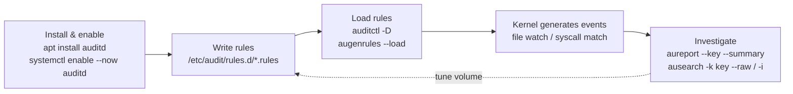

# auditd rules cheat sheet for host security monitoring

The Linux kernel's audit subsystem records privileged syscalls at the kernel level — a
meaningfully harder trail to tamper with than an application log or shell history. Not an
unforgeable one, though: a root-level attacker can still stop the daemon or truncate its local log
file, so this only holds up fully once events are forwarded somewhere the compromised host doesn't
control (see `BLWK-LOG-002` below).

The real catch is `auditd`'s rule syntax, which is unforgiving and spread across three dense man
pages ([`auditctl(8)`](https://man7.org/linux/man-pages/man8/auditctl.8.html),
[`audit.rules(7)`](https://man7.org/linux/man-pages/man7/audit.rules.7.html),
[`auditd.conf(5)`](https://man7.org/linux/man-pages/man5/auditd.conf.5.html)) that reward reading
end-to-end and punish skimming — which is why most people end up copying a rule file from a gist
instead. This is a practical starting point: the rule syntax, a sensible baseline set, how to
investigate what fires, and the one configuration gotcha that can make every rule below silently do
nothing. It's what backs [Bulwark](/)'s `BLWK-LOG-001` check, which flags when `auditd` isn't
installed at all.

## Install and enable it first

```bash
sudo apt install auditd           # Debian/Ubuntu
sudo systemctl enable --now auditd
sudo auditctl -l                  # list currently loaded rules (requires root)
```

`auditd` needs root for everything — there's no unprivileged read mode the way `sysctl` or
`sshd -T` offer, since the rules it reports on govern kernel-level syscall auditing.

## Rule syntax: the three kinds

Audit rules come in three varieties, and mixing them up is the most common source of confusion.

**Control rules** configure the audit system itself — deleting existing rules, setting buffer
size, failure mode:

```bash
auditctl -D                        # delete all existing rules first (standard practice before reloading a rule file)
auditctl -b 8192                   # max outstanding audit buffers
```

The kernel's own default for `-b` is [64](https://man7.org/linux/man-pages/man8/auditctl.8.html)
("Kernel Default=64") — far too low for a real rule set, and when the buffers fill, the kernel
consults the failure flag rather than quietly carrying on.

**File watches** monitor access to a specific file or directory (recursive if it's a directory):

```
-a always,exit -F arch=b64 -F path=/etc/passwd -F perm=wa -F key=identity
```

`perm` takes any combination of `r` (read), `w` (write), `x` (execute), `a` (attribute change).
The older `-w /etc/passwd -p wa -k identity` shorthand still works and is more common in example
configs, but [`auditctl(8)` is blunt about
it](https://man7.org/linux/man-pages/man8/auditctl.8.html): "The -w form of writing watches is for
backwards compatibility and is deprecated due to poor system performance. Convert watches of this
form to the syscall based form."

**Syscall rules** match on the syscall itself, with optional field filters:

```
-a always,exit -F arch=b64 -S execve -F euid=0 -F key=root-exec
```

Always specify `-F arch=b64` (and a matching `-F arch=b32` rule if this is a bi-arch machine).

For a **file watch**, the `perm` field works by making the kernel select the specific syscalls that
perform that kind of access. Without an `arch` to narrow that selection, it can't — and
[`audit.rules(7)`](https://man7.org/linux/man-pages/man7/audit.rules.7.html) spells out the
consequence: "Not supplying the arch will cause the selection of all system calls which will affect
performance as all system calls will be evaluated." A real and entirely avoidable cost.

For a **syscall rule** like the `execve` one above, it's worse than a performance issue — it's a
correctness one. Syscall names resolve to numbers per-ABI, and those numbers don't always line up
between 32-bit and 64-bit, so an unqualified rule can end up auditing *a different syscall entirely*
on one of the two ABIs. On a bi-arch machine `auditctl` will warn you when it detects exactly that
mismatch — [`WARNING - 32/64 bit syscall mismatch in line %d, you should specify an
arch`](https://github.com/linux-audit/audit-userspace/blob/master/src/auditctl.c) — and it's a
warning worth not ignoring, because a rule that's silently watching the wrong syscall looks exactly
like a rule that's working.

## A sensible starter rule set

These track the same class of files [Bulwark](/)'s file-integrity monitoring watches by default
(`/etc/passwd`, `/etc/shadow`, `/etc/sudoers`, PAM configs, `sshd_config`) — auditd gives you the
*who and when* of a change in near-real time; FIM gives you the *before/after diff* on the next
scan. They're complementary, not redundant:

```
# identity and privilege files
-a always,exit -F arch=b64 -F path=/etc/passwd -F perm=wa -F key=identity
-a always,exit -F arch=b64 -F path=/etc/shadow -F perm=wa -F key=identity
-a always,exit -F arch=b64 -F path=/etc/group -F perm=wa -F key=identity
-a always,exit -F arch=b64 -F path=/etc/sudoers -F perm=wa -F key=identity
-a always,exit -F arch=b64 -F dir=/etc/sudoers.d -F perm=wa -F key=identity

# SSH config changes
-a always,exit -F arch=b64 -F path=/etc/ssh/sshd_config -F perm=wa -F key=sshd-config

# auditd's own config — tampering with the audit trail itself
-a always,exit -F arch=b64 -F dir=/etc/audit -F perm=wa -F key=audit-config

# privilege escalation: any execve that lands as root (euid=0), triggered by a real login user
-a always,exit -F arch=b64 -S execve -F euid=0 -F auid>=1000 -F auid!=unset -F key=root-exec
```

The last rule is the most valuable and the easiest to get wrong: `auid` (the *login* UID,
[set once at login by `pam_loginuid`](https://man7.org/linux/man-pages/man8/pam_loginuid.8.html) and
carried through `su`/`sudo` unchanged) is what actually tells you which human triggered an event, as
opposed to `uid`/`euid`, which reflect the current process identity. `-F auid!=unset` excludes kernel
threads and system-initiated processes with no login UID, which would otherwise show up as noise
with [an unsigned representation of
`-1`](https://man7.org/linux/man-pages/man7/audit.rules.7.html) (`4294967295`).

One caveat that matters, because `auid` is usually described as "immutable" and it isn't: by default
a process with `CAP_AUDIT_CONTROL` — i.e. root — can rewrite `/proc/<pid>/loginuid` and change the
very attribution this rule exists to establish. (The change is itself audited, in a record carrying
both `old-auid=` and `auid=`, so it isn't *invisible* — but the record it forges afterwards looks
clean.) If you want that attribution to hold up against the attacker the rest of this cheat sheet is
about, [make it tamper-proof
explicitly](https://man7.org/linux/man-pages/man8/auditctl.8.html) — "setting this makes loginuid
tamper-proof":

```bash
auditctl --loginuid-immutable   # or: add --loginuid-immutable to /etc/audit/rules.d/
```

Until you do, `auid` is a reliable record of what happened, not evidence that survives someone with
root deciding otherwise.

## First, check that auditing is actually on

Before trusting any of the above, verify the rules can fire at all. `auditctl(8)` has an entire
section titled ["DISABLED BY
DEFAULT"](https://man7.org/linux/man-pages/man8/auditctl.8.html) for this: "On many systems auditd
is configured to install an `-a never,task` rule by default. This rule causes every new process to
skip all audit rule processing." It's shipped deliberately (auditing has a real cost, and most
systems don't want it on by default) — Fedora, for instance, installs
[upstream's `10-no-audit.rules`](https://github.com/linux-audit/audit-userspace/blob/master/rules/10-no-audit.rules)
as its default `/etc/audit/rules.d/audit.rules`, while RHEL 9, Debian and Ubuntu ship a base-config
file with no such rule.

Which means you cannot go by distro, or by filename. Grep for the rule itself:

```bash
grep -rn 'never,task\|task,never' /etc/audit/rules.d/   # if this matches, delete or comment the line
auditctl -l                                             # confirm your rules are actually loaded
ausearch -k identity --start today                      # confirm events are actually landing
```

(The rule is written `-a task,never` in the shipped files and `-a never,task` in the man page's
prose; `auditctl` accepts either order, so search for both.) The failure mode is the worst kind: a
system that looks fully instrumented, loads every rule without error, and records nothing. Don't
stop at `auditctl -l` showing your rules — the rules being *loaded* and the rules being *effective*
are different things, and only the third command distinguishes them.

## Give every rule a `key`, or the investigation later is much harder

The `-k`/`key` field is a free-form label — its entire value is letting you filter results later
without re-deriving which rule matched. Set it once, consistently, and the investigation workflow
becomes straightforward:

```bash
aureport --start this-week --key --summary        # which keyed rules have been firing, and how often
ausearch --start this-week -k identity --raw | aureport --file --summary   # which files, for one key
ausearch --start this-week -k root-exec -i          # human-readable events for a specific key
```

Without keys, you're grepping raw `ausearch`/`aureport` output for context clues instead of
filtering directly — the single biggest difference between an audit setup that's actually usable
during an incident and one that's just accumulating noise nobody reads.

## Don't over-audit

[`auditctl(8)`'s own performance guidance](https://man7.org/linux/man-pages/man8/auditctl.8.html) is
direct about the cost: "Syscall rules get evaluated for each syscall for every program. If you have
10 syscall rules, every program on your system will delay during a syscall while the audit system
evaluates each rule."

The fix isn't fewer rules so much as *combined* ones — the man page's own advice is to "try to
combine as many as you can whenever the filter, action, key, and fields are identical," so one rule
listing multiple `-S` syscalls beats the same syscalls spread across separate rules. Its other
headline tip is to "use file system auditing wherever practical," which is worth reading carefully,
because it does **not** mean going back to the deprecated `-w` watches: it means putting a `-F path=`
or `-F dir=` filter on an arch-scoped syscall rule, exactly as the starter set above does. That way
"the kernel will not evaluate it each and every syscall. It will be handled by the filesystem
auditing code and only checked on filesystem related syscalls."

Start from the short list above, confirm it's not generating more volume than you can actually
review, and extend deliberately from there rather than starting from a 200-line rule file copied
from somewhere else.



Persist your rules in `/etc/audit/rules.d/*.rules` — [`augenrules` merges them into
`/etc/audit/audit.rules`](https://man7.org/linux/man-pages/man8/augenrules.8.html) and the daemon
loads them on start — rather than only running `auditctl` interactively, since rules added with bare
`auditctl` don't survive a reboot. [Bulwark](/)'s own `logging-auditing` category checks that
`auditd` is installed at all, alongside remote log forwarding and process accounting — on servers
via `bulwarkctl scan` over SSH, and on a desktop in the GUI, where "this machine has no audit trail
at all" is exactly the kind of finding that otherwise goes unnoticed for years. The config above is
what to actually put in it once it is.

## References

- [`auditctl(8)`](https://man7.org/linux/man-pages/man8/auditctl.8.html) — the `-b` kernel default of 64, the `-w` watch deprecation ("deprecated due to poor system performance"), the "DISABLED BY DEFAULT" `never,task` section, `--loginuid-immutable`, and the PERFORMANCE TIPS quoted above.
- [`audit.rules(7)`](https://man7.org/linux/man-pages/man7/audit.rules.7.html) — why an arch-less file watch audits every syscall, and the `auid` / `unset` / `4294967295` equivalence.
- [`augenrules(8)`](https://man7.org/linux/man-pages/man8/augenrules.8.html) — how `/etc/audit/rules.d/*.rules` gets loaded.
- [`pam_loginuid(8)`](https://man7.org/linux/man-pages/man8/pam_loginuid.8.html) — where `auid` is set, and why it must not be reset by `su`/`sudo`.
- [audit-userspace `src/auditctl.c`](https://github.com/linux-audit/audit-userspace/blob/master/src/auditctl.c) — the exact 32/64-bit mismatch warning text.
- [audit-userspace `rules/10-no-audit.rules`](https://github.com/linux-audit/audit-userspace/blob/master/rules/10-no-audit.rules) — the upstream file whose `never,task` rule silently suppresses everything.
