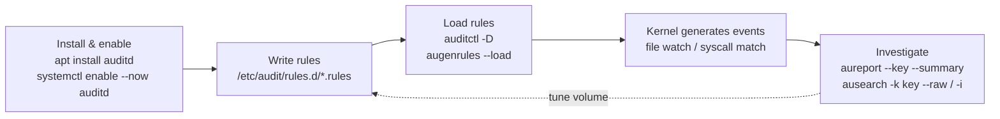

# auditd rules cheat sheet for host security monitoring

The Linux kernel's audit subsystem records privileged syscalls at the kernel level — a
meaningfully harder trail to tamper with than an application log or shell history. Not an
unforgeable one, though: a root-level attacker can still stop the daemon or truncate its local log
file, so this only holds up fully once events are forwarded somewhere the compromised host doesn't
control (see `BLWK-LOG-002` below).

The real catch is `auditd`'s rule syntax, which is unforgiving and spread across three dense man
pages (`auditctl(8)`, `audit.rules(7)`, `auditd.conf(5)`) that reward reading end-to-end and
punish skimming — which is why most people end up copying a rule file from a gist instead. This is
a practical starting point: the rule syntax, a sensible baseline set, how to investigate what
fires, and the one configuration gotcha that can make every rule below silently do nothing. It's
what backs [Bulwark](/)'s `BLWK-LOG-001` check, which flags when `auditd` isn't installed at all.

## Install and enable it first

```bash
sudo apt install auditd           # Debian/Ubuntu
sudo systemctl enable --now auditd
sudo auditctl -l                  # list currently loaded rules (requires root)
```

`auditd` needs root for everything — there's no unprivileged read mode the way `sysctl` or
`sshd -T` offer, since the rules it reports on govern kernel-level syscall auditing.

## Rule syntax: the three kinds

Audit rules come in three varieties, and mixing them up is the most common source of confusion.

**Control rules** configure the audit system itself — deleting existing rules, setting buffer
size, failure mode:

```bash
auditctl -D                        # delete all existing rules first (standard practice before reloading a rule file)
auditctl -b 8192                   # max outstanding audit buffers (kernel default: 64 — far too low for real rule sets)
```

**File watches** monitor access to a specific file or directory (recursive if it's a directory):

```
-a always,exit -F arch=b64 -F path=/etc/passwd -F perm=wa -F key=identity
```

`perm` takes any combination of `r` (read), `w` (write), `x` (execute), `a` (attribute change).
The older `-w /etc/passwd -p wa -k identity` shorthand still works and is more common in
example configs, but is deprecated in favor of the syscall-rule form above for performance
reasons.

**Syscall rules** match on the syscall itself, with optional field filters:

```
-a always,exit -F arch=b64 -S execve -F euid=0 -F key=root-exec
```

Always specify `-F arch=b64` (and a matching `-F arch=b32` rule if this is a bi-arch machine).

For a **file watch**, the `perm` field works by making the kernel select the specific syscalls
that perform that kind of access. Without an `arch` to narrow that selection, it can't — so
*every* system call gets audited instead, which is a real and entirely avoidable performance cost.

For a **syscall rule** like the `execve` one above, it's worse than a performance issue — it's a
correctness one. Syscall names resolve to numbers per-ABI, and those numbers don't always line up
between 32-bit and 64-bit, so an unqualified rule can end up auditing *a different syscall
entirely* on one of the two ABIs. `auditctl` will even warn you about this ("32/64 bit syscall
mismatch... you are likely auditing the wrong syscall") — a warning worth not ignoring, because a
rule that's silently watching the wrong syscall looks exactly like a rule that's working.

## A sensible starter rule set

These track the same class of files [Bulwark](/)'s file-integrity monitoring watches by default
(`/etc/passwd`, `/etc/shadow`, `/etc/sudoers`, PAM configs, `sshd_config`) — auditd gives you the
*who and when* of a change in near-real time; FIM gives you the *before/after diff* on the next
scan. They're complementary, not redundant:

```
# identity and privilege files
-a always,exit -F arch=b64 -F path=/etc/passwd -F perm=wa -F key=identity
-a always,exit -F arch=b64 -F path=/etc/shadow -F perm=wa -F key=identity
-a always,exit -F arch=b64 -F path=/etc/group -F perm=wa -F key=identity
-a always,exit -F arch=b64 -F path=/etc/sudoers -F perm=wa -F key=identity
-a always,exit -F arch=b64 -F dir=/etc/sudoers.d -F perm=wa -F key=identity

# SSH config changes
-a always,exit -F arch=b64 -F path=/etc/ssh/sshd_config -F perm=wa -F key=sshd-config

# auditd's own config — tampering with the audit trail itself
-a always,exit -F arch=b64 -F dir=/etc/audit -F perm=wa -F key=audit-config

# privilege escalation: any execve that lands as root (euid=0), triggered by a real login user
-a always,exit -F arch=b64 -S execve -F euid=0 -F auid>=1000 -F auid!=unset -F key=root-exec
```

The last rule is the most valuable and the easiest to get wrong: `auid` (the *login* UID, set once
at login by `pam_loginuid` and carried through `su`/`sudo` unchanged) is what actually tells you
which human triggered an event, as opposed to `uid`/`euid`, which reflect the current process
identity. `-F auid!=unset` excludes kernel threads and system-initiated processes with no login
UID, which would otherwise show up as noise with an unsigned representation of `-1`
(`4294967295`).

One caveat that matters, because `auid` is usually described as "immutable" and it isn't: by
default a process with `CAP_AUDIT_CONTROL` — i.e. root — can rewrite `/proc/<pid>/loginuid` and
forge the very attribution this rule exists to establish. If you want that attribution to hold up
against the attacker the rest of this cheat sheet is about, you have to explicitly make it
tamper-proof:

```bash
auditctl --loginuid-immutable   # or: add --loginuid-immutable to /etc/audit/rules.d/
```

Until you do, `auid` is a reliable record of what happened, not evidence that survives someone
with root deciding otherwise.

## First, check that auditing is actually on

Before trusting any of the above, verify the rules can fire at all. Several distributions ship a
file — typically `/etc/audit/rules.d/10-no-audit.rules` — containing a single line:

```
-a never,task
```

That rule is evaluated *first* and suppresses auditing for every task, which means every rule in
this cheat sheet loads successfully, reports no error, and **silently never fires**. It's shipped
deliberately (auditing has a real cost, and most systems don't want it on by default), but it's an
easy thing to miss, and the failure mode is the worst kind: a system that looks fully instrumented
and is recording nothing.

```bash
grep -rn 'never,task' /etc/audit/rules.d/    # if this matches, delete or comment the line
auditctl -l                                  # confirm your rules are actually loaded
ausearch -k identity --start today           # confirm events are actually landing
```

Don't stop at `auditctl -l` showing your rules. The rules being *loaded* and the rules being
*effective* are different things, and only the third command distinguishes them.

## Give every rule a `key`, or the investigation later is much harder

The `-k`/`key` field is a free-form label — its entire value is letting you filter results later
without re-deriving which rule matched. Set it once, consistently, and the investigation workflow
becomes straightforward:

```bash
aureport --start this-week --key --summary        # which keyed rules have been firing, and how often
ausearch --start this-week -k identity --raw | aureport --file --summary   # which files, for one key
ausearch --start this-week -k root-exec -i          # human-readable events for a specific key
```

Without keys, you're grepping raw `ausearch`/`aureport` output for context clues instead of
filtering directly — the single biggest difference between an audit setup that's actually usable
during an incident and one that's just accumulating noise nobody reads.

## Don't over-audit

`auditd`'s own manual is direct about this: every syscall rule adds real per-syscall overhead on a
busy host — with ten syscall rules loaded, *every program on the system* pays an evaluation cost on
every syscall. The fix isn't fewer rules so much as *combined* ones: one rule listing multiple `-S`
syscalls is far cheaper than the same syscalls spread across separate rules, because all the
syscall fields are packed into a single mask and one comparison decides whether the syscall is of
interest. Rules can only be merged this way when their filter, action, key, and fields are
otherwise identical. The manual's other headline tip is worth repeating too: prefer file-system
watches to syscall rules wherever practical — they're cheaper.

Start from the short list above, confirm it's not generating more volume than you can actually
review, and extend deliberately from there rather than starting from a 200-line rule file copied
from somewhere else.



Persist your rules in `/etc/audit/rules.d/*.rules` (loaded automatically on `auditd` start, via
`augenrules`) rather than only running `auditctl` interactively — rules added with bare
`auditctl` don't survive a reboot. [Bulwark](/)'s own `logging-auditing` category checks that
`auditd` is installed at all, alongside remote log forwarding and process accounting — the config
above is what to actually put in it once it is.
