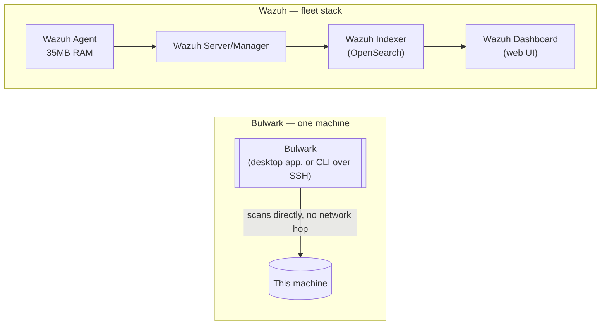

# Bulwark vs. Wazuh: lightweight scanner vs. full SIEM/XDR

Most existing "Bulwark vs Wazuh"-shaped content online only exists buried inside generic
"CrowdStrike alternatives" listicles, treating every open-source security tool as roughly
interchangeable. They aren't. Wazuh is a serious, mature SIEM/XDR platform; [Bulwark](/) is a
desktop-first host scanner — a native GUI for the machine in front of you, plus a CLI that does
the same job on a server over SSH. This is a direct comparison of what each actually is, grounded
in Wazuh's own documentation rather than marketing copy — including where Wazuh is clearly the
better choice, not just where Bulwark differs. Every figure below links to the Wazuh page it
came from.

## What Wazuh actually is

Wazuh's core (manager and agent) is licensed [**GPL-2.0**](https://github.com/wazuh/wazuh/blob/main/LICENSE);
the [indexer](https://github.com/wazuh/wazuh-indexer) and [dashboard](https://github.com/wazuh/wazuh-dashboard)
components are Apache-2.0 forks of OpenSearch and OpenSearch Dashboards. No *feature* is
paywalled — every detection module ships in the self-hosted platform. What's paid is hosting and
support: **Wazuh Cloud**, a managed SaaS offering, priced by agent count — [starting at $571/month
for up to 100 agents with 1-month indexed retention, $923/month for 250 agents, and $1,467/month
for 500](https://wazuh.com/cloud/), with custom pricing above that.

Architecturally, Wazuh is **agent + manager + indexer + dashboard** — the indexer is a full
OpenSearch deployment, and [Wazuh's own quickstart](https://documentation.wazuh.com/current/quickstart.html)
puts the floor for an all-in-one single-host deployment at **4 vCPU / 8 GiB RAM** even for the
1–25 agent tier (50 GB of storage for 90 days of retention), rising to 8 vCPU at 25 agents and up.
The agent alone is genuinely lightweight — [Wazuh's own figure is 35 MB of RAM on
average](https://documentation.wazuh.com/current/installation-guide/wazuh-agent/index.html), and it
[runs on Linux, Windows, macOS, Solaris, AIX, and
HP-UX](https://documentation.wazuh.com/current/getting-started/components/index.html) — but the
agent by itself doesn't do anything: it ships data to a manager, which needs the full stack behind
it to actually process, correlate, and display findings. There is no native desktop GUI: the
dashboard is a web UI (an OpenSearch Dashboards fork) that requires the server stack running and a
browser to view.

## Where the feature sets genuinely overlap

Wazuh natively includes [File Integrity
Monitoring](https://documentation.wazuh.com/current/user-manual/capabilities/file-integrity/index.html)
(checksum-baseline file watching), [Security Configuration
Assessment](https://documentation.wazuh.com/current/user-manual/capabilities/sec-config-assessment/index.html)
(SCA, Wazuh's equivalent of config-hardening checks), and
[rootcheck](https://documentation.wazuh.com/current/user-manual/reference/ossec-conf/rootcheck.html)
(signature-based rootkit/trojan detection) — the same three categories Bulwark's `file-integrity`,
most of its hardening rules, and `rootkit-malware` category cover, respectively. This is real,
substantive overlap, not a stretch.

One distinction is easy to overstate in either direction: Wazuh's ClamAV "integration" is **log
collection, not scanning** — [Wazuh reads a *separately installed* ClamAV's own syslog output
through prebuilt
decoders](https://documentation.wazuh.com/current/user-manual/capabilities/malware-detection/clam-av-logs-collection.html).
It doesn't run or manage the scan itself. [Bulwark](/) shells out to `clamscan` directly and
manages the scan and freshness check as a first-class part of its own rule pack
(`BLWK-AV-001`/`002`). Both approaches depend on ClamAV actually being installed and current — see
the [ClamAV article](/articles/does-linux-need-antivirus) for what that buys you either way — but
"Wazuh has ClamAV integration" and "Bulwark runs ClamAV" are meaningfully different claims. Wazuh
also supports YARA as an active-response trigger and VirusTotal as a cloud API lookup — neither
bundled by default, both require separate setup.

## Where Wazuh is the clearly better choice

If you're securing more than a handful of hosts, want log correlation and alerting across a fleet,
need a real SIEM (searchable event history, dashboards, compliance reporting across many
machines), or want active-response automation (auto-blocking an IP, auto-quarantining a file),
Wazuh is doing a fundamentally different and more ambitious job than Bulwark attempts, and it's a
mature, widely-deployed platform for exactly that job. Wazuh's own positioning is explicit about
this — [it markets itself as "Unified XDR and SIEM protection for endpoints and cloud
workloads,"](https://wazuh.com/) built for fleets.

## Where a single machine is a real friction point for Wazuh

Wazuh's own documentation does officially support small deployments — [its architecture guide
describes the all-in-one setup as "best suited for labs and small environments with a limited
number of monitored
endpoints."](https://documentation.wazuh.com/current/getting-started/architecture.html) But
running the full OpenSearch-backed stack for one laptop or one server is genuine overhead compared
to a tool built for exactly that scale, and this is a real, reported friction point, not a
hypothetical one.

The [Hacker News thread on Wazuh](https://news.ycombinator.com/item?id=41967127) (October 2024) is
a fair place to see the range of real operator experience, precisely because it doesn't converge.
One commenter (`krunck`) writes that "with Elastic underneath it's far too much maintenance for my
30 servers" — though that complaint is worth qualifying rather than citing straight: as of
[**4.3.0 (May 2022)**](https://wazuh.com/blog/introducing-wazuh-4-3-0/) Wazuh ships its own
OpenSearch-based indexer and dashboard, so an Elastic-backed stack has not been the default for
two and a half years by the time that comment was posted. (Wazuh *added* those components rather
than ripping Elastic support out, so the comment isn't impossible — just not a description of what
a new install gives you.) Another commenter (`JediPig`), with "over 2 years" of hands-on
experience, reports ongoing breakage: "things constantly break, the indexes, emailing reports,
just general bit rot." Replying directly to him, `ArnoVW` reports close to the opposite — "never
had a single issue with indexes," on a Docker-based install he's upgraded several times at roughly
an hour per upgrade — and elsewhere in the thread puts his ongoing load at "a couple of hours per
month," noting that "the real thing that takes time is the installation and configuration of the
rules and agents."

Real accounts point in different directions, so the summary isn't "Wazuh is a maintenance
nightmare" — it's that operating the full stack is a nontrivial, recurring cost that lands
somewhere between a couple of hours a month and constant firefighting depending on who's running
it, and it's a cost a tool built specifically for one machine at a time doesn't carry at all.

## Where Bulwark fits instead

[Bulwark](/) is built for the case Wazuh's own docs treat as the small end of its range: the
machine you're sitting at, or a server or two you look after, where standing up an
indexer/manager/dashboard stack is disproportionate to the job.

- **On the desktop** — a native GUI (not a web dashboard requiring a running server) that scans
  your own Linux workstation, explains each finding in plain language, and re-checks it
  continuously. This is the case Wazuh isn't really built for at all: nobody runs an OpenSearch
  cluster to find out whether their laptop's SSH config is sane.
- **On a server** — the same rule engine as a single CLI invocation over SSH (`bulwarkctl scan`),
  with no agent to install and nothing to report to.

Both front-ends share one engine, one local scan history, and a rule pack that ships CIS/MITRE
ATT&CK references per finding (see [the mapping](/articles/cis-mitre-mapping)) without needing
OpenSearch underneath it. Bulwark deliberately doesn't attempt log correlation, multi-host
alerting, or active response — those are Wazuh's actual job, done well, at a cost (operational
complexity, resource footprint) that only makes sense once you're actually managing a fleet.

## The decision rule

Managing more than a few hosts, or need SIEM-grade log correlation and active response? Use
Wazuh — that's what it's for, and Bulwark isn't trying to replace it. Hardening the Linux desktop
in front of you, or a server or two, and want something that runs as a native app or a single CLI
invocation over SSH with no server stack to operate? That's [Bulwark](/)'s actual target — see the
[full scanner comparison](/articles/choosing-a-linux-security-scanner) for how it stacks up against
the CLI-only tools in that same lighter-weight category.

## References

Wazuh's figures move as the product does; these were checked on 12 July 2026.

- [Wazuh Cloud pricing](https://wazuh.com/cloud/) — the $571 / $923 / $1,467 per-month tiers and their agent counts.
- [Wazuh quickstart](https://documentation.wazuh.com/current/quickstart.html) — the 4 vCPU / 8 GiB / 50 GB all-in-one hardware floor, per agent tier.
- [Wazuh agent installation guide](https://documentation.wazuh.com/current/installation-guide/wazuh-agent/index.html) — "it requires 35 MB of RAM on average".
- [Wazuh components](https://documentation.wazuh.com/current/getting-started/components/index.html) — the supported agent operating systems.
- [Wazuh architecture](https://documentation.wazuh.com/current/getting-started/architecture.html) — "Best suited for labs and small environments with a limited number of monitored endpoints."
- [Introducing Wazuh 4.3.0](https://wazuh.com/blog/introducing-wazuh-4-3-0/) — the release that added the OpenSearch-based indexer and dashboard, May 2022.
- [ClamAV logs collection](https://documentation.wazuh.com/current/user-manual/capabilities/malware-detection/clam-av-logs-collection.html) — Wazuh's ClamAV support is decoding its syslog output, not running the scan.
- [wazuh/wazuh LICENSE](https://github.com/wazuh/wazuh/blob/main/LICENSE), [wazuh-indexer](https://github.com/wazuh/wazuh-indexer), [wazuh-dashboard](https://github.com/wazuh/wazuh-dashboard) — the GPL-2.0 core and Apache-2.0 OpenSearch forks.
- [Hacker News: Wazuh discussion](https://news.ycombinator.com/item?id=41967127) (October 2024) — the operator accounts quoted above.
