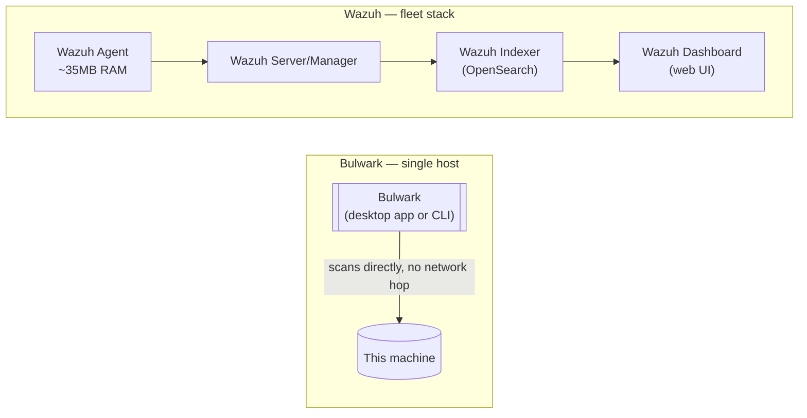

# Bulwark vs. Wazuh: lightweight scanner vs. full SIEM/XDR

Most existing "Bulwark vs Wazuh"-shaped content online only exists buried inside generic
"CrowdStrike alternatives" listicles, treating every open-source security tool as roughly
interchangeable. They aren't. Wazuh is a serious, mature SIEM/XDR platform; [Bulwark](/) is a
lightweight, single-host config scanner with a native GUI. This is a direct comparison of what
each actually is, grounded in Wazuh's own documentation rather than marketing copy — including
where Wazuh is clearly the better choice, not just where Bulwark differs.

## What Wazuh actually is

Wazuh's core (manager and agent) is licensed **GPL-2.0**; the indexer and dashboard components
are Apache-2.0 forks of OpenSearch and OpenSearch Dashboards. No *feature* is paywalled — every
detection module ships in the self-hosted platform. What's paid is hosting and support: **Wazuh
Cloud**, a managed SaaS offering, priced by agent count — starting at $571/month for up to 100
agents with 1-month indexed retention, $923/month for 250 agents, and $1,467/month for 500, with
custom pricing above that.

Architecturally, Wazuh is **agent + manager + indexer + dashboard** — the indexer is a full
OpenSearch deployment, and Wazuh's own quickstart puts the floor for an all-in-one single-host
deployment at **4 vCPU / 8 GiB RAM** even for the 1–25 agent tier (50 GB of storage for 90 days
of retention), rising to 8 vCPU at 25 agents and up. The agent alone is genuinely lightweight —
Wazuh's own figure is ~35MB RAM on average, and it runs on Linux, Windows, macOS, Solaris, AIX,
and HP-UX — but the agent by itself doesn't do anything: it ships data to a manager, which needs
the full stack behind it to actually process, correlate, and display findings. There is no native
desktop GUI: the dashboard is a web UI (an OpenSearch Dashboards fork) that requires the server
stack running and a browser to view.

## Where the feature sets genuinely overlap

Wazuh natively includes File Integrity Monitoring (checksum-baseline file watching), Security
Configuration Assessment (SCA, Wazuh's equivalent of config-hardening checks), and Rootcheck
(signature-based rootkit/trojan detection) — the same three categories Bulwark's `file-integrity`,
most of its hardening rules, and `rootkit-malware` category cover, respectively. This is real,
substantive overlap, not a stretch.

One distinction is easy to overstate in either direction:
Wazuh's ClamAV "integration" is **log collection, not scanning** — Wazuh reads a *separately
installed* ClamAV's own syslog output through prebuilt decoders. It doesn't run or manage the
scan itself. [Bulwark](/) shells out to `clamscan` directly and manages the scan and freshness
check as a first-class part of its own rule pack (`BLWK-AV-001`/`002`). Both approaches depend on
ClamAV actually being installed and current — see the [ClamAV
article](/articles/does-linux-need-antivirus) for what that buys you either way — but "Wazuh has
ClamAV integration" and "Bulwark runs ClamAV" are meaningfully different claims. Wazuh also
supports YARA as an active-response trigger and VirusTotal as a cloud API lookup — neither
bundled by default, both require separate setup.

## Where Wazuh is the clearly better choice

If you're securing more than a handful of hosts, want log correlation and
alerting across a fleet, need a real SIEM (searchable event history, dashboards, compliance
reporting across many machines), or want active-response automation (auto-blocking an IP,
auto-quarantining a file), Wazuh is doing a fundamentally different and more ambitious job than
Bulwark attempts, and it's a mature, widely-deployed platform for exactly that job. Wazuh's own
positioning is explicit about this — it markets itself as "Unified XDR and SIEM protection for
endpoints and cloud workloads," built for fleets.

## Where a single host is a real friction point for Wazuh

Wazuh's own documentation does officially support small deployments — its architecture guide
describes the all-in-one setup as "best suited for labs and small environments with a limited
number of monitored endpoints." But running the full OpenSearch-backed stack for one or two
machines is genuine overhead compared to a tool built for exactly that scale, and this is a real,
reported friction point, not a hypothetical one.

The [Hacker News thread on Wazuh](https://news.ycombinator.com/item?id=41967127) (October 2024) is
a fair place to see the range of real operator experience, precisely because it doesn't converge.
One commenter (`krunck`) writes that "with Elastic underneath it's far too much maintenance for my
30 servers" — though that complaint is worth discounting rather than citing straight: Wazuh
replaced Elasticsearch/Kibana with its own OpenSearch-based indexer and dashboard in **4.3.0 (May
2022)**, two and a half years before that comment was posted, so it describes a stack Wazuh had
already stopped shipping. Another (`JediPig`), with "over 2 years" of hands-on experience, reports
ongoing breakage: "things constantly break, the indexes, emailing reports, just general bit rot."
Replying directly to him, `ArnoVW` reports close to the opposite — "never had a single issue with
indexes," on a Docker-based install he's upgraded several times at roughly an hour per upgrade —
and elsewhere in the thread puts his ongoing load at "a couple of hours per month," noting that
"the real thing that takes time is the installation and configuration of the rules and agents."

Real accounts point in different directions, so the summary isn't "Wazuh is a maintenance
nightmare" — it's that operating the full stack is a nontrivial, recurring cost that lands
somewhere between a couple of hours a month and constant firefighting depending on who's running
it, and it's a cost a tool built specifically for single-host use doesn't carry at all.

## Where Bulwark fits instead

[Bulwark](/) is built for the case Wazuh's own docs treat as the small end of its range: one
machine, or a handful, where standing up an indexer/manager/dashboard stack is disproportionate
to the job. A native desktop GUI (not a web dashboard requiring a running server), a CLI that
works identically over SSH, continuous file-watcher-triggered re-scanning without an agent
reporting to anything, and a rule pack that ships CIS/MITRE ATT&CK references per finding without
needing OpenSearch underneath it. It deliberately doesn't attempt log correlation, multi-host
alerting, or active response — those are Wazuh's actual job, done well, at a cost (operational
complexity, resource footprint) that only makes sense once you're actually managing a fleet.

## The decision rule

Managing more than a few hosts, or need SIEM-grade log correlation and active response? Use
Wazuh — that's what it's for, and Bulwark isn't trying to replace it. Securing one machine, or a
handful, and want something that runs as a lightweight desktop app or a single CLI invocation
over SSH with no server stack to operate? That's [Bulwark](/)'s actual target — see the
[full scanner comparison](/articles/choosing-a-linux-security-scanner) for how it stacks up
against the CLI-only tools in that same lighter-weight category.
