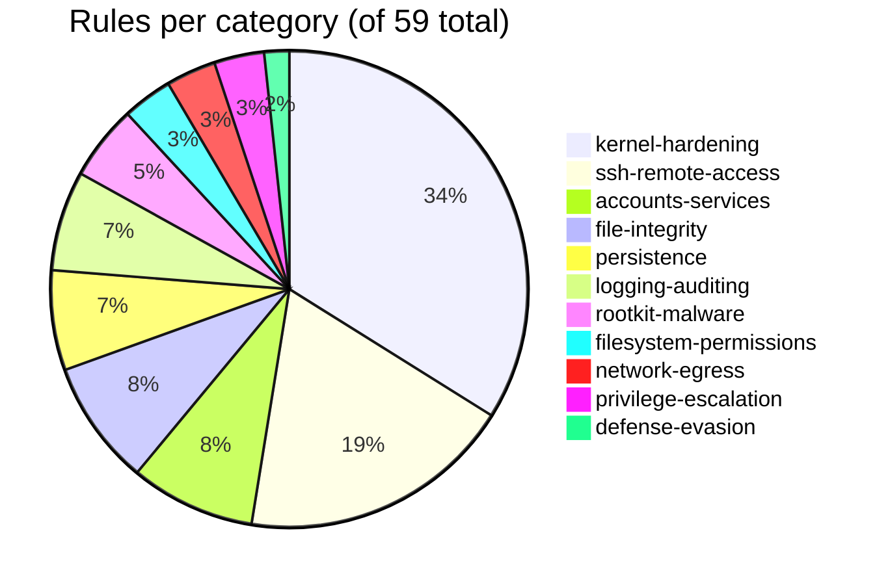

# Mapping Bulwark's rule pack to CIS Benchmarks and MITRE ATT&CK

"CIS-mapped" and "MITRE ATT&CK-aligned" show up on a lot of security-tool marketing pages as an
unverifiable claim. [Bulwark](/)'s rule pack carries these references as a structured field on
every rule YAML file, not prose — which means the mapping below isn't a summary, it's a direct
count pulled from `rules/*/*.yaml` right now.

## The real numbers

Bulwark ships **59 rules** across 11 categories. Of those, **55 rules** carry at least one
external reference — 33 distinct CIS Benchmark control IDs and 27 distinct MITRE ATT&CK technique
IDs between them, 13 rules citing both. The remaining **4 rules** deliberately carry no external
reference at all, and it's worth being upfront about which and why, rather than only showing the
numbers that look complete.

## What maps to CIS

CIS Benchmark controls dominate the `kernel-hardening`, `accounts-services`, and
`ssh-remote-access` categories — the parts of a Linux host CIS's own benchmarks cover in the most
granular detail:

- **CIS §1.5.x** (kernel/memory hardening: ASLR, kptr_restrict, sysrq, unprivileged BPF,
  perf_event_paranoid, suid_dumpable, hardlink/symlink/FIFO/regular-file protections) — 9 distinct
  sub-controls covering 10 `kernel-hardening` rules; one control (§1.5.9) covers both the FIFO
  and regular-file protection rules, so it's a 10-to-9 mapping, not strictly one-to-one.
- **CIS §3.1–3.2** (network kernel parameters: SYN cookies, ICMP redirects, source routing,
  martian logging, reverse-path filtering) — 5 sub-controls, one of them (§3.2.1) covering both
  the accept- and send-redirects rules.
- **CIS §5.2.x** (SSH daemon configuration) — 8 sub-controls, covering the same directives as the
  [SSH hardening checklist](/articles/ssh-hardening-checklist).
- **CIS §6.1–6.2** (file permissions and password-aging policy) — 5 sub-controls.
- **CIS §1.1.1, §1.4, §1.4.1, §1.7.1, §4.1, §4.6** — one each, covering kernel module blacklisting,
  mandatory access control enforcement, GRUB boot password, legal banners, `auditd` presence, and
  process accounting respectively.

## What maps to MITRE ATT&CK

ATT&CK technique references cluster around a handful of tactics that map directly onto Bulwark's
own category names:

- **Persistence** — `T1543.002` (Create or Modify System Process: Systemd Service) on the
  `persistence` category's two Linux rules, the reverse-tunnel and messaging-API units from the
  [persistence walkthrough](/articles/linux-persistence-techniques); and `T1053.003` (Scheduled
  Task/Job: Cron) on the cron-downloader rule, which lives in `accounts-services`, not
  `persistence` — the categories group rules by what they *check*, not by which ATT&CK tactic
  they map to, and the two don't always line up. Worth stating plainly rather than quietly
  reshuffling the count to look tidier.
- **Persistence, on platforms this article isn't about** — the `persistence` category's other two
  rules are deliberate OS skeletons that declare a target platform in the rule file and never
  fire on a Linux scan: `T1543.001` (the *macOS* Launch Agent/Daemon sibling of `.002`) and
  `T1547.001` (the *Windows* registry Run-key). They're counted in the 59 because they're real
  rules that ship; they're called out here because a mapping table that let you infer Linux
  coverage from them would be lying.
- **Credential Access** — `T1003`, `T1003.007` (`/proc` memory access via ptrace),
  `T1003.008` (`/etc/shadow`), `T1110` (brute force, on the SSH rate-limiting rules).
- **Privilege Escalation** — `T1068` (exploiting a kernel privesc primitive), `T1548.003`
  (sudo/sudo caching abuse), `T1078` (valid accounts), `T1055` (process injection, on the ASLR
  rule — weakened address-space randomization is what makes injection reliable).
- **Defense Evasion** — `T1070`/`T1070.003` (indicator/history removal), `T1222` (file permission
  modification), `T1556` (auth-process modification), `T1601` (kexec-based system-image patching).
- **Command and Control / Exfiltration** — `T1071.001` (application-layer C2 protocol),
  `T1090` (proxy/tunneling, on the ngrok and SSH-tunnel rules specifically), `T1572` (protocol
  tunneling), `T1041` (exfil over C2 channel), `T1563` (remote-service session hijacking),
  `T1219` (remote access software — the VNC-listener rule; a distinct technique from `T1090`
  despite the surface similarity, since this one covers a full remote-desktop tool rather than a
  tunnel).
- **Discovery / Collection** — `T1040` (network sniffing, the promiscuous-interface check),
  `T1557` (adversary-in-the-middle, ICMP redirects), `T1542` (boot/pre-OS tampering, the GRUB
  password rule), `T1098`/`T1556` (account/auth manipulation, on the file-integrity rules watching
  `/etc/passwd`, `/etc/shadow`, `/etc/sudoers`, and PAM configs).

## The 4 rules with no reference — and why

`BLWK-LOG-002` (no remote log forwarding configured), `BLWK-AV-001`/`BLWK-AV-002` (ClamAV missing
or its signature database stale), and `BLWK-FIM-003` (no file-integrity baseline recorded yet) —
all four are checks about Bulwark's or the host's own tooling *state*, not a specific
misconfiguration or attack technique either framework catalogs directly. There's no CIS control
number or ATT&CK technique ID that means "your file-integrity tool has no baseline yet" — that's
a prerequisite-for-detection gap, not a vulnerability or a technique. Leaving the reference field
empty for these, rather than reaching for a loosely-related ID to fill it in, keeps the mapping
that does exist trustworthy — every reference actually present in the rule pack corresponds to a
specific, real cross-check, not a plausible-sounding decoration. It's also worth being precise in
the other direction: not every rule with a reference has *both* — `BLWK-KERNEL-008` (the kexec
rule), for instance, carries `ATTACK-T1601` but no CIS control at all, since not every ATT&CK
technique this rule pack tracks has a matching CIS Benchmark control to cite.

## Why this matters beyond the count

A rule mapping is only useful if it lets you answer a real question directly: *for a given
framework, what's actually covered, and what's failing right now?* Because the reference field is
structured data on every rule rather than a separate document to keep in sync by hand, Bulwark's
Compliance view cross-references it against open findings automatically — showing per-framework
pass/fail coverage that updates the moment a scan re-runs, not a static mapping table that drifts
out of date the first time a rule changes. This is also directly checkable against an established
tool: the [Lynis benchmark](/research/lynis-benchmark) documents a specific case where Bulwark's
kernel-hardening rules itemize individual findings (`BLWK-KERNEL-008`/`016`/`017`, covering kexec,
ICMP redirects, and martian-packet logging respectively) where Lynis's own report only surfaces
one aggregate "some sysctl values differ from profile" line — the structured mapping isn't just
bookkeeping, it's what makes a finding traceable back to the specific control or technique it
affects instead of a general hardening suggestion you have to go dig into a log to decode.
