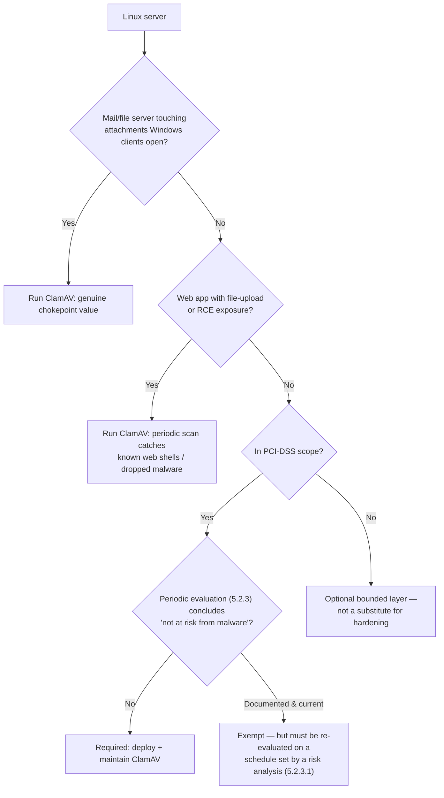

# Does a Linux server need antivirus? What ClamAV actually catches

"Linux doesn't get viruses" was defensible advice for a desktop a decade ago and is a genuinely
risky assumption for a server today. The honest answer is narrower than either side of the usual
argument: ClamAV — the open-source scanner most people mean when they say "Linux antivirus" — is
signature-based, catches a specific and useful set of things well, and plainly does not do what
the word "antivirus" implies to someone coming from Windows. Here's what it actually is, backed
by real detection-rate data rather than a vague verdict either way.

## What ClamAV actually does

ClamAV's own documentation is direct about this: it "relies on signatures to differentiate clean
and malicious/unwanted files" — hash-based, byte-pattern, and container/archive-format
signatures, plus a smaller bytecode engine for algorithmic unpacking and detection, and narrow
heuristics for phishing URLs and credit-card/SSN-pattern data-loss checks. That's it. It is not
a behavioral or machine-learning engine, and — worth stating plainly, since it's the most common
misconception — it does not inspect the memory of running processes. A ClamAV developer put it
directly on the project's own mailing list: "ClamAV is not a rootkit detector, and does not
inspect and scan the running memory of other processes... it doesn't have the features to
inspect running kernel or user process memory." If you want that class of detection, you're
looking at a completely different tool category (rkhunter/chkrootkit for known rootkit
signatures, or eBPF-based runtime tools for live behavioral detection) — see the
[scanner comparison](/articles/choosing-a-linux-security-scanner) for where each fits.

## What it's realistically good at

- **Known web shells.** A web shell is a genuinely common way a Linux web server gets a persistent
  backdoor planted after any file-upload or RCE vulnerability, and exactly the kind of thing
  scanning `/var/www` periodically will actually catch. Coverage is uneven, though, and worth
  checking rather than assuming: a current signature database carries around 110 distinct China
  Chopper signatures and roughly 220 web-shell signatures overall — but only two for AntSword, both
  ASP-only. "ClamAV catches web shells" is true for the long-established families and thin for
  newer ones.
- **Known Linux ELF malware.** Once a piece of Linux-targeting malware is public and its samples
  are in circulation, ClamAV's signature database picks it up like any other AV engine.
- **Cross-platform mail/file-server scanning.** ClamAV's single most common real-world deployment
  is exactly this: a Linux mail or file server scanning attachments and uploads *for the Windows
  clients that will eventually open them* — the Linux host itself may be a much smaller target,
  but it's a convenient, always-on scanning point for everything passing through it.

## What it's not good at — and the actual numbers

Signature-based detection structurally can't catch a threat it has no sample of yet, and the
real-world numbers back that up more starkly than "somewhat lower than commercial engines" would
suggest. A Splunk research team's 2022 test against 416,561 real samples pulled from MalwareBazaar
found ClamAV's overall detection rate at **59.94%** (249,696 of 416,561) — strong specifically on
ELF, DOCX, and DLL file types, meaningfully weaker on EXE, XLS, and ZIP, and weak against modern
commodity threats like RATs, infostealers, and cryptominers. An older AV-TEST comparison
(October 2015, 16 Linux security products against 12,000 Windows malware samples and 900 Linux
malware samples) put ClamAV at just **15.3%** against the Windows sample set, and named it one of
the four worst performers on the Linux set — a bottom group whose scores ranged from 23% to 66.1%
(AV-TEST didn't publish the individual figure, so ClamAV's exact Linux number is unknown; be
suspicious of any writeup that quotes one). Neither number is a reason to skip ClamAV — they're a
reason to be precise about what "we run antivirus" actually buys you: real coverage against known,
previously-seen threats, and near-zero coverage against anything novel.

## The EICAR test: proving it actually works, not just that it's installed

The [EICAR test file](https://www.eicar.org/download-anti-malware-testfile/) is an industry-standard
68-byte string — not real malware — that every legitimate antivirus engine is expected to flag,
specifically so admins can verify a scanner is actually active rather than just present on disk.

```bash
curl -s https://secure.eicar.org/eicar.com -o /tmp/eicar.com
clamscan /tmp/eicar.com
```

A detail worth knowing, because it trips people up: ClamAV reports this one file under *two
different names* depending on which engine catches it. The canonical 68-byte file matches an
exact-hash signature in `main.hdb` and comes back as **`Eicar-Test-Signature`**. Pad it with
trailing whitespace — still a valid EICAR test file, which the spec permits up to 128 bytes — and
the hash no longer matches, so the **bytecode** engine catches it instead and reports
**`Eicar-Signature`**. [Bulwark](/)'s ClamAV output parser is unit-tested against both
(`crates/bulwark-core/src/av_scan.rs`), so a real detection is recognized as one however
`clamscan` happens to phrase it.

If `clamscan` doesn't flag this file on your host, treat every other result it reports with the
same suspicion — check `freshclam`'s signature-database age first, since a stale or broken install
is the most likely cause.



## So: does your server need it?

For a general-purpose Linux server, the honest case for running ClamAV isn't "it stops zero-day
attacks" — nothing does that with signatures. It's: a periodic, low-cost scan catches known
web shells and known Linux malware that a compromise might have dropped, and if this host is a
mail or file server touching anything a Windows client will open, it's genuinely one of the few
practical chokepoints for catching cross-platform threats before they reach a more vulnerable
endpoint.

It's also increasingly not optional in practice. PCI-DSS v4.0.1 requires anti-malware on all
system components (5.2.1), with exactly one exception path: components the entity has determined
are *not at risk from malware*. That determination isn't a one-time sign-off — it's a **periodic
evaluation** (5.2.3), and since March 2025 its frequency has to be justified by a documented
targeted risk analysis (5.2.3.1). A Linux server can genuinely clear that bar; it just has to be
actively re-cleared on a defined schedule, not assumed once and forgotten.

[Bulwark](/)'s `rootkit-malware` category checks that ClamAV is installed and that its signature
database isn't stale (`BLWK-AV-001`/`002`) — deliberately not reimplementing detection itself, on
the same reasoning laid out here: signature-based scanning is a real, bounded layer, not a
substitute for the rest of a host's hardening.
