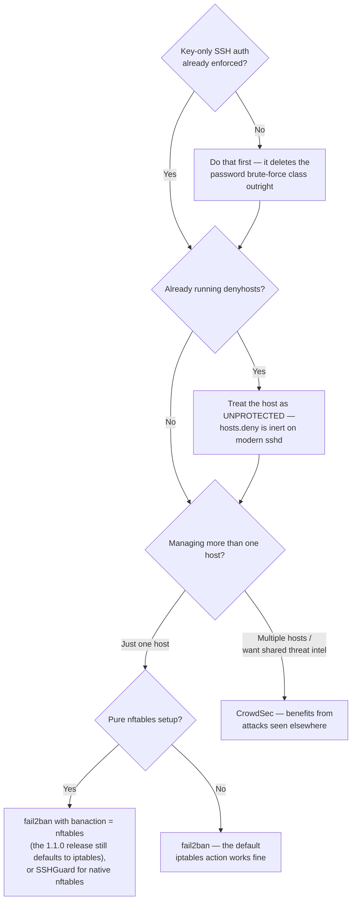

# fail2ban vs. CrowdSec vs. denyhosts: which SSH brute-force defense actually works

Any internet-facing SSH port gets probed within hours of going live — this isn't targeted, it's
background noise from constantly-scanning botnets. All three tools below exist to react to that
automatically, but they are not equivalent, and one of them — still routinely recommended in
guides and still installable from your distro's repos — has a blocking mechanism that modern
OpenSSH stopped honoring over a decade ago. It runs, it logs, it reports success, and it blocks
nothing. Every version, date and figure below links to the release, commit or docs page it came
from, because in this comparison the dates *are* the argument.

## fail2ban: the established default

fail2ban ([GPL-2.0-or-later](https://github.com/fail2ban/fail2ban/blob/master/COPYING)) works by
tailing log files (`/var/log/auth.log`, journald output, etc.), matching failed-login patterns
against regex "filters," and triggering an "action" — almost always a firewall rule update — once a
threshold is crossed. It's been around [since 2004](https://github.com/fail2ban/fail2ban/blob/master/ChangeLog)
(its ChangeLog's oldest entry is `ver. 0.1.0 (2004/10/12)`), over two decades of production use,
and it's still under active development: [commits land on its `master`
branch](https://github.com/fail2ban/fail2ban/commits/master) as recently as June 2026. Both halves
of the next sentence are true and worth holding at once, though: its most recent *tagged release*
is still [**v1.1.0, from April 2024**](https://github.com/fail2ban/fail2ban/releases/tag/1.1.0) —
well over two years without a formal release, while
[`master` carries `1.1.1.dev1`](https://github.com/fail2ban/fail2ban/blob/master/fail2ban/version.py).
If you install from your distro's package rather than tracking `master`, what you're running is the
2024 release.

Which matters for the one practical gotcha here, because it's mid-flip. In **released 1.1.0**,
[`jail.conf` sets `banaction = iptables-multiport`](https://github.com/fail2ban/fail2ban/blob/1.1.0/config/jail.conf#L208)
— iptables-based, which works on nftables-only systems through the `iptables-nft` compatibility
shim, but isn't native. On **`master`**, that line is commented out and the stock default now
resolves to `nftables` via
[`paths-debian.conf`](https://github.com/fail2ban/fail2ban/blob/master/config/paths-debian.conf),
which `jail.conf` includes by default —
[the ChangeLog spells the change out](https://github.com/fail2ban/fail2ban/blob/master/ChangeLog):
"default banactions need to be specified in `paths-*.conf` (maintainer level) now; since stock
fail2ban includes `paths-debian.conf` by default, banactions are `nftables`". So on a modern,
purely nftables setup running the current *release*, set the action explicitly:

```ini
# jail.local
[DEFAULT]
banaction = nftables
banaction_allports = nftables[type=allports]
```

Use `nftables`, not the `nftables-multiport` action you'll see recommended in older guides — that
one still exists but [its own config file marks it
obsolete](https://github.com/fail2ban/fail2ban/blob/master/config/action.d/nftables-multiport.conf):
"Obsolete: superseded by nftables[type=multiport]".

Its real structural limitation is that it's **reactive and log-dependent** — detection lags behind
whatever polling interval reads the log, a log-format change or a journald misconfiguration can
silently break detection with no obvious failure signal, and each host only reacts to attacks it
personally sees. An attacker who spreads a slow, low-volume brute-force across many source IPs
against one host, or who's already been banned on a thousand other servers, gets no benefit passed
to yours — every fail2ban instance starts from zero.

## CrowdSec: the same idea, with shared intelligence

CrowdSec ([MIT](https://github.com/crowdsecurity/crowdsec/blob/master/LICENSE)) works similarly at
the detection layer — parsing logs against scenarios — but adds a real, structural difference:
participating agents report anonymized attack signals to a central "consensus engine," which filters
for false positives and redistributes a curated Community Blocklist back to participants. In
practice that means a host running CrowdSec can start blocking an IP flagged as hostile elsewhere,
before that IP has ever touched your machine.

Be precise about the sharing model, because it's easy to get backwards in either direction:
signal-sharing is **on by default and opt-*out***. [CrowdSec's configuration
reference](https://docs.crowdsec.net/docs/configuration/crowdsec_configuration/) documents the key,
and the shipped `config.yaml` omits it — [the code defaults it to
true](https://github.com/crowdsecurity/crowdsec/blob/master/pkg/csconfig/api.go). If you don't want
it, you disable it explicitly:

```yaml
# config.yaml
api:
  server:
    online_client:
      sharing: false
```

Sharing and receiving are genuinely independent settings — you can turn sharing off and still pull
a community blocklist — but there's a catch the marketing doesn't lead with, and it's worth knowing
before you decide: [non-contributing free users get the Community Blocklist
*Lite*](https://docs.crowdsec.net/docs/central_api/community_blocklist/), "capped at 3 thousand
IPs," while free users who do contribute signals get the full Community Blocklist, which "contains
15 thousand malicious IP's." So free-riding is permitted, at a fifth of the list — and either way
you have to register with the central API to pull anything at all.

It's actively and heavily maintained, and the release cadence is the sharpest contrast with
fail2ban: [v1.7.8 shipped in May 2026](https://github.com/crowdsecurity/crowdsec/releases/tag/v1.7.8),
with [roughly 14,000 GitHub stars](https://github.com/crowdsecurity/crowdsec). Per [CrowdSec's own
feature comparison](https://docs.crowdsec.net/u/console/premium_upgrade/features_overview/), the
free Console tier gives you the top-3,000-IP community blocklist, 500 alerts per month, 2-month
retention, one user seat, and up to three blocklist subscriptions; "Console Premium" raises that to
a top-50,000-IP blocklist, webhooks, 365-day retention, and five-plus team seats. Its
[firewall bouncer](https://github.com/crowdsecurity/cs-firewall-bouncer/tree/main/pkg) supports four
native backends — `nftables` (IPv4 and IPv6), `iptables`, `ipset`, and `pf` — with no
compatibility-shim caveat of the kind the current fail2ban release carries.

## denyhosts: check the date before you install this

denyhosts is SSH-specific and blocks by writing to TCP wrappers' `/etc/hosts.deny` rather than by
touching the firewall. That isn't merely dated — on a modern system it **does not work at all**,
and this deserves to be the headline rather than a footnote.

**OpenSSH removed TCP-wrappers (`libwrap`) support entirely in [OpenSSH 6.7, released 6 October
2014](https://www.openssh.com/txt/release-6.7)** — "sshd(8): Support for tcpwrappers/libwrap has
been removed." On any stock `sshd` from the last decade, writing an IP into `/etc/hosts.deny` has no
effect on SSH whatsoever. DenyHosts' primary blocking mechanism is therefore inert by default: it
will faithfully parse your auth log, correctly identify the attacker, dutifully append them to
`hosts.deny` — and the attacker will keep right on connecting. Unless you enable its
optional/legacy iptables path, it is a tool that appears to be working while blocking nothing.
(systemd [dropped `tcpwrap` support in v212,
2014](https://github.com/systemd/systemd/blob/main/NEWS) too — "tcpwrap is old code, not really
maintained anymore and has serious shortcomings" — [Fedora deprecated TCP
wrappers](https://fedoraproject.org/wiki/Changes/Deprecate_TCP_wrappers) in F28, and [RHEL 8 dropped
the package outright](https://bugzilla.redhat.com/show_bug.cgi?id=1683760).) There is no native
nftables support.

Maintenance status compounds it. Its last tagged release was
[**v3.1, in December 2015**](https://github.com/denyhosts/denyhosts/releases/tag/v3.1) — over a
decade ago. [The version published on PyPI is far older still (2.6, from May
2012)](https://pypi.org/project/DenyHosts/), and that release now has *zero* distribution files
attached, so `pip install DenyHosts` doesn't install something ancient so much as fail to install
anything at all. GitHub activity since then is sparse and strictly maintenance: a
[`urllib3` security bump in February 2025](https://github.com/denyhosts/denyhosts/pull/235),
[Python 3.8–3.13 compatibility fixes in October
2025](https://github.com/denyhosts/denyhosts/pull/239), against a
[bug tracker](https://github.com/denyhosts/denyhosts/issues) and
[pull-request queue](https://github.com/denyhosts/denyhosts/pulls) that between them held 61 open
issues and 8 open PRs when this was written. Someone is keeping it *installable*; nobody is
developing it.

For a new setup in 2026, that combination — a primary blocking mechanism modern `sshd` ignores, no
release in a decade — is disqualifying, not a nostalgic footnote.

## Which one to actually run

First, the thing that outranks all three: **none of them is the primary fix.** They're reactive
log-parsers that respond to an attack already in progress. Setting `PasswordAuthentication no` and
`PermitRootLogin no` (see the [SSH hardening checklist](/articles/ssh-hardening-checklist)) doesn't
*mitigate* SSH password brute-forcing — it deletes the attack class outright. Do that first. What
these tools then buy you is log-noise reduction, defense for whatever else you expose, and a check
against a key being compromised. That's worth having; it just isn't the foundation.

With that said:



- **One host, want the well-documented, battle-tested default:** fail2ban, with `banaction = nftables`
  set explicitly if you're on a modern nftables-native setup.
- **One host, want native nftables without the config caveat:** SSHGuard is a genuine third option
  the usual comparisons skip. [ISC-licensed](https://github.com/SSHGuard/sshguard/blob/master/COPYING)
  (commonly miscited as BSD — the BSD component is a bundled dependency, not the project),
  actively maintained ([latest release v2.5.1, April
  2025](https://github.com/SSHGuard/sshguard/releases/tag/v2.5.1), [commits through
  2026](https://github.com/SSHGuard/sshguard/commits/master)), with
  [native nftables, iptables, pf, and ipfw backends](https://github.com/SSHGuard/sshguard/tree/master/src/fw).
  It's narrower than fail2ban — less extensible, fewer filters — but for the specific job of "block
  SSH brute-forcers on an nftables host," it does it without a compatibility shim.
- **Multiple hosts, or want to benefit from attacks already seen elsewhere:** CrowdSec — the
  shared-intelligence model is a real, meaningful difference once you're not defending in isolation,
  and it's the only one of the four with a current release cadence.
- **denyhosts:** skip it. Not because it's old, but because its blocking mechanism doesn't function
  on a modern `sshd`. If you've inherited a host running it, treat that host as *unprotected* until
  you've migrated, not as protected-but-dated.

## Blocking is one layer; knowing your exposure is another

None of these three do what [Bulwark](/) does, and Bulwark doesn't do what they do — it's a
config-audit and detection tool, not an active blocking layer. Bulwark's `ssh-remote-access` rules
catch the *configuration* gaps that make brute-forcing worth attempting in the first place
(password auth left enabled, no `MaxAuthTries` cap — see the
[SSH hardening checklist](/articles/ssh-hardening-checklist)), and `network-egress` rules catch
unexpected listening services. fail2ban/CrowdSec are the layer that actively responds to an attack
in progress; Bulwark is the layer that tells you, on a schedule, whether that response layer is even
necessary and whether the rest of the host's SSH exposure is sane — in the desktop app if you're
hardening the machine in front of you, or via `bulwarkctl scan` over SSH if you're hardening a
server.

## References

Release cadence is half the argument here, so these were all checked on 12 July 2026 — and star
counts, open-issue counts and pricing tiers move on their own; the links go to the live pages.

- fail2ban: [COPYING](https://github.com/fail2ban/fail2ban/blob/master/COPYING), [ChangeLog](https://github.com/fail2ban/fail2ban/blob/master/ChangeLog) (2004 origin, and the `paths-*.conf` banaction change), [v1.1.0 release](https://github.com/fail2ban/fail2ban/releases/tag/1.1.0) (April 2024), [master commits](https://github.com/fail2ban/fail2ban/commits/master), [version.py](https://github.com/fail2ban/fail2ban/blob/master/fail2ban/version.py) (`1.1.1.dev1`), [1.1.0 jail.conf, line 208](https://github.com/fail2ban/fail2ban/blob/1.1.0/config/jail.conf#L208), [paths-debian.conf](https://github.com/fail2ban/fail2ban/blob/master/config/paths-debian.conf), [nftables-multiport.conf](https://github.com/fail2ban/fail2ban/blob/master/config/action.d/nftables-multiport.conf) (marked obsolete).
- CrowdSec: [LICENSE](https://github.com/crowdsecurity/crowdsec/blob/master/LICENSE), [v1.7.8 release](https://github.com/crowdsecurity/crowdsec/releases/tag/v1.7.8), [repository](https://github.com/crowdsecurity/crowdsec) (live star count), [configuration reference](https://docs.crowdsec.net/docs/configuration/crowdsec_configuration/) and [csconfig/api.go](https://github.com/crowdsecurity/crowdsec/blob/master/pkg/csconfig/api.go) (sharing defaults on), [Community Blocklist docs](https://docs.crowdsec.net/docs/central_api/community_blocklist/) (the 3k Lite vs 15k full list), [Console feature comparison](https://docs.crowdsec.net/u/console/premium_upgrade/features_overview/) (free vs Premium quotas), [firewall bouncer backends](https://github.com/crowdsecurity/cs-firewall-bouncer/tree/main/pkg).
- denyhosts: [v3.1 release](https://github.com/denyhosts/denyhosts/releases/tag/v3.1) (December 2015), [PyPI project](https://pypi.org/project/DenyHosts/) (2.6, May 2012, no distribution files), [PR #235](https://github.com/denyhosts/denyhosts/pull/235), [PR #239](https://github.com/denyhosts/denyhosts/pull/239), [open issues](https://github.com/denyhosts/denyhosts/issues), [open PRs](https://github.com/denyhosts/denyhosts/pulls).
- SSHGuard: [COPYING (ISC)](https://github.com/SSHGuard/sshguard/blob/master/COPYING), [v2.5.1 tag](https://github.com/SSHGuard/sshguard/releases/tag/v2.5.1), [commits](https://github.com/SSHGuard/sshguard/commits/master), [firewall backends](https://github.com/SSHGuard/sshguard/tree/master/src/fw).
- TCP wrappers' removal: [OpenSSH 6.7 release notes](https://www.openssh.com/txt/release-6.7), [systemd NEWS (v212)](https://github.com/systemd/systemd/blob/main/NEWS), [Fedora: Deprecate TCP wrappers](https://fedoraproject.org/wiki/Changes/Deprecate_TCP_wrappers), [Red Hat Bugzilla #1683760](https://bugzilla.redhat.com/show_bug.cgi?id=1683760) (dropped in RHEL 8).
