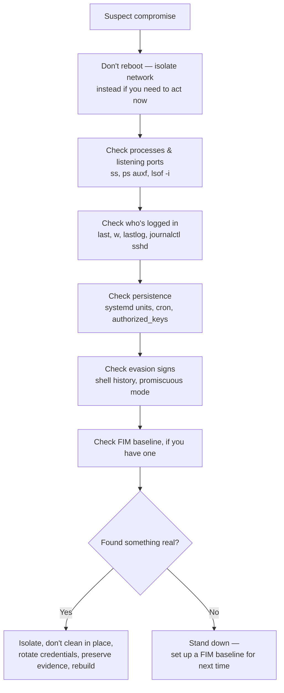

# Is my Linux server hacked? A first-hour checklist

The canonical answer to this question online is a [Server Fault thread from
2011](https://serverfault.com/questions/218005/how-do-i-deal-with-a-compromised-server) — still
widely linked, still useful in outline, but OS-agnostic and over a decade old. This is a
current, Linux-specific version: what to actually check, in a sensible order, in the first hour
after something feels wrong — a process you don't recognize, an alert you didn't expect, a
friend saying your IP is scanning them. It's not exhaustive forensics; it's the fast triage pass
that tells you whether to escalate to a real incident response process or stand down.

## Before anything else: don't reboot

Rebooting feels like the instinctive first move and is very often the wrong one. A reboot clears
running processes, open network connections, and anything living only in memory — exactly the
evidence that tells you *what's actually happening right now*, as opposed to what's merely
configured to survive a reboot. If you strongly suspect active compromise on something you can
afford to take offline, disconnect its network access instead (pull the cable, or drop it into
an isolated VLAN/security-group) — that stops an attacker's live session and outbound traffic
without destroying the state you need to investigate.

## What's running, and what's listening, right now

```bash
ss -tulpn          # every listening TCP/UDP socket, with the owning process
ps auxf             # every running process, in a tree so you can see real parent/child chains
lsof -i             # every process with an open network connection (helps confirm ss's picture)
```

Read `ss -tulpn` looking specifically for a listening port you don't recognize, or a familiar
port owned by a process that shouldn't be able to bind it. [Bulwark](/)'s `network-egress`
rules automate exactly two of the most common opportunistic patterns here: a VNC/remote-desktop
listener on port 5900-range or 6080 that was never intentionally set up, and ngrok's local
inspector port (4040) — the telltale sign of an active outbound tunnel.

## Who has actually logged in

```bash
last -a             # login history, with source host
w                    # who's logged in right now, and what they're running
lastlog              # last login time per account — flags accounts that logged in unexpectedly
journalctl _COMM=sshd --since "-7 days" | grep -i "accepted\|failed"
```

Look for a login source you don't recognize, a service account (one that should never
interactively log in) with a login history at all, or a burst of failed attempts immediately
followed by one success — the shape of a successful brute-force; `lastlog` just lists the last
login time per account, it's on you to spot the one that shouldn't have one. Cross-check
`/etc/passwd` for any account with UID `0` that isn't `root`:

```bash
awk -F: '$3 == 0 {print $1}' /etc/passwd
```

## Where an attacker would have set up persistence

Systemd units and cron are the two overwhelmingly common Linux persistence mechanisms — see the
[full walkthrough](/articles/linux-persistence-techniques) for the exact patterns, but the fast
check is:

```bash
systemctl list-units --type=service --state=running   # anything unfamiliar still running
find /etc/systemd/system /etc/systemd/system/*.wants -newer /etc/hostname -type f
crontab -l -u <each real user>
cat /etc/cron.d/* /etc/crontab
cat ~/.ssh/authorized_keys   # for every account — a rogue key here is a durable backdoor
```

A `curl|wget ... | sh` pattern in any of these, or a `systemd` unit whose `ExecStart` shells out
to a tunneling tool (`ngrok`, `cloudflared`, a raw `ssh -R`) or a messaging-API webhook, is
exactly what [Bulwark](/)'s `persistence` rules (`BLWK-PERSIST-001`/`002`) and `BLWK-ACCT-001`
match against automatically.

## Signs the tracks are being covered

```bash
grep -E "HISTSIZE=0|unset HISTFILE" ~/.bashrc ~/.zshrc ~/.profile /etc/bash.bashrc /root/.bashrc
ip link show | grep -i promisc              # any interface with PROMISC in its flags
```

A shell configured to record no history, or a network interface silently sniffing traffic that
isn't addressed to it, are both defense-evasion and active-collection signs, respectively — and
both correspond directly to a Bulwark rule (`BLWK-EVASION-001`, `BLWK-ROOTKIT-001`) precisely
because they're common enough to check for by default rather than only during an incident.

## If you have a file-integrity baseline — use it now

```bash
bulwarkctl scan   # re-checks every FIM path against its baseline; add --privileged for the root-only ones
# or: diff current hashes against your AIDE/Tripwire baseline directly
```

This is the step most hosts can't actually take, because it requires having recorded a known-good
baseline *before* the incident. Without one, you can only confirm that a sensitive file
(`/etc/passwd`, `/etc/shadow`, `/etc/sudoers`, PAM configs, `sshd_config`) *currently* looks
reasonable — not whether it changed last night.

Which is the argument for doing it on every host you own today, while you have no particular
reason to worry:

```bash
bulwarkctl fim baseline --privileged   # records the known-good hashes, including /etc/shadow and /etc/sudoers
```

Bulwark never establishes this baseline automatically, and that's deliberate: a baseline recorded
*after* a compromise would faithfully enshrine the compromised state as "known good" — which is
worse than having no baseline at all, because it looks like a clean bill of health. Record it on a
host you have reason to trust, and treat "no baseline yet" (`BLWK-FIM-003`) as the finding it is.

## What to do if you find something real

- **Isolate**, don't necessarily power off — network isolation preserves the evidence a hard
  power-off or reboot destroys.
- **Don't try to clean in place.** Once you have real evidence of compromise, the safe assumption
  is that you don't know everything the attacker touched. The reliable fix is to rebuild from a
  known-good image/backup and redeploy, not to hunt down and remove the specific artifacts you
  found — there's likely more you didn't.
- **Rotate every credential** the compromised host had access to — SSH keys, API tokens, database
  passwords, anything in environment variables or config files it could read — not just the
  account that was used to get in.
- **Preserve what you found** (command output, timestamps, the actual malicious files) somewhere
  off the host before you rebuild it, in case you need to understand scope later.

## The actual point of this checklist



Every check above reads static, on-disk or currently-running state — nothing here requires
having been watching in real time when the intrusion happened. That's deliberate: a periodic
scan that reads the same locations (listening ports, systemd units, cron, shell startup files,
`authorized_keys`, file-integrity baselines) catches the durable evidence an intrusion leaves
behind, on a schedule short enough to matter, which is the entire design premise behind
[Bulwark](/) — see the [architecture doc](/guide/architecture) for the full reasoning. Running
that scan regularly, before you have a reason to suspect anything, is what turns this checklist
from a stressful hour into a five-minute "no, we're clean" confirmation.
