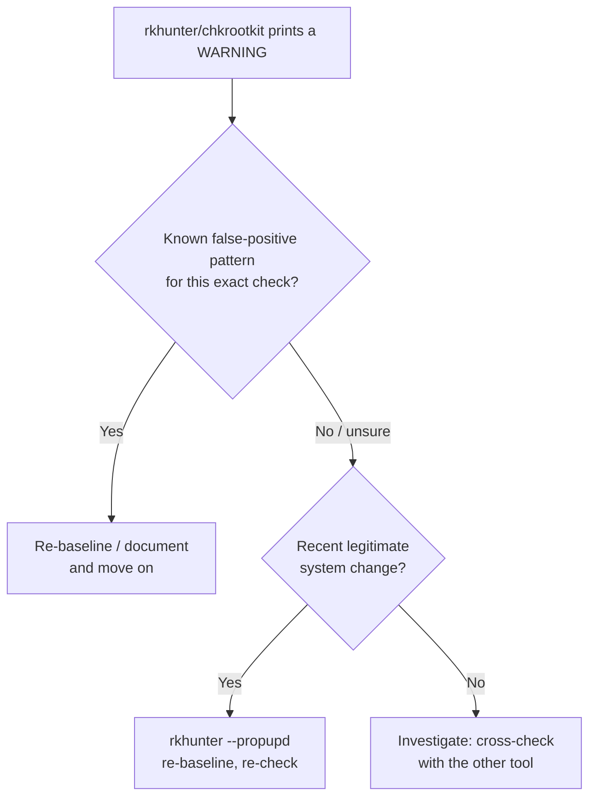

# Reading rkhunter and chkrootkit output without panicking

`rkhunter` and `chkrootkit` both work the same fundamental way: a large battery of signature and
heuristic checks against known rootkit/backdoor patterns, printed as a plain "OK / Warning"
report with essentially no built-in context about *why* something fired. A "Warning" in either
tool's output means "this matched a suspicious pattern," not "this is confirmed malware" — and
distinguishing the two is the actual skill, one that's poorly documented because most writeups
either explain the tools' internals or just tell you to panic. Below is real output from actually
running both — not a hypothetical — with each warning explained.

## Run them yourself first

Both tools are architecturally "root or nothing": on an unprivileged account they refuse to run at
all (`rkhunter`: "You must be the root user to run this program."; `chkrootkit`: "./chkrootkit needs
root privileges") rather than degrading to a partial unprivileged mode the way Lynis does. The
cheapest way to see their real output — including the false positives below — is a disposable
container, which is real root by construction and costs you nothing if you break it:

```bash
docker run --rm ubuntu:24.04 bash -c '
  apt-get update -qq && apt-get install -y -qq rkhunter chkrootkit >/dev/null
  rkhunter --check --sk --nocolors --logfile /tmp/rkhunter.log
  chkrootkit
'
```

Every warning quoted below came from exactly that command. Your output will differ in the details
(signature counts move with each release), and that's the point — the *categories* of false positive
are what generalize, not the specific numbers.

## What actually happened when we ran them

- **rkhunter 1.4.6** checked 461 rootkit signatures and 116 file properties in 49 seconds. It raised
  warnings in three distinct categories, and confirmed zero rootkits:
  - `postfix` user and group present in `/etc/passwd`/`/etc/group` — this was rkhunter itself
    pulling in `postfix` as a package dependency during install inside the test container, not a
    finding about the host. A rootkit-scanner warning about an account that its own installation
    just created is a real, if slightly absurd, false-positive category worth knowing about.
  - No running syslog daemon — a genuine minimal-container artifact (no init/syslog stack at all
    in a bare `docker run`), not something a normal server would trigger.
  - One rootkit — Suckit — flagged for "additional checks," not confirmed. This is rkhunter's own
    documented false-positive category for its LKM-hiding heuristic on non-standard kernels or
    containerized environments, where the normal signal it looks for doesn't cleanly apply.
- **chkrootkit** (`0.53-github2`) ran its full suite — `aliens`, `bindshell`, `lkm`, `sniffer`,
  `chkutmp`, plus dozens of named signature checks (ShKit, Ebury, BPF Door, and more) — and
  raised exactly four `WARNING`s, all explainable as environment artifacts, zero confirmed:
  - 3 stray `.document` files under `/usr/lib/ruby` — a well-known chkrootkit false-positive
    pattern specifically on Ruby installations (the `aliens` test flags leftover empty marker
    files Ruby's gem system creates, which happen to match a pattern chkrootkit watches).
  - A BTRFS-incompatibility notice from the `chkdirs` test — the filesystem type, not a finding.
  - `ifpromisc` flagged an interface, with no actual promiscuous interface on the host — a
    detection artifact of the container's virtual networking, not a real finding.
  - `chkutmp` failed to open `utmp` — because a minimal container has no populated `utmp` at all,
    not because anything tampered with it.

## The pattern worth internalizing

Every single warning above traces back to one of three explainable causes: **the tool's own
installation** (the postfix dependency), **the environment it's running in** (a minimal
container missing normal init/logging infrastructure), or **a documented heuristic limitation**
(Suckit's LKM-hiding check, the Ruby `.document` pattern). None were an actual rootkit. That's
not a knock on either tool — signature and heuristic rootkit detection inherently trades false
positives for not missing real ones, and both tools are explicit in their own documentation about
which checks are heuristic versus confirmed-signature matches. The mistake is treating every
"Warning" line as equally serious without reading what it's actually claiming.

## A practical triage process

1. **Read what the specific check does**, not just its warning text. `rkhunter --check --sk`
   (skip-keypress mode, for scripted runs) writes a detailed log to
   `/var/log/rkhunter.log` — the summary line and the log entry for the same finding often carry
   very different amounts of context.
2. **Check whether it's a known false-positive pattern for that specific check.**
   [rkhunter's own FAQ and documentation](https://rkhunter.sourceforge.net/) document several
   recurring ones (the Suckit LKM heuristic above is one); chkrootkit's `aliens` test against Ruby's
   `.document` files is another well-known one. A quick search for `<tool> <specific warning text>`
   usually surfaces whether this is a common, already-triaged pattern before you assume the worst.
3. **After a legitimate system change** (a package update that replaced a binary chkrootkit or
   rkhunter fingerprints, a deliberate config change), re-baseline rather than re-panicking:
   `rkhunter --propupd` updates rkhunter's stored file-property baseline to the current
   (trusted) state.
4. **Keep signatures current** — `rkhunter --update` before each run; a rootkit scanner running
   against a stale signature database gives you false confidence on genuinely new threats while
   still generating the same volume of environment-noise warnings on old ones.
5. **Cross-check with a second tool when a warning is ambiguous.** rkhunter and chkrootkit use
   different signature/heuristic engines and occasionally disagree — running both isn't
   redundant, it's a real second opinion, which is exactly why the command above runs both rather
   than treating one as sufficient.



## Where a scheduled scan fits alongside these

[Bulwark](/) deliberately doesn't reimplement rootkit signature scanning — its `rootkit-malware`
category shells out to ClamAV for signature-based detection (see [what that actually
catches](/articles/does-linux-need-antivirus)) and adds a small set of scoped, low-false-positive
indicators of its own, like the promiscuous-network-interface check `BLWK-ROOTKIT-001` — the same
condition chkrootkit's `sniffer` test looks at, which is exactly why the container run above is a
useful sanity check on it.

For full signature-based rootkit coverage, rkhunter and chkrootkit — read with the triage process
above, not just their raw warning count — remain the right dedicated tools. What Bulwark adds is the
part neither does: running the scoped checks unattended and showing you the result without a log to
parse, in the desktop app on the machine in front of you or via `bulwarkctl scan` over SSH on a
server. See the [full scanner comparison](/articles/choosing-a-linux-security-scanner) for how these
fit together.

## References

- [rkhunter](https://rkhunter.sourceforge.net/) — the project's own documentation and FAQ, including which checks are heuristic rather than signature matches.
- [chkrootkit](https://www.chkrootkit.org/) — the test list (`aliens`, `bindshell`, `lkm`, `sniffer`, `chkutmp`, `chkdirs`) referenced above.
- The warnings quoted here are from a single `ubuntu:24.04` container run using the command at the top of this article — rkhunter 1.4.6 and chkrootkit 0.53-github2, as packaged by Ubuntu. Re-run it and you'll get the same categories, with counts that track whatever versions `apt` gives you.
