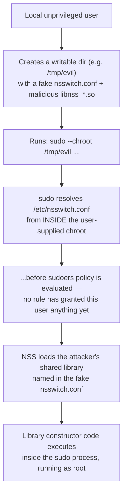

# Sudoers hardening on Linux: a practical checklist

Most sudoers content online is offensive: GTFOBins-style writeups on which binaries a `sudo`
rule can be abused through, aimed at breaking in. There's much less written from the other
side — actually auditing your own `/etc/sudoers` and `/etc/sudoers.d/` before someone else does
it for you. `sudo` misconfiguration is one of the most common real-world local
privilege-escalation vectors, precisely because it's easy to write a rule that's broader than
intended and forget about it. This is a companion to the [SSH hardening
checklist](/articles/ssh-hardening-checklist) — the other half of "how does a foothold on this
box become root."

## Start by asking what you're actually allowed to do

```bash
sudo -l
```

This lists every command (and `RunAsUser`/`RunAsGroup`) the current user is permitted to run via
sudo, on this host. Run it as every account that has any sudo access at all — not just yours.
It's the single fastest way to discover a rule someone added months ago and forgot, and it's the
same audit step [Bulwark](/)'s `privilege-escalation` category (`BLWK-PRIV-001`) automates by
parsing the sudoers source directly.

## `NOPASSWD`: audit every instance, don't assume

```
# risky
deploy ALL=(ALL) NOPASSWD: ALL

# scoped — the shape a legitimate NOPASSWD rule should take
monitoring ALL=(ALL) NOPASSWD: /usr/bin/systemctl status *
```

A `NOPASSWD` rule means anyone who reaches that account — even briefly, even via a hijacked
shell or terminal session rather than a stolen password — has unrestricted root with no
re-authentication prompt to slow them down. `NOPASSWD: ALL` is almost never actually necessary;
a legitimate use case (a monitoring agent, a specific deploy script) can nearly always be scoped
to the exact command(s) it needs, as in the second example.

Grep for **`!authenticate`** separately, and don't treat it as a synonym for `NOPASSWD` — it's
the more dangerous of the two precisely because it looks equivalent. `NOPASSWD` is a *tag* on a
command spec, so it's scoped to the commands that follow it in that rule. `authenticate` is a
*Defaults flag*, so a bare `Defaults !authenticate` line disables password authentication **for
every user on the host at once** — a global kill-switch with no `NOPASSWD` equivalent. They also
behave differently in `sudo -l`/`sudo -v` output and in `exempt_group` handling. Prefer `NOPASSWD`
for per-command grants; treat any bare `Defaults !authenticate` as a finding.

## Session logging: `use_pty` and `log_input`/`log_output`

Without session logging, a `sudo` session leaves no record of what was actually typed or shown —
only that the command was invoked.

```
Defaults log_input,log_output
Defaults logfile="/var/log/sudo.log"
```

`use_pty` runs the sudo'd command in a pseudo-terminal, which is what lets `log_input`/`log_output`
capture an interactive session faithfully rather than just the initial command line. Note that
**`use_pty` has been on by default since sudo 1.9.14 (June 2023)** — most hardening checklists
still tell you to enable it, and on any current system that's a no-op. The check worth doing is the
opposite one: confirm nobody has *disabled* it with a `Defaults !use_pty` somewhere in
`/etc/sudoers.d/`.

`log_input` and `log_output` genuinely are still off by default, and those are the two you have to
turn on yourself. This matters most for shared or `NOPASSWD`-scoped accounts where you want a
record of exactly what happened during a sudo session, not just that it happened.

## The defaults that are already doing their job — verify, don't assume

- **`Defaults env_reset`** (on by default) runs the command in a minimal environment — `TERM`,
  `PATH`, `HOME`, `MAIL`, `SHELL`, `LOGNAME`, `USER`, and `SUDO_*` — instead of inheriting the
  invoking user's. Without it, a user could set `LD_PRELOAD` or a hostile `PATH` in their own shell
  and have it carried into the privileged command. It's not quite the fixed list it looks like:
  anything matched by `env_keep` or `env_check` is added back afterwards, and `secure_path`, if
  set, overrides `PATH`. So audit `env_keep` too — that's where an over-broad exception actually
  hides — and confirm `env_reset` isn't disabled somewhere in `/etc/sudoers.d/`.
- **`secure_path`** is worth checking rather than assuming, and the usual summary of it is subtly
  wrong. Sudo 1.9.16 (September 2024) did **not** change sudo's compiled-in default — the option
  itself is still documented as "disabled by default." What changed is that the *shipped sample
  `sudoers` file* now sets it. So whether your host has it depends on your distro's config file,
  not your sudo version: Debian and Ubuntu have set it for many years regardless, but a
  hand-rolled or inherited `sudoers` may not. Check the config, not the version number — without
  it, a compromised user `PATH` can shadow a system binary the sudo'd command calls internally.
- **`timestamp_timeout`** defaults to 5 minutes — how long a successful sudo authentication is
  cached before the next `sudo` call re-prompts. `0` forces a password every time; a longer
  value trades convenience for a longer window where a hijacked terminal session (left unlocked,
  or reached via another vulnerability) can run further sudo commands with no further prompt.

## Cross-reference against GTFOBins

[GTFOBins](https://gtfobins.github.io/) is a community-maintained catalog of standard Unix
binaries whose legitimate functionality can be abused to escalate privileges, read/write files,
or spawn a shell — including a `sudo` function per binary, showing exactly how a scoped sudo
rule for that binary can be broken out of. Before shipping a `NOPASSWD` or scoped sudo rule for
any binary, check it against GTFOBins first: rules that grant sudo access to editors, pagers,
find, or interpreters (`vim`, `less`, `find`, `python`, `awk`, and dozens more) are frequently
one flag away from an unrestricted root shell.

## Why this matters right now: CVE-2025-32463

On 30 June 2025, a real sudo vulnerability showed exactly how a seemingly narrow feature can
become a full sudoers bypass. Sudo's `-R`/`--chroot` option let a user specify an arbitrary chroot
directory to run a command inside — but sudo versions 1.9.14 through 1.9.17 resolved
`/etc/nsswitch.conf` from *inside* that user-supplied chroot path while the sudoers policy was
still being evaluated. A local user could plant a malicious `nsswitch.conf` pointing at an
attacker-controlled shared library, which sudo would load and execute as root — **even if they
were not listed in the sudoers file at all**. CISA tracks it as actively exploited:



The fix, in 1.9.17p1, reverted the 1.9.14 change and marked `--chroot` deprecated. As of sudo
**1.9.17p2** (the current stable release, July 2025), the feature is still only *deprecated* —
removal is planned but hasn't shipped, and it isn't in the 1.9.18 release-candidate branch either.

The two published severity scores disagree, which is worth knowing rather than citing one as
uncontested: NVD's own analyst score is **7.8 (High)**; the CNA-supplied score, the one most press
coverage quotes, is **9.3 (Critical)**. The entire gap is a judgment call about whether an
unprivileged local user counts as "no privileges required" and whether the exploit crosses a
security boundary — not an arithmetic error on either side. See
[sudo's own advisory](https://www.sudo.ws/security/advisories/chroot_bug/) for the technical
writeup.

The practical takeaway isn't "audit your chroot usage" specifically — it's that sudo is complex,
actively-developed software with a real, ongoing CVE history, so staying on a current, patched
version matters as much as the config review above. Two other recent examples: the
[CVE-2025-32462 `-h`/`--host` bypass](https://www.sudo.ws/security/advisories/host_any/), fixed in
that same 1.9.17p1 release, which made the *host* field of a sudoers rule effectively meaningless —
affecting a much wider range (1.8.8 through 1.9.17), though unlike the chroot bug it only bites
sites that actually use host-specific rules, and the user still has to be in sudoers at all; and
2023's [sudoedit argument-injection bug](https://nvd.nist.gov/vuln/detail/cve-2023-22809), which
let anyone with *any* `sudoedit` privilege edit *arbitrary* files.

```bash
sudo -V | head -1   # confirm the installed version against sudo.ws's advisory list
```

[Bulwark](/)'s `privilege-escalation` rules cover the sudoers `NOPASSWD` audit and a related,
often-overlooked boot-time privilege-escalation path — a missing GRUB bootloader password, which
lets anyone with physical or console access edit kernel boot parameters straight to a root shell
with no credential at all. Neither replaces reading this checklist once by hand; both catch it
again automatically the next time a rule quietly gets broader than intended.
