# sysctl kernel hardening: every parameter, with the tradeoffs nobody lists

Most Linux hardening guides give you a wall of `sysctl -w` commands to copy-paste and move on.
The problem isn't the advice — it's the missing half: several of these settings have real,
documented cases of breaking legitimate things, and a guide that doesn't mention that isn't
actually helping you make a decision, just handing you a script. Below are the kernel and
network sysctls [Bulwark](/)'s `kernel-hardening` category checks — 18 of its 20 rules are
sysctl-based (the other two, mandatory access control enforcement and kernel-module
blacklisting, work through different mechanisms entirely and aren't sysctls) — grouped by what
they actually protect against, with the genuine tradeoffs called out wherever one exists and
cited, not invented for the sake of balance. A few closely-related sysctls that aren't yet a
Bulwark rule are included too, flagged as such, where they round out the same family of setting.

## Local privilege-escalation primitives

These four all guard the same class of bug: a local, unprivileged user turning a race condition
or a permission gap into root.

- **`fs.protected_hardlinks=1`**, **`fs.protected_symlinks=1`** — without these, any user can
  hardlink to a file they don't own, or follow a symlink they don't own inside a world-writable
  sticky directory like `/tmp`. Both are classic TOCTOU privilege-escalation primitives. No known
  tradeoff — every mainstream distro (Debian, Ubuntu, RHEL, Fedora) has shipped both `1` by
  default for over a decade; if you're seeing `0`, something explicitly turned it off.
- **`fs.protected_fifos=1`**, **`fs.protected_regular=1`** — the same protection extended to
  FIFOs and regular files in sticky directories, closing a narrower version of the same
  interception/tampering class. These two are *not* as free as the hardlink/symlink pair above,
  despite usually being lumped in with them: they only became default-on with systemd 241
  (February 2019), systemd's own release notes flagged them as a potentially
  backwards-incompatible change, and they did break real software that legitimately wrote to
  another user's FIFO in a shared directory ([snapcast#452](https://github.com/badaix/snapcast/issues/452)).
  Almost certainly still worth having — just don't believe anyone who tells you they're free.
- **`fs.suid_dumpable=0`** — a crashed setuid process dumping core lets the invoking unprivileged
  user read whatever secrets were in that process's memory at crash time. `0` (the kernel default)
  suppresses core dumps for setuid/privileged processes entirely; `2` ("suidsafe") lets them dump
  but only through a controlled handler — a pipe handler or fully-qualified `core_pattern`, i.e.
  `systemd-coredump` or `apport` — with the dump readable only by root. Either is fine. `1`
  ("debug") is the dangerous one, and the danger isn't quite the "world-readable file" it's often
  described as: the dump is written owned by the *invoking* user with no security applied at all,
  which is worse and more direct.

## Kernel-exploit-development friction

- **`kernel.randomize_va_space=2`** — full ASLR. Worth being precise about what the levels
  actually do, since `1` is usually described as "partial" in a way that implies it's much weaker
  than it is: `1` already randomizes the stack, the mmap base, the VDSO **and shared libraries**.
  The *only* thing `2` adds on top is heap (`brk`) randomization. That's still worth having — but
  the gap between 1 and 2 is one region, not "no ASLR vs. ASLR." Every mainstream distro ships `2`
  by default, so anything lower means something deliberately lowered it.
- **`kernel.kptr_restrict=1`** (or `2`) — restricts kernel pointers printed via the `%pK` format
  specifier (`/proc/kallsyms` and friends), one of the easiest ways to defeat KASLR locally. The
  common framing — "0 leaks raw kernel addresses" — hasn't been true since kernel 4.15: at `0`
  pointers are *hashed*, not raw. `1` zeroes them for anyone without `CAP_SYSLOG`; `2` zeroes them
  for everyone regardless of privilege. Still worth setting; just a smaller win than it's usually
  sold as.
- **`kernel.dmesg_restrict=1`** — restricts `dmesg` to `CAP_SYSLOG`, since the kernel ring buffer
  routinely contains addresses and driver-internal state useful for exploit development. Not
  currently one of Bulwark's 20 rules, but the same family of setting as `kptr_restrict` above
  and worth setting alongside it.
- **`kernel.perf_event_paranoid`** — this is the one hardening guides most consistently describe
  incorrectly, so it's worth stating what it does *not* do. Level `2` does **not** restrict
  `perf_event_open()` to `CAP_PERFMON`/`CAP_SYS_ADMIN`; it disallows *kernel* profiling without
  `CAP_PERFMON`, while unprivileged users can still call `perf_event_open()` against their own
  userspace processes. It's also **already the upstream default**, so "set it to 2" is usually a
  no-op you can verify rather than a change you need to make. The levels that actually lock the
  syscall down (`3` on Debian, `4` on Ubuntu) are *downstream distro patches* that were rejected
  upstream — so if you're relying on that behavior, you're relying on your distro's kernel, not
  Linux's, and you should check `sysctl kernel.perf_event_paranoid` rather than assume.

## The ones with a real, documented tradeoff

This is the part most checklists skip. Each of these is a legitimate hardening step — but each
has caused genuine breakage somewhere, and you should decide with that in mind rather than find
out afterward.

- **`kernel.yama.ptrace_scope=1`** (Bulwark's own recommended fix, and the sensible default for
  almost everyone) restricts `ptrace()` to a process's own *descendants*, blocking the
  `/proc/<pid>/mem` credential-scraping technique this rule exists for. The cost at this level is
  narrow but real, and it's the inverse of what you might expect: tracing something *below* you
  still works — what breaks is tracing a **non-descendant**, including your own *parent*. That's
  exactly the shape of a crash handler that forks a dedicated dumper process to trace its own
  crashing parent, which is why KDE's, Chromium's, and Firefox's crash handlers all call
  `prctl(PR_SET_PTRACER, ...)` to explicitly grant the exemption
  ([Yama documentation](https://docs.kernel.org/admin-guide/LSM/Yama.html)). Software that does
  this correctly keeps working; software that doesn't, silently stops producing crash dumps.
  Going further to `2` restricts `ptrace` to `CAP_SYS_PTRACE` only — no `PR_SET_PTRACER` exemption
  helps at that point, so `strace`/`gdb` genuinely stop working for anyone but root, and tools that
  shell out to them break with it
  ([firejail#3237](https://github.com/netblue30/firejail/issues/3237) is exactly this, at scope
  2 and 3). `3` disables `ptrace` entirely, root included, and **cannot be lowered again without a
  reboot**. `1` is the right choice for almost everyone; `2`+ is for hosts where interactive
  debugging by anyone other than root truly shouldn't happen at all.
- **`net.ipv4.conf.all.rp_filter=1`** (strict mode) blocks IP-spoofed traffic whose source
  address couldn't plausibly have arrived on that interface — but it's a real, reported cause of
  dropped traffic on asymmetric-routing setups: multi-homed servers with return traffic on a
  different path than the request lose reachability
  ([Red Hat solution 53031](https://access.redhat.com/solutions/53031)), and Cilium's
  kube-proxy-free NodePort load balancing hits the same wall
  ([cilium#13130](https://github.com/cilium/cilium/issues/13130)). If this host does asymmetric
  routing on purpose, `2` (loose mode) still blocks the worst spoofing while tolerating it.

  There's a second-order trap here that almost nobody writes down, and it's the reason the Cilium
  bug is awkward to work around. The kernel takes the **numeric maximum** of
  `conf/all/rp_filter` and `conf/<iface>/rp_filter` — so setting `all=1` forces *strict* mode on
  every interface, and you **cannot relax an individual interface back to 0 or 2**, because 1 is
  the higher number and `all` wins. This is why systemd's own `50-default.conf` deliberately sets
  `net.ipv4.conf.default.rp_filter=2` and leaves `all` *unset* rather than hardening it. If you
  need per-interface control, set `default` and the specific interfaces — not `all`.
- **`kernel.kexec_load_disabled=1`** stops a privileged process from `kexec`-loading an
  unverified kernel image and switching to it live — a real defense-evasion technique for
  surviving a reboot with a backdoored kernel. Two tradeoffs, both real: it's a one-way switch
  until the next reboot, and it breaks `kdump`, whose crash-capture kernel is loaded through the
  same `kexec_load` path. The ordering makes this unavoidable rather than merely likely —
  `systemd-sysctl` applies the setting in `sysinit.target`, long before `kdump.service` tries to
  load the crash kernel in `multi-user.target`, so the sysctl always wins and the load fails with
  `kexec_load failed: Operation not permitted`
  ([Red Hat solution 5064581](https://access.redhat.com/solutions/5064581)). The kernel's own
  permission check (`kexec_load_permitted()` in `kernel/kexec_core.c`) runs *before* it
  distinguishes a crash kernel from a normal one, which is why there's no exemption to configure.
  Skip this one on hosts where you rely on `kdump`.
- **`user.max_user_namespaces=0`** (or the older `kernel.unprivileged_userns_clone=0`) — not
  currently one of Bulwark's 20 rules, but included here because it's the one hardening guides
  most often get wrong in the other direction: it closes off a real kernel attack-surface-widening
  feature, but breaks rootless Podman/Docker, Flatpak, and `bubblewrap`-based sandboxing outright —
  [bubblewrap#324](https://github.com/containers/bubblewrap/issues/324) and
  [flatpak#5839](https://github.com/flatpak/flatpak/issues/5839) are exactly this failure mode.
  If this host runs any rootless container tooling, leave user namespaces enabled and rely on
  `kernel.yama.ptrace_scope` and MAC confinement (AppArmor/SELinux) instead.
- **`kernel.unprivileged_bpf_disabled=1`** — two things worth knowing, and the second is the one
  that bites. First, this is mostly already done for you: Debian (bullseye, 2021) and Ubuntu
  (Focal/Bionic, March 2022) both ship kernels built with `CONFIG_BPF_UNPRIV_DEFAULT_OFF=y`, which
  sets this sysctl to `2` out of the box — so explicitly setting it mostly affects CI pipelines or
  legacy BCC-based tools, not a production workload you'd notice breaking. Second, and less
  widely known: **`1` and `2` are not the same knob at different strengths.** `2` is
  "disabled, but re-enableable"; `1` is **disabled without recovery** — a one-way switch you
  cannot undo without rebooting, exactly like `kexec_load_disabled`. If you're setting this at
  all, `2` gets you the same protection while leaving yourself a way back.

## The ones that won't break anything — but still have a gotcha

Nothing in this group has a tradeoff that should stop you from setting it, and it's worth saying
so plainly rather than inventing balance for its own sake. What they *do* have is a detail that's
usually copied wrong — a precondition, a cost that isn't zero, or in one case a widely-recommended
magic number that doesn't do what everyone says it does.

- **`net.ipv4.tcp_syncookies=1`** — SYN-flood connection-table exhaustion protection. Its one
  historical cost (losing TCP options like SACK and window scaling on a cookie-validated
  handshake) is largely moot on a modern kernel, which packs window scale, SACK, and ECN back
  into the low bits of the cookie's timestamp. But that recovery has a precondition worth knowing,
  because it's one hardening guides routinely break: it only works if **`net.ipv4.tcp_timestamps=1`**.
  Plenty of checklists tell you to set `tcp_timestamps=0` (to hide uptime), and doing so silently
  reinstates exactly the option loss this bullet says you don't have to worry about. Pick one.
- **`net.ipv4.conf.all.accept_source_route=0`** — rejects packets that specify their own route, a
  spoofing/routing-bypass primitive with no legitimate use on an end host. It's already `0` on
  end hosts by default (the kernel only defaults it on for routers), so this is belt-and-braces.
- **`net.ipv4.conf.all.log_martians=1`** — logs (doesn't drop) packets with impossible source
  addresses. No behavior change for the host, which isn't the same as no cost: this is a `printk`
  path, and while it's rate-limited by `net_ratelimit()`, a sustained spoofed-source flood can
  still fill your journal and burn CPU logging it. Cheap, but not free.
- **`kernel.sysrq`** set to a restricted bitmask rather than the fully-open `1`, so that the
  magic-SysRq keys available to anyone at the keyboard or console are limited to the genuinely
  useful ones. Be careful with the number you copy here, though — Ubuntu's default of **`176`**
  is widely recommended as "the safe one" and it is **not** as safe as it's usually described.
  `176 = 128 + 32 + 16`: sync (16) and remount-read-only (32), which are the two you actually want
  on a hung system — **plus reboot/poweroff (128)**, which it keeps rather than drops. It does
  drop debug dumps (8), process signalling/kill (64), and console/keyboard control (2/4). If what
  you want is "sync and remount read-only, but nobody gets to power-cycle this box from the
  keyboard," the value you want is **`48`**, not 176. (For reference, upstream systemd's own
  default is `16` — sync only.)
- **`net.ipv4.conf.all.accept_redirects=0`** and **`net.ipv4.conf.all.send_redirects=0`** — reject,
  and stop sending, unauthenticated ICMP route-manipulation packets, respectively. The one
  caveat, which Bulwark's own `send_redirects` rule states directly: skip disabling that half on
  a host that's intentionally acting as a router — a non-router server has no legitimate reason
  to touch either setting.

```mermaid
flowchart TB
    A["sysctl kernel hardening"] --> B["Privilege-escalation primitives"]
    A --> C["Exploit-development friction"]
    A --> D["Tradeoff-bearing settings"]
    A --> E["Safe to set — but copied wrong"]

    B --> B1["fs.protected_hardlinks"]
    B --> B2["fs.protected_symlinks"]
    B --> B3["fs.protected_fifos"]
    B --> B4["fs.protected_regular"]
    B --> B5["fs.suid_dumpable"]

    C --> C1["kernel.randomize_va_space"]
    C --> C2["kernel.kptr_restrict"]
    C --> C3["kernel.perf_event_paranoid"]

    D --> D1["kernel.yama.ptrace_scope\nblocks tracing a non-descendant;\nstrace/gdb break past level 1"]
    D --> D2["net.ipv4.conf.all.rp_filter\nbreaks asymmetric routing/Cilium NodePort;\n'all' wins by numeric max"]
    D --> D3["kernel.kexec_load_disabled\nbreaks kdump; one-way until reboot"]
    D --> D4["user.max_user_namespaces\nbreaks rootless Podman/Flatpak/bubblewrap"]
    D --> D5["kernel.unprivileged_bpf_disabled\n'1' is one-way; already 2 on many distros"]

    E --> E1["net.ipv4.tcp_syncookies\nneeds tcp_timestamps=1"]
    E --> E2["net.ipv4.conf.all.accept_redirects/send_redirects"]
    E --> E3["net.ipv4.conf.all.accept_source_route"]
    E --> E4["net.ipv4.conf.all.log_martians\ncan flood the journal"]
    E --> E5["kernel.sysrq\n176 KEEPS reboot — use 48"]
```



## Applying and checking what's actually loaded

```bash
# check the current value of anything above
sysctl kernel.yama.ptrace_scope net.ipv4.conf.all.rp_filter

# persist a change
echo 'kernel.yama.ptrace_scope = 1' | sudo tee /etc/sysctl.d/60-hardening.conf
sudo sysctl --system
```

`sysctl --system` re-reads every drop-in under `/etc/sysctl.d/`, `/run/sysctl.d/`, and
`/usr/lib/sysctl.d/` in priority order — if a value doesn't stick, check for a conflicting
file with a name that sorts later. [Bulwark](/)'s `kernel-hardening` rule category runs every
check above automatically, on a schedule, and reports each one individually with the live
value interpolated — not, as one of the tools it's benchmarked against does, a single aggregate
"some sysctl values differ from profile" line you have to go digging for (see the
[Lynis benchmark](/research/lynis-benchmark) for that comparison in detail).
