# systemd service sandboxing: a directive-by-directive checklist

Every systemd unit can be sandboxed with a few dozen directives that restrict what its process
can actually touch — its own filesystem view, its capabilities, even which syscalls it's allowed
to make — but almost none of them are set by default, and the best current reference most people
find is a personal gist, not systemd's own (excellent, but dense) man page. This is the
[persistence article](/articles/linux-persistence-techniques)'s counterpart from the hardening
side: not how an attacker abuses a systemd unit, but how to stop a *legitimate* one from being
useful to an attacker who compromises the process running inside it.

## Start with the score, not the directive list

```bash
systemd-analyze security <unit>.service
```

This scores a unit's actual configuration against every sandboxing directive systemd knows
about, on a 0.0–10.0 scale where **low is good**: 0 is fully sandboxed, 10 is no restriction at
all. Scores land in one of seven named bands (`PERFECT`, `SAFE`, `OK`, `MEDIUM`, `EXPOSED`,
`UNSAFE`, `DANGEROUS`), emoji included. Run against two real services on the same real machine,
unmodified:

```
→ Overall exposure level for cron.service: 9.6 UNSAFE 😨
→ Overall exposure level for chrony.service: 3.7 OK 🙂
```

Both are ordinary distro-shipped units doing their job correctly — the 5.9-point spread between
them is entirely about how much of the host each is *allowed* to touch, not whether either is
doing anything wrong. `chrony.service` ships with a static non-root `User=_chrony`,
`ProtectSystem=strict`, `ProtectProc=invisible`, `PrivateTmp=yes`, `RestrictSUIDSGID=yes`, and
most of the capability bounding set stripped. `cron.service` — which genuinely needs broad access,
since its whole job is running arbitrary user jobs as arbitrary users — has essentially none of
it. The score isn't a verdict on the software or its maintainers; it's a direct measurement of how
much blast radius a compromised process in that unit would have.

## Filesystem confinement

```ini
[Service]
ProtectSystem=strict
ProtectHome=read-only
PrivateTmp=yes
```

`ProtectSystem=strict` mounts the entire filesystem hierarchy read-only for the unit except the
API filesystems `/dev`, `/proc`, and `/sys` — the single highest-leverage directive here. Be
precise about what it does *not* promise, though, because it's routinely oversold as "the process
can only write to `ReadWritePaths=`": those three API trees stay writable (you close them with
`PrivateDevices=`, `ProtectKernelTunables=`, and `ProtectControlGroups=` respectively), and so do
`/tmp` and `/var/tmp` if `PrivateTmp=` is on, plus anything granted via `StateDirectory=`,
`LogsDirectory=`, `CacheDirectory=`, or `RuntimeDirectory=`. It's a large reduction in writable
surface, not an airtight one.

`ProtectHome=` is also broader than its name suggests: it covers `/home`, `/root`, **and**
`/run/user` — not just `/home`. At `read-only` all three become read-only; at `yes` all three are
made inaccessible *and appear empty* to the unit (a third value, `tmpfs`, mounts an empty tmpfs
over them). `PrivateTmp=yes` gives the unit its own private `/tmp` and `/var/tmp`, unreachable by
and unable to reach other processes' temp files — closing off a whole class of `/tmp`-based
interference between unrelated services.

## Privilege containment

```ini
NoNewPrivileges=yes
User=some-unprivileged-user
CapabilityBoundingSet=
```

`NoNewPrivileges=yes` is, per systemd's own man page, "the simplest and most effective way to
ensure that a process and its children can never elevate privileges again" — it blocks
`execve()` from granting new privileges via setuid/setgid bits or filesystem capabilities,
closing off an entire exploitation category in one line. One gap worth knowing, which the same man
page notes: it has no effect on processes the unit gets run *on its behalf* by another service —
work handed to `at(1)`, `crontab(1)`, `systemd-run(1)`, or an arbitrary IPC service escapes the
restriction, because those run in someone else's context. Run as a specific non-root `User=`
rather than root wherever the unit's actual job allows it. `CapabilityBoundingSet=` (empty, or an
explicit allow-list like `CAP_NET_BIND_SERVICE` for a service that only needs to bind a low
port) strips every Linux capability not explicitly listed — a compromised process with an empty
bounding set can't `chown()` arbitrary files, load kernel modules, or override permission checks
no matter what code runs inside it.

## Kernel and device isolation

```ini
PrivateDevices=yes
ProtectKernelModules=yes
ProtectKernelTunables=yes
ProtectKernelLogs=yes
ProtectClock=yes
```

`PrivateDevices=yes` gives the unit a `/dev` containing only harmless pseudo-devices (`/dev/null`,
`/dev/zero`, `/dev/random`, plus the pseudo-TTY subsystem) — no physical block devices like
`/dev/sda`, no raw memory via `/dev/mem`, no `/dev/port`. It also drops `CAP_MKNOD` and
`CAP_SYS_RAWIO` and blocks the `@raw-io` syscall group, so it's doing more than just reshaping a
directory. `ProtectKernelModules=yes` and `ProtectKernelTunables=yes` remove the capabilities and
filesystem access a process would need to load a kernel module or alter `/proc/sys` at runtime —
the same class of controls Bulwark's `kernel-hardening` sysctls enforce system-wide, applied
per-service instead. `ProtectKernelLogs=yes` blocks access to the kernel log ring buffer
(`dmesg`) — the same information-disclosure surface `kernel.dmesg_restrict` closes system-wide
(see the [sysctl article](/articles/sysctl-kernel-hardening)). `ProtectClock=yes` blocks writes to
the hardware or system clock, closing a narrow but real timestamp-tampering vector for a
compromised service trying to confuse log correlation.

## Namespace and syscall restriction

```ini
RestrictNamespaces=yes
LockPersonality=yes
MemoryDenyWriteExecute=yes
SystemCallArchitectures=native
SystemCallFilter=@system-service
SystemCallFilter=~@privileged @resources @clock @mount @module @reboot @swap @raw-io @debug @obsolete @cpu-emulation
```

`RestrictNamespaces=yes` blocks the unit from creating any further namespaces of its own —
closing off container-escape-adjacent techniques that rely on nesting a new namespace inside an
already-compromised one. `LockPersonality=yes` prevents changing the process execution domain
(`personality()`), a rarely-legitimate syscall that's occasionally used to weaken memory-layout
protections.

`MemoryDenyWriteExecute=yes` blocks a process from mapping memory as both writable and executable
at once, aimed directly at classic write-then-execute shellcode injection. Two caveats systemd's
own man page carries and most checklists drop: it is **circumventable** — a process that can write
to any filesystem not mounted `noexec` (`/dev/shm` is the usual example), or that calls
`memfd_create()`, can still get executable memory — and it will break anything that legitimately
generates code at runtime: JIT engines (so most JVM, .NET, and JavaScript workloads), executable
stacks, and compiler trampolines. Set it on services that don't JIT; expect a crash if you set it
on one that does.

`SystemCallArchitectures=native` rejects syscalls made under a non-native ABI (e.g. a 32-bit
compatibility syscall table on a 64-bit host) — a real, if narrow, sandbox-bypass surface on
multi-ABI kernels. `SystemCallFilter=@system-service` is systemd's curated set of calls ordinary
services actually need; the man page calls it "the recommended starting point for allow-listing,"
which is the right way to think about it — nothing is filtered by default, so this is a starting
point you opt into, not a default you're already getting. Combining it with an explicit denial of
the groups above — `@privileged`, `@resources`, `@clock`, `@mount`, `@module`, `@reboot`, `@swap`,
`@raw-io`, `@debug`, `@cpu-emulation`, `@obsolete` (the leading `~` is what makes a list a denial
rather than an allowance) — removes syscalls a normal service has no legitimate reason to call at
all, each denied group corresponding to a named filter set systemd maintains and updates as new
syscalls are added to the kernel.

## Applying and measuring the improvement

```bash
sudo systemctl edit <unit>.service     # opens a drop-in override, doesn't touch the packaged unit file
# add the directives above under [Service], save, and systemctl reloads the config for you
sudo systemctl restart <unit>.service
systemd-analyze security <unit>.service   # confirm the score actually moved
```

Always use `systemctl edit` (which writes a drop-in under `/etc/systemd/system/<unit>.d/`) rather
than editing the packaged unit in `/usr/lib/systemd/system/` directly — a package update
overwrites the latter and silently reverts your hardening. No separate `daemon-reload` is needed:
`systemctl edit` reloads the configuration itself once you save. You do still need to `restart`
the unit for the new sandboxing to take effect on the running process.

Add directives incrementally and restart between changes. `ProtectSystem=strict` in particular
will break a service that writes somewhere you haven't allow-listed with `ReadWritePaths=`, and
it's much easier to find which directive caused that with one change at a time than with a dozen
applied at once.

```mermaid
flowchart TB
    A["systemd sandboxing directives"] --> B["Filesystem confinement"]
    A --> C["Privilege containment"]
    A --> D["Kernel & device isolation"]
    A --> E["Namespace & syscall restriction"]

    B --> B1["ProtectSystem=strict"]
    B --> B2["ProtectHome=read-only"]
    B --> B3["PrivateTmp=yes"]

    C --> C1["NoNewPrivileges=yes"]
    C --> C2["User=non-root"]
    C --> C3["CapabilityBoundingSet="]

    D --> D1["PrivateDevices=yes"]
    D --> D2["ProtectKernelModules=yes"]
    D --> D3["ProtectKernelTunables=yes"]
    D --> D4["ProtectKernelLogs=yes"]
    D --> D5["ProtectClock=yes"]

    E --> E1["RestrictNamespaces=yes"]
    E --> E2["LockPersonality=yes"]
    E --> E3["MemoryDenyWriteExecute=yes"]
    E --> E4["SystemCallArchitectures=native"]
    E --> E5["SystemCallFilter=@system-service"]
```



## Sandboxing vs. detection: two different jobs

[Bulwark](/)'s `persistence` rules catch a *malicious* unit — one whose `ExecStart` matches a
known attacker pattern like a reverse tunnel or a `curl`-to-messaging-API exfil hook. Hardening
your own legitimate units with the directives above is a separate, complementary practice aimed
at limiting what happens *if* a legitimate service is compromised through some other route (a
dependency vulnerability, for instance) — not something Bulwark's rule pack currently audits for
completeness, but the single highest-leverage thing you can do to a unit file that Bulwark's
`persistence` and `kernel-hardening` checks don't already cover.
