# systemd service sandboxing: a directive-by-directive checklist

Every systemd unit can be sandboxed with a few dozen directives that restrict what its process
can actually touch — its own filesystem view, its capabilities, even which syscalls it's allowed
to make — but almost none of them are set by default, and the best current reference most people
find is a personal gist, not systemd's own (excellent, but dense) man page. This is the
[persistence article](/articles/linux-persistence-techniques)'s counterpart from the hardening
side: not how an attacker abuses a systemd unit, but how to stop a *legitimate* one from being
useful to an attacker who compromises the process running inside it. Every directive below links
to its entry in [`systemd.exec(5)`](https://www.freedesktop.org/software/systemd/man/latest/systemd.exec.html),
so the exact wording is one click away.

## Start with the score, not the directive list

```bash
systemd-analyze security <unit>.service
```

This scores a unit's actual configuration against every sandboxing directive systemd knows about.
[`systemd-analyze(1)`](https://www.freedesktop.org/software/systemd/man/latest/systemd-analyze.html)
describes the result as "an estimation in the range 0.0…10.0 indicating how exposed a service is
security-wise," where "high exposure levels indicate very little applied sandboxing" — so **low is
good**. Scores land in one of seven named bands (`PERFECT`, `SAFE`, `OK`, `MEDIUM`, `EXPOSED`,
`UNSAFE`, `DANGEROUS`), emoji included; the names and their thresholds live in
[systemd's source](https://github.com/systemd/systemd/blob/main/src/analyze/analyze-security.c)
rather than the man page — `OK` spans 1.0–5.0, `UNSAFE` starts at 9.0.

Two real distro-shipped services on the same machine (Ubuntu, systemd 259), unmodified:

```
→ Overall exposure level for cron.service: 9.6 UNSAFE 😨
→ Overall exposure level for chrony.service: 3.7 OK 🙂
```

Run the same two commands and your numbers may differ — the score depends on the unit file your
distro packages and on which checks your systemd version knows about, so treat these as an
illustration of the spread, not as constants. Both are ordinary units doing their job correctly.
The 5.9-point gap between them is entirely about how much of the host each is *allowed* to touch.
`chrony.service` [as packaged on Debian/Ubuntu](https://sources.debian.org/src/chrony/) ships a
static non-root `User=_chrony`, `ProtectSystem=strict`, `ProtectProc=invisible`, `PrivateTmp=yes`,
`RestrictSUIDSGID=yes`, and most of the capability bounding set stripped. `cron.service` — which
genuinely needs broad access, since its whole job is running arbitrary user jobs as arbitrary users
— has essentially none of it.

The score isn't a verdict on the software or its maintainers; it's a direct measurement of how much
blast radius a compromised process in that unit would have. And `systemd-analyze` is careful to say
so itself: a high exposure level "neither means that there is no effective sandboxing applied by the
service code itself, nor that the service is actually vulnerable to remote or local attacks."

## Filesystem confinement

```ini
[Service]
ProtectSystem=strict
ProtectHome=read-only
PrivateTmp=yes
```

[`ProtectSystem=strict`](https://www.freedesktop.org/software/systemd/man/latest/systemd.exec.html#ProtectSystem=)
mounts "the entire file system hierarchy read-only, except for the API file system subtrees /dev/,
/proc/ and /sys/" — the single highest-leverage directive here. Be precise about what it does *not*
promise, though, because it's routinely oversold as "the process can only write to
`ReadWritePaths=`": those three API trees stay writable (you close them with `PrivateDevices=`,
`ProtectKernelTunables=` and `ProtectControlGroups=`, which between them cover the three, though not
in a tidy one-each mapping), and so do `/tmp` and `/var/tmp` if `PrivateTmp=` is on, plus anything
granted via `StateDirectory=`, `LogsDirectory=`, `CacheDirectory=`, or `RuntimeDirectory=`. It's a
large reduction in writable surface, not an airtight one.

[`ProtectHome=`](https://www.freedesktop.org/software/systemd/man/latest/systemd.exec.html#ProtectHome=)
is also broader than its name suggests: it covers `/home`, `/root`, **and** `/run/user`. At
`read-only` all three become read-only; at `yes` all three are "made inaccessible and empty" to the
unit; a third value, `tmpfs`, mounts a *read-only* tmpfs over them (the read-only part is easy to
miss, and it's the point — the unit sees an empty directory rather than a writable scratch space).
[`PrivateTmp=yes`](https://www.freedesktop.org/software/systemd/man/latest/systemd.exec.html#PrivateTmp=)
gives the unit its own private `/tmp` and `/var/tmp`, unreachable by and unable to reach other
processes' temp files — closing off a whole class of `/tmp`-based interference between unrelated
services.

## Privilege containment

```ini
NoNewPrivileges=yes
User=some-unprivileged-user
CapabilityBoundingSet=
```

[`NoNewPrivileges=yes`](https://www.freedesktop.org/software/systemd/man/latest/systemd.exec.html#NoNewPrivileges=)
is, per systemd's own man page, "the simplest and most effective way to ensure that a process and
its children can never elevate privileges again" — it blocks `execve()` from granting new privileges
via setuid/setgid bits or filesystem capabilities, closing off an entire exploitation category in
one line. One gap worth knowing, which the same man page notes: "it has no effect on processes
potentially invoked on request of them through tools such as at(1), crontab(1), systemd-run(1), or
arbitrary IPC services" — work handed off that way runs in someone else's context and escapes the
restriction.

Run as a specific non-root `User=` rather than root wherever the unit's actual job allows it.
[`CapabilityBoundingSet=`](https://www.freedesktop.org/software/systemd/man/latest/systemd.exec.html#CapabilityBoundingSet=)
(empty, or an explicit allow-list like `CAP_NET_BIND_SERVICE` for a service that only needs to bind
a low port) strips every Linux capability not explicitly listed — a compromised process with an empty
bounding set can't `chown()` arbitrary files, load kernel modules, or override permission checks no
matter what code runs inside it.

One trap worth checking for by hand, because it's invisible in a diff and `systemd-analyze` is
exactly the tool that catches it: these are plain assignments, and **the last one wins**. Debian's
own packaged `chrony.service` sets `NoNewPrivileges=yes` near the top and then, further down (under
a comment about `sendmail` for the `mailonchange` directive), sets `NoNewPrivileges=no` — so on a
stock install the directive is effectively *off*, and part of why chrony scores 3.7 rather than
lower. A hardening directive silently undone later in the same file is not a hypothetical.

## Kernel and device isolation

```ini
PrivateDevices=yes
ProtectKernelModules=yes
ProtectKernelTunables=yes
ProtectKernelLogs=yes
ProtectClock=yes
```

[`PrivateDevices=yes`](https://www.freedesktop.org/software/systemd/man/latest/systemd.exec.html#PrivateDevices=)
gives the unit a `/dev` containing "only API pseudo devices such as /dev/null, /dev/zero or
/dev/random (as well as the pseudo TTY subsystem)" — no physical block devices like `/dev/sda`, no
raw memory via `/dev/mem`, no `/dev/port`. It also removes `CAP_MKNOD` and `CAP_SYS_RAWIO` from the
bounding set and blocks the `@raw-io` syscall group, so it's doing more than just reshaping a
directory. `ProtectKernelModules=yes` and `ProtectKernelTunables=yes` remove the capabilities and
filesystem access a process would need to load a kernel module or alter `/proc/sys` at runtime —
the same class of controls Bulwark's `kernel-hardening` sysctls enforce system-wide, applied
per-service instead.
[`ProtectKernelLogs=yes`](https://www.freedesktop.org/software/systemd/man/latest/systemd.exec.html#ProtectKernelLogs=)
denies "access to the kernel log ring buffer" (`dmesg`) — the same information-disclosure surface
`kernel.dmesg_restrict` closes system-wide (see the [sysctl
article](/articles/sysctl-kernel-hardening)).
[`ProtectClock=yes`](https://www.freedesktop.org/software/systemd/man/latest/systemd.exec.html#ProtectClock=)
denies "writes to the hardware clock or system clock," closing a narrow but real timestamp-tampering
vector for a compromised service trying to confuse log correlation.

## Namespace and syscall restriction

```ini
RestrictNamespaces=yes
LockPersonality=yes
MemoryDenyWriteExecute=yes
SystemCallArchitectures=native
SystemCallFilter=@system-service
SystemCallFilter=~@privileged @resources @clock @mount @module @reboot @swap @raw-io @debug @obsolete @cpu-emulation
```

[`RestrictNamespaces=yes`](https://www.freedesktop.org/software/systemd/man/latest/systemd.exec.html#RestrictNamespaces=)
prohibits "access to any kind of namespacing" — creating *or* switching into one — closing off
container-escape-adjacent techniques that rely on nesting a new namespace inside an already-
compromised one.
[`LockPersonality=yes`](https://www.freedesktop.org/software/systemd/man/latest/systemd.exec.html#LockPersonality=)
locks down `personality(2)` so "the kernel execution domain may not be changed," a rarely-legitimate
syscall that's occasionally used to weaken memory-layout protections.

[`MemoryDenyWriteExecute=yes`](https://www.freedesktop.org/software/systemd/man/latest/systemd.exec.html#MemoryDenyWriteExecute=)
blocks a process from mapping memory as both writable and executable at once, aimed directly at
classic write-then-execute shellcode injection. Two caveats systemd's own man page carries and most
checklists drop. First, it is **circumventable**: "the protection can be circumvented, if the
service can write to a filesystem, which is not mounted with noexec (such as /dev/shm), or it can
use memfd_create()" — which the man page's own suggested countermeasures (`InaccessiblePaths=/dev/shm`,
`SystemCallFilter=~memfd_create`) tell you to close separately. Second, it "is incompatible with
programs and libraries that generate program code dynamically at runtime, including JIT execution
engines, executable stacks, and code 'trampoline' feature of various C compilers" — in practice,
most JVM, .NET and JavaScript workloads. Set it on services that don't JIT; expect a crash if you
set it on one that does.

[`SystemCallArchitectures=native`](https://www.freedesktop.org/software/systemd/man/latest/systemd.exec.html#SystemCallArchitectures=)
permits "only native system calls," rejecting a non-native ABI (e.g. a 32-bit compatibility syscall
table on a 64-bit host) — a real, if narrow, sandbox-bypass surface on multi-ABI kernels, and one
that is *off* by default: "this option is set to the empty list, i.e. no filtering is applied."
[`SystemCallFilter=@system-service`](https://www.freedesktop.org/software/systemd/man/latest/systemd.exec.html#SystemCallFilter=)
is systemd's curated set of calls ordinary services actually need; the man page calls it "the
recommended starting point for allow-listing system calls for system services," which is the right
way to think about it — a starting point you opt into, not a default you're already getting.
Combining it with an explicit denial of the groups above — `@privileged`, `@resources`, `@clock`,
`@mount`, `@module`, `@reboot`, `@swap`, `@raw-io`, `@debug`, `@cpu-emulation`, `@obsolete` (the
leading `~` is what makes a list a denial rather than an allowance: "if the first character of the
list is '~', the effect is inverted") — removes syscalls a normal service has no legitimate reason
to call at all, each denied group corresponding to a named filter set systemd maintains and updates
as new syscalls are added to the kernel.

## Applying and measuring the improvement

```bash
sudo systemctl edit <unit>.service     # opens a drop-in override, doesn't touch the packaged unit file
# add the directives above under [Service], save, and systemctl reloads the config for you
sudo systemctl restart <unit>.service
systemd-analyze security <unit>.service   # confirm the score actually moved
```

Always use [`systemctl edit`](https://www.freedesktop.org/software/systemd/man/latest/systemctl.html)
(which writes a drop-in under `/etc/systemd/system/<unit>.d/`) rather than editing the packaged unit
in `/usr/lib/systemd/system/` directly — a package update overwrites the latter and silently reverts
your hardening. No separate `daemon-reload` is needed: after the editor exits, "configuration is
reloaded, equivalent to `systemctl daemon-reload`." You do still need to `restart` the unit for the
new sandboxing to take effect, since a reload rebuilds systemd's view of the unit but does not
re-exec the process already running under the old one.

Add directives incrementally and restart between changes. `ProtectSystem=strict` in particular will
break a service that writes somewhere you haven't allow-listed with `ReadWritePaths=`, and it's much
easier to find which directive caused that with one change at a time than with a dozen applied at
once.



```mermaid
flowchart TB
    A["systemd sandboxing directives"] --> B["Filesystem confinement"]
    A --> C["Privilege containment"]
    A --> D["Kernel & device isolation"]
    A --> E["Namespace & syscall restriction"]

    B --> B1["ProtectSystem=strict"]
    B --> B2["ProtectHome=read-only"]
    B --> B3["PrivateTmp=yes"]

    C --> C1["NoNewPrivileges=yes"]
    C --> C2["User=non-root"]
    C --> C3["CapabilityBoundingSet="]

    D --> D1["PrivateDevices=yes"]
    D --> D2["ProtectKernelModules=yes"]
    D --> D3["ProtectKernelTunables=yes"]
    D --> D4["ProtectKernelLogs=yes"]
    D --> D5["ProtectClock=yes"]

    E --> E1["RestrictNamespaces=yes"]
    E --> E2["LockPersonality=yes"]
    E --> E3["MemoryDenyWriteExecute=yes"]
    E --> E4["SystemCallArchitectures=native"]
    E --> E5["SystemCallFilter=@system-service"]
```

## Sandboxing vs. detection: two different jobs

[Bulwark](/)'s `persistence` rules catch a *malicious* unit — one whose `ExecStart` matches a
known attacker pattern like a reverse tunnel or a `curl`-to-messaging-API exfil hook. Hardening
your own legitimate units with the directives above is a separate, complementary practice aimed
at limiting what happens *if* a legitimate service is compromised through some other route (a
dependency vulnerability, for instance) — not something Bulwark's rule pack currently audits for
completeness, but the single highest-leverage thing you can do to a unit file that Bulwark's
`persistence` and `kernel-hardening` checks don't already cover. Worth doing on a server, and worth
doing on a desktop too: a Linux workstation runs plenty of units that never needed `/home` access in
the first place.

## References

Man-page quotes are from systemd 259; the `latest` links track the current release, so wording may
drift as systemd adds checks.

- [`systemd.exec(5)`](https://www.freedesktop.org/software/systemd/man/latest/systemd.exec.html) — every directive quoted above: `NoNewPrivileges=`, `ProtectSystem=`, `ProtectHome=`, `PrivateTmp=`, `PrivateDevices=`, `ProtectKernelLogs=`, `ProtectClock=`, `RestrictNamespaces=`, `LockPersonality=`, `MemoryDenyWriteExecute=`, `SystemCallArchitectures=`, `SystemCallFilter=`, `CapabilityBoundingSet=`.
- [`systemd-analyze(1)`](https://www.freedesktop.org/software/systemd/man/latest/systemd-analyze.html) — the 0.0–10.0 exposure scale and the caveat about what a high score does and doesn't mean.
- [`analyze-security.c`](https://github.com/systemd/systemd/blob/main/src/analyze/analyze-security.c) — the seven band names and their score thresholds, which aren't documented in the man page.
- [`systemctl(1)`](https://www.freedesktop.org/software/systemd/man/latest/systemctl.html) — `systemctl edit` writing a drop-in and reloading configuration automatically.
- [chrony as packaged by Debian](https://sources.debian.org/src/chrony/) — the `User=_chrony` and sandboxing directives quoted (upstream's own example unit sets no `User=` at all), and the `NoNewPrivileges=yes` → `no` override.
