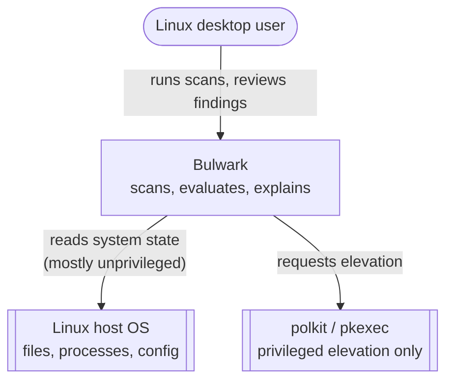
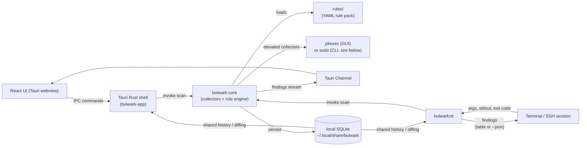
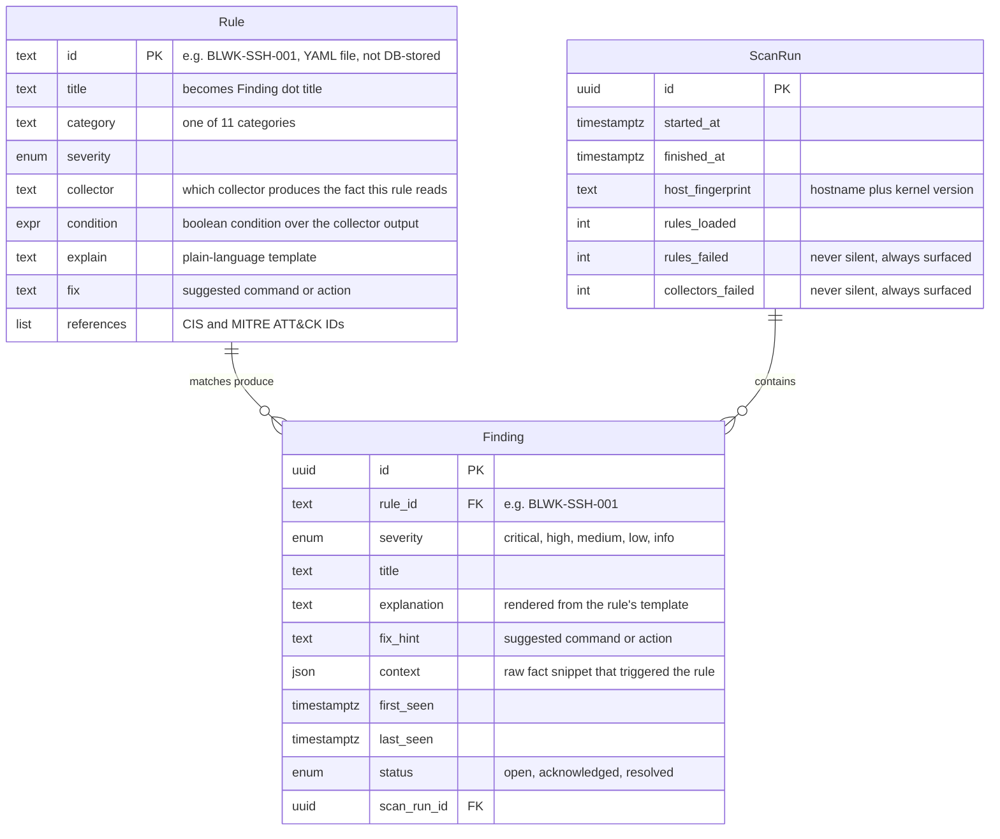
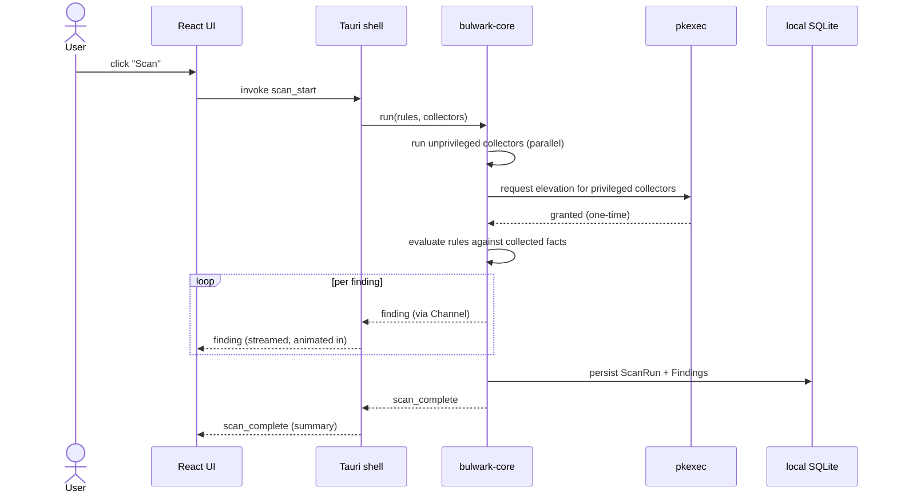

# Bulwark — Linux Host Security Scanner

## TL;DR

Bulwark is a Tauri + Rust desktop app that scans a Linux host for security misconfigurations, intrusion indicators, and hardening gaps, using a native Rust engine that evaluates declarative YAML rules against collected system facts, then explains findings in plain language with a one-line fix. The single most important design decision: rules are native and declarative (a Sigma/Falco-style condition DSL), not a wrapper around Lynis/rkhunter — so the rule set can grow without recompiling, stays open to community contribution, and can cover attack patterns (like tunnel-service egress) that no existing tool names as a control.

## Status update

This document was written before implementation and has been revised to describe what actually shipped, not just what was planned. As of v0.1:

- **57 rules across all 11 planned categories** (SSH/remote access, persistence, privilege escalation, defense evasion, credential/secrets exposure via filesystem permissions, network egress, kernel/sysctl hardening, logging/auditing, accounts & services, rootkit/malware indicators, file integrity).
- **Both front-doors work end-to-end**: `bulwarkctl` (scan, rules list/validate, history) and `bulwark-app` (Tauri v2 + React GUI), sharing one `bulwark-core` engine and one local SQLite store, exactly as designed in §4.
- **Real ClamAV integration** — not a placeholder: live streamed per-file scan progress, real engine/database version and staleness reporting, and a distro-aware install command shown when ClamAV isn't installed at all.
- **File-integrity monitoring** for a curated set of security-relevant files, plus a background monitoring loop that re-scans on an interval and reconciles findings across runs.
- **A system tray icon** so closing the window hides the app instead of killing the monitoring loop — verified live against the real `org.kde.StatusNotifierWatcher` D-Bus registration, not just "no error thrown."
- **A Lynis-style hardening index** score on the Compliance view, computed the same way Lynis computes its own (skipped/privileged-only checks don't count against the score).
- **Benchmarked hands-on against 5 real tools** — Lynis directly, and rkhunter/chkrootkit/AIDE/OpenSCAP via a disposable root container — see [the research page](/research/lynis-benchmark).
- **A profile system (OS + opt-in "needs")** is now built into the rule/collector model, with macOS and Windows collector *skeletons* wired end-to-end but not yet real — see §17.

Sections below are the original design reasoning, updated in place where the as-shipped decision differs from the draft (notably §16's color decision). Section numbers are preserved since other project docs (`AGENTS.md`) reference them by number.

---

## 1. Problem

### What's broken today
Linux desktops are compromised through a well-worn, well-documented playbook: persistence via a rogue systemd unit tunneling remote access out through a service like ngrok, a remote-desktop service (VNC) left exposed with no password, SSH brute-forced after password auth gets quietly re-enabled, browser/OS-keyring credential theft, and exfiltration of cloud and API secrets sitting in plaintext `.env` files and shell history. Every one of these leaves static, after-the-fact traces — but is rarely caught *at the time*, because the tools that could catch it (Lynis, rkhunter, auditd, Wazuh) are individually solid yet CLI-only, snapshot-oriented, and not something a non-SOC developer actually installs and reads day to day. The gap isn't detection technology — it's that none of it is a friendly, GUI-native tool this audience will actually run.

### Who feels it
- **Primary:** solo Linux desktop developers and AI power users — people running increasingly capable local tooling and AI agents on their own machines, with no SOC, no existing HIDS deployment, but technical enough to act on a finding once it's explained.
- **Secondary:** future OSS adopters with the same profile, across more distros than just Debian/Ubuntu.

### Why now
The research groundwork is already done — a checklist grounded in Lynis's test categories, MITRE ATT&CK, and HackTricks/linPEAS (`research/2026-07-11-linux-security-checklist/report.md`) is directly enumerable into rules today. The marginal cost of starting now vs. later is pure execution time, not more research.

---

## 2. Goals and non-goals

### Goals (ranked)
1. **Catch real-world intrusion indicators with plain-language, actionable output** — breadth grounded in established frameworks (Lynis, MITRE ATT&CK Persistence/Credential Access/Defense Evasion, HackTricks/linPEAS), not a narrow, ad hoc list. See the research page.
2. **Be genuinely usable by a non-SOC developer** — GUI-native, explains *why* a finding matters and *how* to fix it.
3. **Ship as a real, installable, personal-tool-first OSS project** — `.deb`/`.rpm`/AppImage builds, without needing a team to maintain it.

**Update:** all three goals were met for v0.1 — see the Status update above and the research page for the sourced comparison.

### Non-goals (explicit)
- Real-time eBPF/syscall monitoring in v1 (Falco-class complexity) — v1 is on-demand/periodic scanning, "Lynis with a GUI."
- A full EDR/antivirus replacement — shells out to the system's own ClamAV installation for signature-based malware rather than reimplementing it.
- Wrapping Lynis/rkhunter as a backend — native Rust checks only (§13, Option A).
- Working macOS/Windows support in v1 — Linux desktop only, Debian/Ubuntu-first packaging, for actual detection coverage. The rule/collector *model* is now OS-aware (§17) precisely so this can change without an engine rewrite, but no macOS/Windows collector does anything real yet — there's no machine to build and verify one against in this project's current environment.
- A hosted/cloud dashboard or telemetry phone-home — fully local, no data leaves the machine, ever.
- **Sandboxed untrusted-code execution and autonomous "agents" are explicitly out of v1 scope**, but the architecture (crate boundaries, a generic executor pattern, Channel-based event streaming) is deliberately shaped so adding them later is a new workspace member, not a rewrite. See §4 and §14. Still true as of this update — neither has been started.

### Success metrics
- **Rule coverage** — v1 ships rules across all 11 categories in the research checklist. **Met**: 57 rules, 11/11 categories.
- **Time-to-first-finding** — an unprivileged baseline scan completes and renders results in under 10 seconds; this explicitly excludes any time spent on a human entering a `pkexec`/`sudo` password, which is outside the app's control (see §10).
- **Dogfooding** — a fixture set of known attack-pattern indicators (rogue systemd persistence, exposed VNC, re-enabled SSH password auth, browser credential exposure, etc.) is encoded as rule unit tests and run against real machines.

---

## 3. Constraints

| Constraint | Value / limit |
|------------|---------------|
| Deadline | None fixed — personal tool sharpened into OSS, no external deadline pressure |
| Team / headcount | Solo-maintained |
| Budget | $0 — OSS; distribution via GitHub Releases |
| Existing stack | Tauri + Rust backend, React + Vite frontend. Cargo workspace ships both a GUI (`bulwark-app`) and a CLI (`bulwarkctl`) over the same `bulwark-core` library, so headless/SSH-only boxes are scannable without a display session. |
| Compliance / security | No formal compliance target, but findings reference CIS/MITRE ATT&CK IDs where applicable, leaving headroom for compliance-mapping later |
| SLA | None — desktop app, no uptime commitment |

---

## 4. High-level architecture

### System context (C4 L1)



### Container view (C4 L2)



**`bulwark-core` has zero UI/Tauri/CLI-specific code.** Both `bulwark-app` (Tauri GUI) and `bulwarkctl` are thin front-doors over the same library crate — same collectors, same rule engine, same `Finding`/`Rule`/`ScanRun` model, same local SQLite history. A scan run from the CLI shows up in the GUI's history and vice versa, since they share one on-disk store rather than each keeping their own. This also means the CLI can ship and be dogfooded before the GUI is polished, and it's the only form factor that can reach a headless box (`ssh host 'bulwarkctl scan'`) — the case that matters most for catching lateral movement on a local network.

**Privilege model decision:** the GUI uses `pkexec` with a bundled polkit policy (`auth_admin_keep`) so a session only prompts once. The CLI does **not** use `pkexec` — `pkexec` depends on a running polkit authentication agent, which is normally GUI-session-bound and typically absent on a box reached only over SSH. Instead `bulwarkctl` requires the elevated subset to be run as `sudo bulwarkctl scan --privileged`; unprivileged checks run either way without elevation. This is a deliberate, resolved decision, not an open question — `sudo` has no GUI-agent dependency and is the one elevation path guaranteed to work identically in a local terminal and over plain SSH.

**Since v0.1 (implemented, not just reserved):** a system tray icon (`apps/bulwark-app/src-tauri/src/tray.rs`) keeps the app resident when the window is closed — the window's `CloseRequested` event is intercepted and the window is hidden rather than destroyed, so a background monitoring loop that's mid-interval keeps running. The monitoring loop periodically re-invokes the same `bulwark-core` scan path used by a manual "Scan" click and reconciles findings across runs (see §5).

**Future extension seam (still not built, deliberately):** `bulwark-sandbox` and `bulwark-agent` remain reserved as future workspace members, not started. `bulwark-core`'s executor and event-streaming pattern (a Tauri Channel for the GUI, a plain iterator/stream for the CLI) is written generically enough that a sandboxed-execution job or an agent action could plug into the same pattern instead of requiring a parallel system — see §14.

---

## 5. Data model

`Rule` is YAML source, not DB-stored — modeled here alongside the two real tables for the
engine's sake, since a `Finding` is what you get when a `Rule`'s condition matches a fact row
from a given `ScanRun`.



### Condition grammar (v1)

A condition is a boolean expression over the named fields a collector produces — no cross-collector joins in v1 (one rule reads one collector's output; matches Sigma's per-logsource scoping). Grammar: field references (`sshd.password_authentication`), comparison operators (`==`, `!=`, `in`, `contains`, `matches` for regex, and `<` `>` `<=` `>=` for numeric thresholds like password-aging policy), and boolean combinators (`and`, `or`, `not`), parenthesized for precedence — deliberately a subset of Falco's filter syntax, not a new language.

```yaml
id: BLWK-SSH-001
title: SSH password authentication is enabled
category: ssh-remote-access
severity: critical
collector: sshd_config
condition: sshd.password_authentication == "yes"
explain: >
  PasswordAuthentication is set to "{{ sshd.password_authentication }}" in sshd_config,
  which allows brute-force login attempts.
fix: "Set 'PasswordAuthentication no' in /etc/ssh/sshd_config and restart sshd."
references: [CIS-5.2.10, ATTACK-T1110]
```

A collector's output is a flat map of fields (`{password_authentication: "yes", permit_root_login: "yes", ...}`), so writing a new rule against an existing collector never touches collector code, only YAML. Collectors that produce lists (listening ports, cron entries) expose them the same way, evaluated one row at a time. `{{ }}` interpolation applies to both `explain` and `title` — templating `title` too (not just `explain`) was added after list-shaped rules sharing one static title read as duplicates in the UI even though each row was a genuinely distinct finding.

### Reconciliation (implemented)

A finding is considered "the same" across scan runs if its previously-stored `context` is a **subset** of the newly-collected `context` (`store::is_context_subset`), not exact equality. This tolerates a collector gaining new fact fields over time — extending a collector no longer silently breaks identity-matching for its existing rules and producing a spurious duplicate row, which is exactly what happened before this was fixed: `login_defs.rs` gained two new fields and the exact-string match immediately started duplicating `BLWK-ACCT-002`. On a match, both `last_seen`/`scan_run_id` and `context` are updated (previously only the former), so a finding's displayed context always reflects its most recent scan.

### Access patterns
- **Read path:** the UI/CLI queries the latest `ScanRun`'s findings, grouped by severity/category; prior runs are diffed to show new-vs-resolved findings over time.
- **Write path:** the scan engine emits `Finding`s over a stream as they're produced (streamed, not batched); on completion, findings are persisted to local SQLite in one transaction.
- **Index strategy:** local SQLite (`rusqlite`), indexed on `(rule_id, status)` and `(scan_run_id)` — single-host scale, at most a few thousand rows; nothing heavier is needed.

---

## 6. API / contracts

There's no network API — the "client" and "server" are the same process, exposed two ways.

### Tauri IPC commands (GUI)

| Command | Purpose | Auth |
|---------|---------|------|
| `scan_start` | Kick off a scan; streams findings via Channel as they're produced | none (local single-user) |
| `scan_get_history` | List past `ScanRun`s | none |
| `finding_get_by_run` | Fetch findings for a given run | none |
| `finding_update_status` | Mark a finding acknowledged/resolved | none |
| `rule_list` | List loaded rules (built-in + user-added), including any that failed to load, with `explain`/`fix` text for the Rules browser | none |
| `privileged_collect` | Runs the subset of collectors that need root, via `pkexec` | polkit prompt |
| `run_virus_scan` | Streams ClamAV progress (`FileScanned`/`ThreatFound`/`Complete`/`Error`) via Channel | none |
| `clamav_info` | Reports installed engine/database version, or a distro-aware install command if absent | none |
| `monitoring_get_status` / `monitoring_set_interval` | Query/configure the background re-scan loop | none |
| `history_count` | Total past scan runs, backing the sidebar's "N scans recorded" line | none |

### CLI commands (`bulwarkctl`)

| Command | Purpose | Exit code |
|---------|---------|-----------|
| `bulwarkctl scan` | Run unprivileged checks only, print a table to stdout | `0` clean, `1` findings ≥ medium, `2` findings ≥ critical (CI-friendly) |
| `bulwarkctl scan --privileged` | Full scan; must be run under `sudo` (see §4) | same as above |
| `bulwarkctl scan --json` | Same as `scan`, machine-readable output | same as above |
| `bulwarkctl rules list` | List loaded rules, including load failures | `0` / `1` if any rule failed to load |
| `bulwarkctl rules validate <path>` | Lint a rule file without running a scan (used in CI for the bundled pack) | `0` valid / `1` invalid |
| `bulwarkctl fim baseline` | Record the current hashes of the watched files as the known-good baseline. Never runs automatically — a baseline taken *after* a compromise would enshrine it as clean | `0` |
| `bulwarkctl fim baseline --privileged` | Also baseline the root-only paths (`/etc/shadow`, `/etc/sudoers`); refuses unless run as root | `0` |
| `bulwarkctl history` | List past `ScanRun`s (shared with the GUI's history) | `0` |

There is no traditional authn/authz layer — this is a single-user local app; the OS login session is the trust boundary, and `pkexec` (GUI) / `sudo` (CLI) are the only elevation gates (see §10).

### Streamed event shape
```json
{
  "event": "finding",
  "data": {
    "rule_id": "BLWK-SSH-001",
    "severity": "critical",
    "title": "SSH password authentication is enabled",
    "explanation": "PasswordAuthentication is set to 'yes' in sshd_config, which allows brute-force login attempts.",
    "fix_hint": "Set 'PasswordAuthentication no' in /etc/ssh/sshd_config and restart sshd.",
    "context": { "file": "/etc/ssh/sshd_config", "line": 42, "value": "yes" }
  }
}
```

### Error shapes
Collector failures (e.g. `sshd_config` unreadable, elevation denied) surface as explicit `collector_error` events alongside findings, never a silent drop — a check that fails silently is worse than a check that doesn't exist, because it creates false confidence.

---

## 7. Sequence flow — happy path



The CLI path is identical minus the Tauri/React layer: `bulwarkctl` calls `bulwark-core` directly and prints each finding as it arrives instead of streaming it over a Channel. The background monitoring loop reuses this exact same path on a timer, so there is no separate "monitoring" code path to keep in sync with the manual scan path.

---

## 8. Failure modes

| Failure | Likelihood | Impact | Detection | Mitigation |
|---------|------------|--------|-----------|------------|
| Privileged collector's elevation denied or not run (`sudo` omitted on CLI, polkit prompt denied on GUI) | Medium | Partial scan — some categories skipped | Explicit "N checks skipped (no privilege)" banner/line, never silent | Re-run just the privileged subset without a full rescan |
| Rule file has invalid YAML/condition syntax | Low-medium (rises as community rules grow) | That rule silently fails to load | Rule-load validation at startup; `rules_failed` count surfaced in `ScanRun` | `bulwarkctl rules validate` (§6); CI lint on the bundled rule pack |
| A collector hangs (e.g. a spawned process never returns) | Low | Whole scan stalls | Per-collector timeout (5s default) | Collector reported as timed-out; scan continues without it |
| Host has an unusual layout (non-systemd init, non-Debian distro) | Medium (v1 targets Debian/Ubuntu) | Irrelevant checks or false negatives | Each collector declares its own applicability precondition (e.g. "requires systemd") | Collector skips gracefully, excluded from coverage stats — never reported as false "clean" |
| A collector's fact shape changes (new fields added) | Realized once, fixed | Would silently duplicate existing findings on the next scan | Reconciliation tests (`reconcile_tolerates_a_collector_gaining_new_context_fields`) | Subset-match reconciliation (§5), not exact-string context equality |

---

## 9. Scalability

Reframed as rule-set and scan-performance growth, since there's no multi-tenant traffic.

- **Current load:** single host, 57 v1 rules.
- **Expected load:** community-contributed rules could grow into the hundreds over time — Lynis's own documentation describes "hundreds" of individual tests, a directionally useful reference ceiling.
- **Breaking point:** naively re-running a collector for every rule that references it duplicates work once dozens of rules share one collector (e.g. many SSH rules all reading `sshd_config`).
- **Scale-out plan:** not distributed — collectors are memoized per scan run (collect once, evaluate N rules against the cached fact), and independent collectors run concurrently.

---

## 10. Security & privacy

- **Authn:** N/A — single local user; OS-level login is the trust boundary.
- **Authz:** privilege boundary via `pkexec`/polkit (GUI) or `sudo` (CLI), scoped per-collector — root is only required for specific operations, never for the whole app.
- **Data classification:** a finding's context can itself contain sensitive material (a finding may quote the exact secret pattern it detected). Never logged externally, never transmitted — local SQLite only, no network calls from `bulwark-core` by design (a hard invariant, not just a default).
- **Threat model:** Bulwark is itself an attractive target if compromised — broad read access across the system, and elevated write access for any future "apply fix" action. Rule files (and any future "apply fix") are a supply-chain-sensitive surface; signed/provenance-checked rule packs are required before any "install rules from the internet" feature ships (see §14).
- **Known limitation — root-level compromise:** Bulwark cannot defend against an attacker who already has root on the machine it's running on. Such an attacker can disable rules, tamper with the local SQLite findings store, or replace the Bulwark binary itself, exactly as easily as they'd disable any other local defense — a local-only tool cannot be tamper-evident against the privilege level it's trying to detect. This is a structural limit of the v1 design (no phone-home, see Non-goals), not an oversight; it's stated here explicitly rather than left implicit. A future opt-in mode that ships scan results to a destination the same attacker doesn't control (e.g. remote syslog) would close this gap but is out of v1 scope.
- **Audit logging:** every privileged action is logged locally with timestamp and exact command, viewable in-app — useful for review, though subject to the same limitation above if the attacker already has root.

---

## 11. Observability

- **Metrics:** none exported — no telemetry, by design (non-goal). Local-only counters (scan duration, rules loaded, collectors failed) shown in-app only.
- **Logs:** local rotating log file (`~/.local/share/bulwark/logs/`), never transmitted.
- **Traces:** N/A — single-process desktop app, not a distributed system.
- **Alerts:** a desktop notification on new findings from a background monitoring run, via Tauri's notification API — implemented, not just an analog. No other alerting channel exists or is planned for v1.

---

## 12. Rollout plan

Reframed as release channels, since there's no %-traffic rollout for a desktop app.

| Step | What | Status |
|------|------|--------|
| 1 | `bulwarkctl` only, dogfood on real machines, including over SSH | ✅ Done |
| 2 | v0.1 GitHub Release, CLI binary only (`.deb`/`.rpm`/tarball) | ✅ `bulwark-core` stable, CLI builds clean |
| 3 | `bulwark-app` (Tauri GUI) joins the release, full `.deb`/`.rpm`/AppImage line-up | ✅ GUI built, packaged, and dogfooded end-to-end including the `pkexec` privileged path and tray icon |
| 4 | Public announce (README only, no paid promo) | Not yet — repository is currently private |

Shipping the CLI first validated `bulwark-core` — the actual hard part — fast, with far less UI work, and it's the only form factor that can reach a headless/remote box at all.

### Rollback
Uninstalling via the package manager removes the binary only. The local SQLite findings DB and logs under `~/.local/share/bulwark/` are never auto-deleted, since scan history has ongoing forensic value — cleanup is always a deliberate user action, never automatic.

---

## 13. Alternatives considered

### Option A — Wrap Lynis/rkhunter as a backend
- **Pros:** instant access to Lynis's large, battle-tested test suite; far less initial engineering.
- **Cons:** GPLv3 coupling; can't easily add checks Lynis doesn't have (e.g. tunnel-service egress detection — this project's most differentiated check); output-parsing is brittle against Lynis version drift.
- **Why rejected:** the whole point is covering patterns no surveyed tool names as a control, and community extensibility is a ranked goal — a rule engine you can extend beats a report parser you can't.

### Option B — Full policy language (OPA/Rego)
- **Pros:** more expressive than a flat condition DSL, handles complex hierarchical policy composition, proven at scale in Kubernetes/cloud security.
- **Cons:** steep learning curve for a "personal tool sharpened into OSS" whose contribution bar should be "add a YAML file," not "learn a new declarative logic language."
- **Why rejected:** over-engineered for the actual rule shape needed (mostly flat "does fact X match condition Y" checks); Sigma/Falco's simpler condition-expression model covers the real cases with far less contributor friction.

### Option C — Real-time eBPF monitoring (Falco-style) as v1
- **Pros:** catches persistence/exfil at the moment it happens, not on the next scan.
- **Cons:** major engineering lift (kernel-level event capture, an always-on daemon, much higher blast radius if buggy); works against goal #3 (ship something real, soon).
- **Why rejected:** explicitly deferred to v2. Every indicator in the attack-pattern fixture set (§2) is still detectable after the fact from static host state — v1's periodic-scan model already covers what matters, without daemon complexity. Still deferred as of this update.

---

## 14. Open questions

- [ ] Exact workspace crate boundaries for the future sandbox/agent extension (`bulwark-sandbox`, `bulwark-agent`) — still only reserved as a direction. Safely sandboxing untrusted code on Linux (namespaces/seccomp/cgroups, or a microVM approach) is a materially different privilege model than per-collector elevation, and deserves its own design doc once it becomes real scope.
- [ ] Rule-signing/provenance story for community-contributed rules — still deferred until there's an actual external contributor, but §10 flags it as required before any "install rules from the internet" feature ships.
- [ ] Whether findings context needs at-rest encryption in the local SQLite store, or whether OS-level disk encryption is the sufficient boundary — still leaning toward the latter, not yet decided.
- [ ] Exact collector memoization/caching strategy across rules — flagged as necessary in §9, not designed in detail.
- [x] ~~A compliance-coverage view (HIPAA/ISO27001/PCI-DSS-style, mirroring Lynis's own compliance-testing angle)~~ — **implemented**: the Compliance view groups findings by the `references` field every rule already carries, and shows a Lynis-style hardening index headline score (passing / evaluated, excluding privileged-and-skipped checks — same convention Lynis itself uses so skipped tests don't count against the score).
- [ ] An `sshd -T` (effective-config, defaults-resolved) collector path — the current `sshd_config` collector only sees directives explicitly written to the file, so a directive relying on its OpenSSH-compiled-in default is invisible to every SSH rule. Needs a real `sshd` binary to dogfood against; not yet done.
- [ ] Real macOS/Windows collectors — see §17. Blocked on access to a real machine for each OS to build and verify against; skeletons exist, nothing behind them does yet.
- [ ] Persisting the GUI's active profile ("needs") selection across restarts, and threading it through to the background monitoring loop (which currently always scans with the default profile — see §17 and `monitoring.rs`'s `run_tick`).

---

## 15. Decisions referenced

- ADR-0001 — Native Rust rule engine over wrapping Lynis/rkhunter (§13, Option A)
- ADR-0002 — Sigma/Falco-style condition DSL over OPA/Rego (§13, Option B)
- ADR-0003 — Tauri Channels over the global event system for finding-stream delivery, per Tauri's documented guidance on ordered, high-throughput streaming
- ADR-0004 — `sudo` (not `pkexec`) as the CLI's elevation path, since `pkexec` depends on a GUI-session-bound polkit agent that's typically absent over plain SSH (§4)

---

## 16. Visual design & interaction language (addendum)

*Not part of the standard template — included because "a GUI-native alternative to Lynis" is core to this project's reason for existing, so the interaction model is a first-class design decision, not a styling afterthought.*

**Primary color: a deliberate blue/green synthesis (teal), not a coin flip between the two.** The draft version of this document argued for plain blue, reasoning that green was already claimed as a *status* color (pass/safe) across nearly every dashboard convention and would collide with severity color-coding. In practice, a pure blue read as generic and undifferentiated once built. The shipped primary is a deep teal (`oklch` hue ~194 — roughly halfway between blue's ~255 and green's ~149 in this token set): it keeps blue's calm, professional read while leaning toward green's trust association, and sits far enough in hue from the "resolved" status green (~149) that the original brand/status collision concern still doesn't reoccur, even though both are technically in the blue-green family. Flat/no-gradient throughout the app UI (the docs site's hero text is the one deliberate exception, as a way to differentiate marketing surfaces from the product itself).

**Motion principles:**
- Findings stream in one at a time as a scan runs (via the Tauri Channel in §4); each animates in with a short (150–200ms) fade + slide — not a jarring pop — so a fast scan doesn't read as an unreadable flicker of rows.
- Status changes (e.g. marking a finding "resolved") animate the row's color/icon transition rather than an instant swap, so the state change registers as an event, not a silent re-render.
- No animation on content the user is actively reading or scrolling — motion is reserved for state transitions, never decorative idle motion.
- `prefers-reduced-motion` is respected everywhere — all micro-animations degrade to instant state changes when the OS signals reduced motion.

**As shipped:** shadcn/ui (Radix primitives) + Tailwind v4, styled entirely off the token system above rather than shadcn's default palette. Screens: Dashboard, Rules, Antivirus, Compliance, History, Monitoring, About — a frameless window with a custom title bar, and a system tray icon for background residency (§4). A dedicated animation/motion tuning pass (beyond the principles above being followed ad hoc per component) remains open — see `AGENTS.md`'s current-status notes.

---

## 17. Profiles — OS and needs (addendum)

*Also not part of the standard template — added when the rule/collector model was extended to be OS-aware, since it changes how every future rule and collector gets authored, not just one feature.*

Every rule and collector in v0.1 was implicitly Linux-only. This section documents the extension that makes "implicitly" explicit and adds a second, orthogonal axis on top of it — without changing behavior for any of the 57 original rules by default.

### Two axes, not one

- **`os`** (hard filter) — which operating system(s) a rule or collector targets: `linux`, `macos`, or `windows`. A rule tagged `os: [macos]` never runs on a Linux host, full stop, regardless of anything else. Defaults to `[linux]` on a `Rule` with no `os` field, so every pre-existing rule file needed zero changes.
- **`profiles`** (opt-in "needs") — free-form tags like `server`, `desktop`, `developer` that a user opts into. A rule with no `profiles` tag is universal and always runs (once its `os` matches). A rule tagged `profiles: [server]` only runs when "server" is in the active profile's `needs` — e.g. `BLWK-LOG-003` (kernel-level process accounting) is real but mostly a server-hardening concern, not something a laptop user needs surfaced by default. There's deliberately no fixed enum of valid tags — adding a new need is a YAML change, matching the "no Rust required to add a rule" philosophy that already governs everything else about the rule format.

```yaml
id: BLWK-PERSIST-003
title: Unexpected LaunchAgent/LaunchDaemon found
collector: launchd_persistence
os: [macos]
profiles: [desktop]
condition: recognized == false
...
```

### Where the gate lives

Both axes are enforced in `engine::run_scan`, via a `Profile { os, needs }` passed alongside the existing `privileged: bool` parameter:

- Rules are filtered before anything else: `rule.os.contains(&profile.os) && (rule.profiles.is_empty() || rule.profiles.iter().any(|p| profile.needs.contains(p)))`.
- Collectors get a second, independent gate: `Collector::supported_os()` (default `[linux]`) is checked before `is_applicable()`/`collect()` are ever called — so a macOS-only collector's `collect()` is structurally unreachable on a Linux host, not just conventionally skipped by a well-behaved rule author. Defense in depth: even a rule that's mistagged can't cause a collector to run facts-gathering code for the wrong OS.

`Profile::default()` (host OS, no opted-in needs) reproduces the exact pre-profile scan behavior bit-for-bit on a Linux host, which is why this shipped with zero regressions against the existing 57-rule test suite.

### What's real today, and what's a skeleton

- The **schema, engine filtering, and collector gate are fully real** — tested (`crates/bulwark-core/src/engine.rs`'s `rule_matches_profile`, plus per-collector tests), and live in both front-doors: the CLI's `bulwarkctl scan --needs server,...` flag and the GUI Dashboard's need-toggle chips (currently just "Server," since that's the only tag with a real rule behind it).
- **`macos_launchd::LaunchdPersistenceCollector`** and **`windows_persistence::WindowsRunKeysCollector`** are intentionally-honest skeletons: they declare their target OS, `is_applicable()` unconditionally returns `false`, and `collect()` returns an explicit "not yet implemented" error rather than fabricating plausible-looking facts. There is no macOS or Windows machine available in this project's environment to build and verify a real plist parser or registry/Task-Scheduler reader against — a stub that silently claimed to work would be worse than one that's honest about not having run for real yet. Two demonstration rules (`BLWK-PERSIST-003`, `BLWK-PERSIST-004`) exist so the OS-tagging pipeline has real end-to-end test coverage (rule loads, validates, and is correctly excluded from a Linux scan), even though neither can fire on any machine this project currently builds on.
- Turning a skeleton into a real collector is "implement `collect()` against real OS APIs, verified on a real machine of that OS" — it does not require touching the engine, the rule schema, or any existing Linux collector.

### Not done as part of this

- Only one rule (`BLWK-LOG-003`) carries a `profiles` tag today; a full pass deciding which of the other 55 Linux rules are genuinely server-only, desktop-only, etc. is future work, not attempted here — mistagging a broadly-relevant rule as opt-in-only would be a real regression (it would silently stop running for most users by default), so this was deliberately left conservative rather than guessed at in bulk.
- The GUI's active-needs selection isn't persisted across restarts, and the background monitoring loop doesn't know about it yet (see §14).
- CI does not yet build/test on macOS or Windows runners — see the research on cheap options for that (GitHub Actions `macos-latest`/`windows-latest` runners, free once this repository is public) — so the two skeleton collectors are only ever compiled on Linux CI today, never actually exercised on their target OS.
