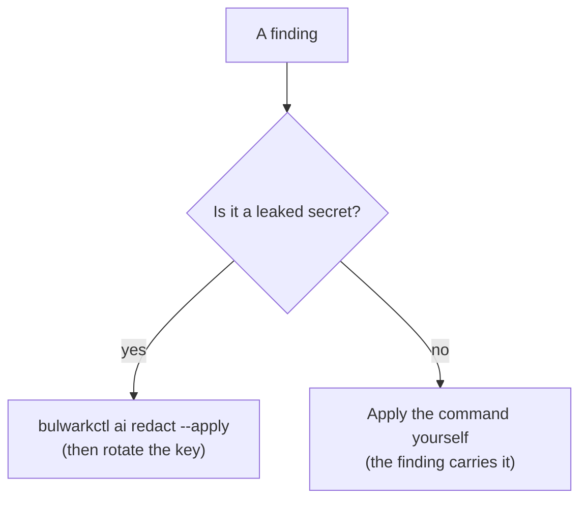

# Fixing what Bulwark finds

Bulwark reports problems; it does not, with one deliberate exception, fix them for you. That is a
design decision, not a missing feature. A scanner that edits your `sshd_config` or `sudoers` and
gets it wrong has locked you out of your own machine — a strictly worse outcome than the finding it
was trying to resolve.

So the fixes divide into two groups by blast radius. Bulwark automates the one that is safe to
automate. For the rest it gives you the exact command and gets out of your way.

## What Bulwark fixes for you: leaked secrets

Secret redaction is the one auto-fix Bulwark performs, because it is the one that is unambiguous
and fully reversible: the secret is either there or it isn't, and the original is always backed up.

```bash
# Preview — shows exactly which files and how many secrets. Changes nothing.
bulwarkctl ai redact

# Apply. Each file is backed up 0600 first, its permissions preserved, and every high-confidence
# secret replaced with an inert placeholder.
bulwarkctl ai redact --apply
```

In the desktop app this is the **Redact** button on the Agent Security tab.

**Only the credential's own bytes are replaced.** Everything around it — the `KEY=` name, the quotes
around the value, the line ending that ends it — survives byte-for-byte, so a redacted `.env` still
parses and a redacted file has exactly as many lines as it started with. This matters more than it
sounds: the detection patterns match a *terminator* after the secret (usually the newline itself),
and a redactor that rewrote the whole matched span would delete it, welding the next line onto the
placeholder.

Two things it deliberately will *not* do:

- **It won't rotate the key for you.** Redaction removes the secret from disk; it cannot un-leak it.
  Anything that reached a transcript should be assumed compromised — go rotate it at the provider.
- **It won't touch a low-confidence (`generic-*`) match.** Those are reported but never rewritten,
  because blindly editing a value that merely *looked* like a secret could corrupt a real config.

## What you should fix by hand

Everything below changes how an agent — or your shell, or SSH — behaves. A wrong edit is expensive,
so Bulwark shows you the command rather than running it. Each finding in a scan already carries its
own one-line fix; this is the same guidance, organised by category.

### Auto-execution on repo open (Critical)

These let a repository you merely *opened* run code before you reviewed it. Fix the repo, and be
wary of any repo you didn't author.

| Finding | Fix |
|---|---|
| `BLWK-AI-002` Claude Code hooks | Remove the `hooks` block from the repo's `.claude/settings.json`. Keep hooks only in your own trusted user-level settings. |
| `BLWK-AI-009` VS Code "YOLO mode" | Remove `"chat.tools.autoApprove": true` from `settings.json`. |
| `BLWK-AI-011` auto-run task | Remove `runOn: "folderOpen"`, or set `"task.allowAutomaticTasks": "off"`. |
| `BLWK-AI-010` Workspace Trust off | Set `"security.workspace.trust.enabled": true`. |
| `BLWK-AI-008` auto-enable MCP | Remove `enableAllProjectMcpServers` / `enabledMcpjsonServers` from committed settings. |

### MCP servers — third-party code with your permissions (High)

An MCP server is a program running as you. Treat it like one.

| Finding | Fix |
|---|---|
| `BLWK-AI-003` unpinned package | Pin to an exact version (`@scope/pkg@1.2.3`, not `-y latest`) and vet the publisher. |
| `BLWK-AI-004` vulnerable `mcp-remote` | Upgrade `mcp-remote` to ≥ 0.1.16 and pin it ([CVE-2025-6514](https://nvd.nist.gov/vuln/detail/CVE-2025-6514)). |
| `BLWK-AI-005` shell-wrapped server | Replace `bash -c`/`sh -c` with a direct executable + args. |

### Over-broad permissions (High)

| Finding | Fix |
|---|---|
| `BLWK-AI-006` wildcard allowlist | Scope it: replace `Bash(*)` / `Bash(curl:*)` / a bare `"*"` with the specific, read-only commands the agent actually needs. |
| `BLWK-AI-007` bypass mode | Remove `defaultMode: "bypassPermissions"`, and don't run with `--dangerously-skip-permissions` outside a throwaway container. |
| `BLWK-AI-017` Codex danger config | In `~/.codex/config.toml`, move `approval_policy` away from `"never"` **or** `sandbox_mode` away from `"danger-full-access"`. |

### Exfiltration and injection surface (High → Medium)

| Finding | Fix |
|---|---|
| `BLWK-AI-014` base-URL override | Remove the `ANTHROPIC_BASE_URL` / `OPENAI_BASE_URL` override unless it points at a proxy you trust — pointed at an attacker host it ships your API key in the auth header. |
| `BLWK-AI-012` hidden Unicode | Strip the zero-width / bidirectional control characters from the instruction file. They're invisible to you and read by the model (the ["Rules File Backdoor"](https://www.pillar.security/blog/new-vulnerability-in-github-copilot-and-cursor-how-hackers-can-weaponize-code-agents)). |
| `BLWK-AI-013` injection phrases | Read the flagged line. This is a low-confidence heuristic — confirm before trusting the file. |

### Secret hygiene (High → Medium)

The secrets themselves are redactable (above); these are about their blast radius.

| Finding | Fix |
|---|---|
| `BLWK-AI-016` unignored in git | `echo '<file>' >> .gitignore`, then `git rm --cached <file>` if it was already committed, and rotate the credential. |
| `BLWK-AI-015` world-readable creds | `chmod 600 <file>`. |

## The one-line version



Redact secrets with Bulwark; rotate them at the provider. Everything else, apply the command the
finding gives you — by hand, because the cost of getting it wrong is yours, not the scanner's.
